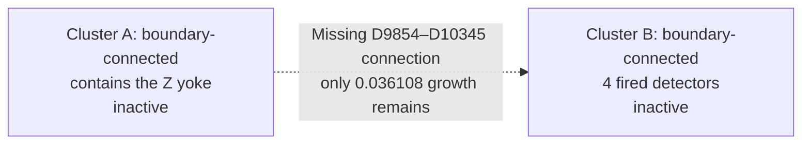

# Where correlated UF loses the correct logical assignment

The strongest measured mechanism is **stopping with a restricted correction
space before exposing a cheaper, logically correct alternative**. This happens
on syndromes produced by interacting physical faults. First-pass correlation
evidence also matters, but replacing only the final UF solver repairs most of
the sampled disagreements while preserving UF's own correlation weights.

This report joins the existing physical-fault and growth investigations with
new diagnostics on the saved SI1000 `p=0.003`, six-patch, two-ideal-yoke,
`rounds=4d` experiment. There are 100,000 original evaluation shots at each of
`d=7,9,11,13`. No samples were regenerated and no production decoder changed.
The new [scripts and records](correlated_uf_failure_mechanisms_d7_d13/README.md)
are analysis artifacts.

## What a typical disagreement looks like

A failure is any incorrect prediction among the 12 logical observables,
ordered `X0,Z0,...,X5,Z5`. Count disagreements on identical shots:

| d | UF fails, MWPM succeeds | MWPM fails, UF succeeds | UF-only failures with exactly two wrong logical bits |
|---|---:|---:|---:|
| 7 | 12,915 | 3,470 | 12,289 / 12,915 = 95.15% |
| 9 | 9,522 | 2,200 | 9,195 / 9,522 = 96.57% |
| 11 | 5,829 | 1,122 | 5,711 / 5,829 = 97.98% |
| 13 | 3,335 | 556 | 3,299 / 3,335 = 98.92% |

Every two-bit error here is in one sector on two different patches. All these
UF-only failures preserve both measured yoke parities. X-only and Z-only
failures occur in similar numbers; the exact distributions and patch pairs
are in each distance's `population.json`.

Thus the dominant observable signature is a **wrong assignment between
patches despite satisfying the global parity constraints**. Two wrong logical
bits do not mean two physical faults. The same signature can arise from many
different fault histories. MWPM also has its own exclusive failures, so the
UF-only population is not the net LER gap.

## Separate correlation evidence from the final solve

For each distance, analyze 128 uniformly selected shots where original
correlated UF fails and original correlated MWPM succeeds. Reuse the original
d=7/9 diagnostic selections; select d=11/13 with seeds `20260915+d`, before
performing these interventions.

Keep the syndrome, graph, and **UF first-pass correlation weights** fixed.
Replace the final solver with MWPM:

| d | Original UF correct / 128 | MWPM under the same UF weights correct / 128 | UF partitions excluding the true logical class |
|---|---:|---:|---:|
| 7 | 0 | 110 (85.94%) | 128 / 128 |
| 9 | 0 | 105 (82.03%) | 128 / 128 |
| 11 | 0 | 104 (81.25%) | 128 / 128 |
| 13 | 0 | 118 (92.19%) | 128 / 128 |

The d=7/9 results reproduce the previous intervention. The d=11/13 results
extend it. These are conditional diagnostic success rates, not full-population
LERs for a new hybrid decoder; 128 shots per distance also leave sampling
uncertainty. Their variation does not establish a monotone distance trend.

The partition test restores **every original edge internal to each final UF
cluster**, including edges absent from the merge forest. It then computes the
logical labels of all syndrome-preserving changes available in that graph.
For all 512 sampled failures, none can reach the true logical class. Optimizing
more carefully inside those same clusters cannot recover that answer.

Under the same weights, MWPM returns a strictly cheaper correction on all
512 shots, including some where it still predicts the wrong logical class.
Lower surrogate graph cost is therefore useful evidence, not a guarantee of
logical correctness or of recovering the actual physical history.

The earlier reverse intervention—MWPM first-pass evidence followed by
UF—repairs 48/128 cases at d=7 and 58/128 at d=9. These overlap with the
final-solver repairs. They cannot be added as independent shares of the gap.
See the [original pass-swap analysis](correlated_uf_mwpm_failure_analysis_d7_d9.md).

## The algorithmic decision that loses the alternative

In the current UF implementation:

1. An odd cluster without an unconstrained boundary initiates growth.
2. A cluster stops initiating growth once it becomes even or reaches a boundary.
3. An inactive cluster can reactivate after a later merge.
4. Growth terminates when no active clusters remain; peeling chooses a
   syndrome-valid correction on the merge forest.

This checks whether the syndrome can be explained within the grown clusters.
It does not certify the cheapest explanation over the full graph. A connection
between two already satisfied clusters may permit a cheaper correction with a
different logical label, while neither cluster has a reason to grow under UF's
activity rule.

Merging itself enlarges the induced set of allowed internal edges. It does not
erase a previously available correct solution. The demonstrated loss is ending
with too few connections and then restricting the final correction to that
space.

One complete saved example is **d=9, shot 34624**, under fixed UF weights:

The edge has accumulated `3.033741` of its `3.069849` weight when growth stops.
Adding that one connection and minimizing correction cost on the enlarged
forest repairs the logical answer. The relevant logical difference component
cost falls from `44.274784` to `37.355427`, a reduction of `6.919357` nats.
The weights and growth clock are model quantities, not hardware latency or
exact physical-history likelihoods. The edge was selected using MWPM for
diagnosis; this example is not an autonomous bridge-selection algorithm.

The [growth report](correlated_uf_growth_diagnosis_d7_d9.md) records three other
controlled examples, checks against event-heap and tie-order artifacts, and
the distinction between ordinary peeling and minimum-cost forest correction.

## How the physical faults produce these syndromes

The earlier [physical-fault ablation](physical_fault_ablation_d7_d9.md) recovered
actual sampled events in 1,024 stratified shots per distance at d=7/9. Deleting
an event family updates both the syndrome and true logical labels, then reruns
both complete correlated decoders with the original noise model.

| Family removed | Estimated reduction of the whole-shot UF–MWPM gap, d=7 | d=9 |
|---|---:|---:|
| CZ gate faults | 98.3% | 95.4% |
| Extra data errors while waiting for measurement/reset | 90.5% | 98.1% |
| Ancilla readout flips | 65.5% | 80.8% |

These are overlapping sensitivities to deleting whole fault families. They
are not additive fault attributions or per-event harmfulness rankings, and
the relative order of the two leading families is uncertain. Both decoders
face a much easier problem after a whole family is removed. No unique X, Y,
Z, or two-qubit Pauli product is established as the culprit.

A concrete interaction occurs in **complete d=7 shot 44875**:

- F247, a round-18 data-Y/ancilla-X CZ fault, flips
  `D5061,D5350,D5351,D5355`.
- F271, a round-19 readout fault, flips `D5351,D5639`.
- These are the only two contributions at D5351, so they cancel. D5351 is
  unfired while D5639 fires.
- Final correlated UF leaves D5351 as an unfired singleton and D5639 in an
  even seven-vertex cluster. MWPM selects their connecting temporal edge.
  Its weight is `3.67830` under both reweightings: it receives no correlation
  discount.
- Removing F271 from the complete shot makes both decoders succeed.

UF can traverse unfired detectors in general. This particular growth history
stops before including the relevant connection. The cancelled detector does
not reveal the two physical events to either decoder; they must infer a
correction from their combined syndrome.

Deleting other events from that recorded shot yields a 12-event physical
counterexample: truth and MWPM assign an X-observable flip to patch 5, while
UF assigns it to patch 3. Both predictions give total X-yoke parity one.
Each event is correctable alone, and deleting any one retained event makes
both decoders succeed. This demonstrates an interaction, not a globally
minimal fault count or a typical-frequency claim.

Reduction changes the growth history: the readout edge is present but
unselected in the reduced example. Its traced missing connection is instead
a boundary edge. The complete and reduced cases must therefore be interpreted
separately. Both physical patterns and their verified replays are archived in
the [physical counterexample analysis](correlated_uf_mwpm_failure_analysis_d7_d9.md).

## Complete d=7 shot 76890: stopping and omitted internal routes

The [complete-shot trace](correlated_uf_failure_mechanisms_d7_d13/full_shot_76890.json)
uses all 401 recorded physical events. This is different from the older
ten-event reduction of shot 76890: the growth history, missing boundary edge,
and wrong patch pair change after reduction.

In the complete shot, F90 is a round-7 I/Y fault after CZ on data q179 and
ancilla q468 in patch 3. Both correlated decoders select its two graph
components, including the same local correlation discount. Removing F90
makes both decoders succeed, and F90 alone is correctable by both. Its
interaction with the other faults changes the syndrome on which UF grows;
the local discount itself is applied correctly. See the archived
[physical trace](correlated_uf_mwpm_failure_analysis_d7_d9/physical_cases.json).

Hold all second-pass weights fixed to UF's own first-pass evidence. UF
predicts mask 3116; full-graph MWPM predicts the correct mask 3236. The
difference is Z-observable bits on zero-based patches 1 and 3: UF predicts
`(Z1,Z3)=(1,0)` while truth and MWPM give `(0,1)`.

The logically relevant difference between their corrections contains one
edge crossing the final UF partition: **D2189 to virtual boundary terminal
8710**, edge 9726. At termination:

- D2189 belongs to a 713-vertex cluster containing Z-yoke detector D8353.
- That cluster is even and already connected to another boundary, so it is
  inactive. Terminal 8710 is a separate inactive singleton.
- The edge has grown `2.490325` of its `3.390990` weight, leaving `0.900665`.
  Neither endpoint's cluster initiates further growth.

The correct class is inaccessible even if every original edge internal to
the final clusters is restored. A correction confined to those clusters
cannot repair the logical answer. Optimizing the original merge forest
also gives exactly UF's original result.

Adding edge 9726 exposes the correct class on the enlarged forest, but its
cheapest representative costs `1480.341716`, versus `1479.505785` for the
wrong class. Independent tree DP and constrained matching agree on both
costs. Ordinary peeling and minimum-cost forest correction therefore both
remain wrong after this single-edge addition.

Four further MWPM edges from the same logical difference component are
missing from the merge forest, although both endpoints are already inside
the 713-vertex cluster: D2470–D2477, D2788–D3083, D5010–D8353, and
D6128–D6416. Restoring these along with the boundary edge permits a cheaper,
correct alternative:

| Allowed connections and solver, all with fixed UF weights | Whole-correction cost | Logical result |
|---|---:|---|
| Original UF | 1479.505785 | Wrong |
| Exact optimization on the original forest | 1479.505785 | Wrong |
| Exact optimization after adding the boundary edge | 1479.505785 | Wrong |
| Exact optimization after adding all five missing edges | 1467.267672 | Correct |
| Full-graph MWPM | 1453.231336 | Correct |

Exchanging just the relevant logical component replaces 17 UF edges costing
`66.958817` with 14 MWPM edges costing `54.720705`. The resulting whole
correction has cost `1467.267672` and satisfies the same syndrome. The full
MWPM correction additionally makes changes that preserve the logical label.

This separates two restrictions: growth stops before admitting the boundary
connection, and the merge forest omits cheaper routes within the large
cluster. The five edges were selected using MWPM for offline diagnosis;
this is a controlled explanation of one failure, not an autonomous repair
algorithm or a minimality claim about those five additions. Every extracted
correction was checked against the original syndrome.

## What frontier growth plus bridges actually changes

The saved frontier experiment preserves the original UF first pass. Its
second pass normalizes each active cluster's total frontier growth budget,
then considers two rounds of cost-improving intercluster bridges with a
remaining-growth cap of 0.5 nats. It minimizes correction cost on the resulting
forest. Thus it directly changes the explored connections without using
ground truth or MWPM predictions.

Joining all saved predictions shows:

| d | Original UF-only failures repaired | Still failing from that group | New failures among originally both-correct shots |
|---|---:|---:|---:|
| 7 | 8,182 / 12,915 (63.35%) | 4,733 | 1,225 |
| 9 | 5,972 / 9,522 (62.72%) | 3,550 | 955 |
| 11 | 3,758 / 5,829 (64.47%) | 2,071 | 651 |
| 13 | 2,207 / 3,335 (66.18%) | 1,128 | 390 |

The latter two columns sum to the frontier-plus-bridges-only failures relative
to MWPM: 5,958, 4,505, 2,722, and 1,518. Other outcome transitions are preserved
in `population.json`; this table is not the complete net LER accounting.

On the selected 128 original UF-only failures per distance, repeat the
logical-space certificate after frontier growth and bridges:

| d | Frontier + bridges repairs / 128 | Residual failures | Residual failures whose final partition excludes truth |
|---|---:|---:|---:|
| 7 | 83 | 45 | 45 |
| 9 | 80 | 48 | 44 |
| 11 | 77 | 51 | 50 |
| 13 | 93 | 35 | 33 |

In **172 of 179 residual sampled failures**, even restoring all original
internal edges does not expose the correct logical class. Changing peeling
or optimizing within these same components cannot repair them. This statement
is conditional on original UF-only failures; it does not cover the new
regressions created by frontier growth.

The bridge extension is useful but bounded. It examines eligible single-edge
connections, pairs disjoint clusters, and accepts an individually improving
forest-cost change. Its rules do not search every multi-edge exchange. The
certificate establishes missing logical freedom in these 172 cases; it does
not identify whether the cap, number of rounds, candidate scoring, or a
multi-edge requirement is responsible in each case.

The seven remaining cases expose a subtler limitation. Their extended forests
admit the true class, but the cheapest available correction in that class
costs **0.75–11.15 nats more** than the cheapest wrong-class correction. An
exact optimizer on the same forest therefore also chooses the wrong answer.
All seven are repaired by full-graph MWPM with the same UF weights.

For example, d=9 shot 343 has these whole-correction costs:

| Available graph and required class | Minimum cost |
|---|---:|
| Extended frontier forest, wrong class | 3121.098881 |
| Extended frontier forest, true class | 3125.166161 |
| Full graph, MWPM result in the true class | 3078.406430 |

The restricted graph exposes an expensive representative of the correct class
while omitting cheaper routes. Access to the correct class is necessary but
not sufficient for the cost rule to select it. The cost differences in this
table include the whole correction, including changes that do not affect the
logical label; they are not a cost assigned to one physical fault.

The [seven-case record](correlated_uf_failure_mechanisms_d7_d13/reachable_cases.json)
contains both class costs. A tree dynamic program computes them; an independent
matching construction constrains the observable by moving tree-edge labels
onto boundary terminals. Both methods agree for all fourteen class solves.

## What this supports, and what remains unresolved

The results locate three relevant stages:

1. **Physical interactions:** CZ, waiting-data, and readout errors combine and
   cancel detector events, creating competing syndrome explanations.
2. **Correlation evidence:** the first correction changes the weights available
   to the second pass. Changing that evidence helps some failures, and its
   contribution overlaps with growth changes.
3. **Candidate exposure and cost:** UF's growth/stopping rule often omits the
   correct logical class; a bounded extension can still omit its cheaper
   representatives. Exact correction within a restricted forest then has
   insufficient alternatives.

The evidence supports improving how the second pass explores connections
between satisfied clusters. It does not establish that every UF implementation
has this failure rate, that one physical Pauli is uniquely harmful, or that
repeating the same decoder will automatically discover the missing routes.

For a future hardware-oriented refinement, a useful diagnostic target is the
coverage of cheaper logical alternatives under fixed UF weights. A local
exchange rule can be evaluated against that target before adding another
confidence estimator. Truth and MWPM remain offline diagnostic references;
the deployed candidate-generation and selection rules must operate from the
syndrome, noise model, and their own state.

## Verification and reproducibility

The new replay verifies input payload, circuit, and DEM hashes; reproduces all
six saved UF-variant predictions on each selected shot; and reproduces native
correlated MWPM. Each extracted physical correction satisfies the full
syndrome. All d=7/9 fixed-weight outcomes and costs match the prior analysis.

- 512 sampled shots, 3,072 saved UF-variant predictions reproduced.
- 512 native correlated-MWPM predictions reproduced.
- 256 old diagnostic rows cross-checked.
- 48 independent restricted-forest minimum-cost checks.
- 192 independent DFS logical-span checks on 32 predetermined shots, covering
  both forest and induced-partition certificates for three variants.
- Seven residual exceptions checked with independent restricted matching,
  including fourteen independently constrained logical-class costs.

Selections, per-shot rows, summaries, source hashes, and reproduction commands
are in the [companion directory](correlated_uf_failure_mechanisms_d7_d13/README.md).
The physical fault deletions and detailed growth traces remain the earlier
experiments linked above; this work joins and extends their decoder diagnosis.
