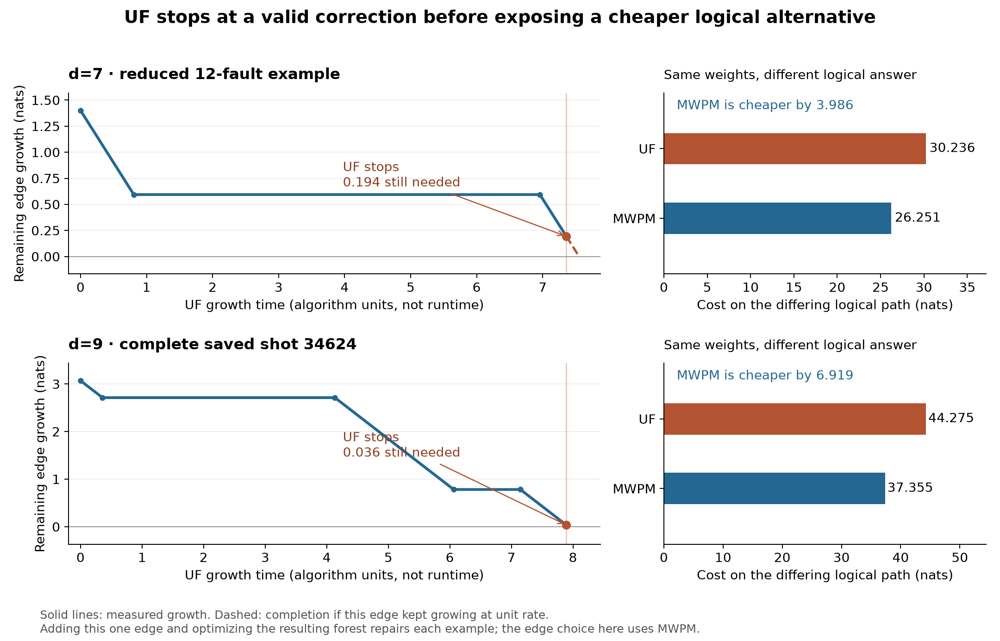

# Where UF stops before finding the better logical correction

**The central failure in the sampled cases is UF's feasibility stopping rule.**
Every final cluster can satisfy its detector parity, so growth stops, although
connections between those clusters would enable a cheaper correction with the
correct logical prediction. This is more specific than blaming an arbitrary
merge or saying that UF does not understand correlated errors.

This follows the [physical-fault and pass-swap investigation](correlated_uf_mwpm_failure_analysis_d7_d9.md)
on the saved SI1000 `p=0.003`, six-patch, two-ideal-yoke experiment at `d=7,9`,
`rounds=4d`. All interventions here preserve the original syndrome and the
**UF-conditioned second-pass edge weights**. No evaluation noise was resampled,
and production decoder files were not changed.

## What the algorithm decides

In [the current implementation](../../src/yoked/decoders/_union_find.py), a
cluster initiates growth exactly when it has odd detector parity and has not
reached an unconstrained boundary. Growth ends when there are no active
clusters. Peeling then constructs a syndrome-valid correction on the merge
forest.

This establishes feasibility, not minimum total correction cost. If `H` is the
detector-incidence matrix, both decoders return `c` satisfying `Hc=s` over GF(2).
MWPM minimizes the sum of selected edge weights on the graph supplied to it.
UF constructs an allowed forest through growth and finds a valid correction
there, without the same global cost minimization. Two valid corrections can
have different logical labels; their difference is a collection of closed
paths and paths between unconstrained boundaries.

An even cluster can reactivate when another cluster joins it. UF is therefore
not simply committing permanently to the first pair of defects it encounters.
However, once all remaining clusters are even or boundary-connected, this
implementation has no mechanism to explore a beneficial exchange between them.
MWPM's alternating-tree machinery can revise matching choices while optimizing
total weight; sparse blossom explicitly supports growing and shrinking regions.
See [Higgott and Gidney, *Sparse Blossom*](https://arxiv.org/html/2303.15933v2),
Sections 3.2–3.4.

**Merging clusters does not delete edges from the graph induced within the
partition.** It enlarges the set of available internal connections. The issue
identified here is stopping with an insufficient partition, followed by a
restricted correction rule. There need not be a single merge that destroys a
previously available correct logical solution.

## Four controlled examples

Two cases use the previously constructed, single-deletion-irreducible physical
fault subsets. Two use complete saved evaluation shots selected for a short
logical difference path with one missing intercluster connection. They are
illustrations, not a random four-shot sample.

For each case, compare UF with MWPM under **the same weights**. The costs below
refer only to the connected component of their correction difference that
changes the logical prediction. Unchanged edges cancel in this comparison.

| Case | Missing connection | Growth still needed | UF path cost | MWPM path cost | Cost reduction |
|---|---|---:|---:|---:|---:|
| d=7, reduced shot 44875, 12 physical faults | D5660 → boundary | 0.193649 | 30.236400 | 26.250892 | 3.985508 |
| d=7, reduced shot 76890, 10 physical faults | D2477 → boundary | 0.059327 | 30.182283 | 25.594643 | 4.587640 |
| d=7, complete shot 6463 | D5125 ↔ D5132 | 0.425733 | 34.508323 | 22.102997 | 12.405326 |
| d=9, complete shot 34624 | D9854 ↔ D10345 | 0.036108 | 44.274784 | 37.355427 | 6.919357 |

Weights and accumulated growth use the graph's log-odds units, nats. These are
costs in a reweighted decoding model, not exact likelihood ratios between
physical fault histories. UF growth time is an algorithmic clock, not measured
execution time.



### A boundary connection nearly completes, then freezes

In reduced shot 44875, the tracked boundary edge has weight `1.400910`:

1. At growth time `0.807090`, two fired detectors join an even cluster. The
   boundary edge stops growing with `0.593821` still needed.
2. At `6.957995`, that cluster joins an odd cluster containing the X yoke.
   The same edge resumes growth. The cluster now contains 13 fired detectors.
3. At `7.358167`, a different connection joins it to a boundary-containing
   cluster. The combined cluster has 14 fired detectors and is inactive.
   The tracked edge is still `0.193649` short. No active clusters remain.

UF predicts an X-observable flip on patch 3; the actual flip is on patch 5.
Both predictions satisfy the yoke's total parity. The competing correction
changes a 17-edge boundary-to-boundary path and has lower cost.

The reduced 76890 example has the same structure, with the omitted boundary
edge only `0.059327` short at termination. Its wrong logical prediction flips
the Z observables on patches 3 and 4.

### Already satisfied clusters can still need to connect

In complete d=9 shot 34624, the missing edge is an ordinary detector-to-detector
edge, not a boundary edge or a yoke edge. At termination:

- One endpoint belongs to a 1,774-vertex cluster containing the Z yoke,
  251 fired detectors, and a boundary connection.
- The other belongs to a 15-vertex cluster with four fired detectors and a
  boundary connection.
- Both clusters are inactive. The edge between them has accumulated
  `3.033741` of its `3.069849` weight.

Each cluster already admits a valid correction. Joining them nevertheless
allows a correction that is cheaper by `6.919357` and repairs the wrong
Z-observable predictions on patches 3 and 4. This is a direct example of
**local feasibility failing to certify the best logical assignment**.

The complete d=7 example likewise leaves two boundary-connected clusters
separate. Both have odd detector parity; their separate boundary connections
make them feasible. Connecting them permits a cheaper joint correction.

## One-edge interventions locate the missing capability

Add only the single missing connection identified above to the original UF
forest. Since it joins separate components, the enlarged graph remains a forest.
All weights remain unchanged. Compare ordinary peeling with an exact
minimum-cost correction on that forest:

| Case | Original UF correct? | Add edge, ordinary peeling | Add edge, minimum-cost forest correction |
|---|---|---|---|
| Reduced d=7, 44875 | No | Wrong | **Correct** |
| Reduced d=7, 76890 | No | Wrong | **Correct** |
| Complete d=7, 6463 | No | **Correct** | **Correct** |
| Complete d=9, 34624 | No | Wrong | **Correct** |

The edge choice uses MWPM as an oracle for diagnosis. These four repairs do not
constitute a standalone edge-selection algorithm.

The forest optimizer uses two states per vertex: whether its parent edge is
selected. Detector vertices enforce syndrome parity, while boundary vertices
may independently absorb parity. A bottom-up dynamic program followed by
backtracking minimizes the cost in linear time in the forest size. This does
not require blossom, but no hardware latency, area, or throughput was measured.

The boundary distinction matters. Current peeling roots each tree at its
smallest boundary terminal and never selects a non-root boundary leaf's edge.
Consequently, an even tree uses no boundary edges, and an odd tree uses only
its root boundary edge. In the two reduced cases, the better correction uses
**two boundary connections in an even tree**. Merely changing which terminal
is the root cannot express that choice.

On the original forest, this limitation cannot explain the logical failure
by itself: the correct logical class is unavailable before augmentation.
It becomes an additional obstacle when attempting to repair growth by exposing
more connections. The primary demonstrated defect is the insufficient final
partition; a growth extension also needs an appropriate correction rule.

For the reduced cases, the enlarged-forest optimum equals global MWPM's total
cost (`49.046075` and `50.200688`). For the complete shots it repairs the logical
answer without attaining global minimum cost: other, logically harmless cost
differences remain.

## How much of the sampled gap does this explain?

Reuse the previous 128 uniformly selected UF-only failures at each distance.
These are shots where native correlated UF fails and native correlated MWPM
succeeds. The second-pass MWPM replacement, keeping UF's correlation weights,
repairs 110/128 at d=7 and 105/128 at d=9.

The previous logical-space certificate found that all 256 final UF partitions
exclude the true logical answer, even after restoring every original edge
inside each cluster. The new minimum-cost forest implementation correspondingly
repairs **0/128 at each distance** when confined to the original forest.

Among the cases repaired by MWPM with fixed UF weights, classify the omitted
intercluster edges in the logical components of one MWPM/UF difference:

| Omitted connections needed by that MWPM correction | d=7, out of 110 | d=9, out of 105 |
|---|---:|---:|
| Boundary edges only | 14 | 19 |
| Includes ordinary detector or yoke connections | 96 | 86 |

Ordinary-detector connections are the dominant category. Only five d=7 cases
in this comparison have an omitted yoke edge; none of the d=9 cases do.
That does not make yokes irrelevant: all four detailed examples involve a
yoke-containing cluster, and its growth history affects ordinary edges too.
The categories describe one returned correction, not a unique causal
decomposition of the LER gap.

### A simple boundary extension helps a minority and can cause regressions

As an exploratory probe, add unused boundary edges whose remaining growth is
below a cap, then run the minimum-cost forest correction. Boundary terminals
are separate leaves, so this always preserves the forest structure. Unlike the
one-edge diagnostic above, this selection rule uses neither truth nor MWPM.
It was chosen after examining the reduced examples.

Also decode 128 uniformly selected **both-correct** control shots per distance,
using seeds `2026091807` and `2026091809`.

| Remaining-growth cap | d=7 failures repaired / 128 | d=7 controls spoiled / 128 | d=9 failures repaired / 128 | d=9 controls spoiled / 128 |
|---|---:|---:|---:|---:|
| Original forest | 0 | 0 | 0 | 0 |
| 0.10 | 0 | 0 | 0 | 0 |
| 0.25 | 3 | 0 | 4 | 0 |
| 0.50 | 8 | 1 | 7 | 0 |
| 1.00 | 12 | 1 | 16 | 1 |
| All boundary edges | 31 | 6 | 31 | 3 |

Ordinary peeling after adding all boundary edges repairs only 11/128 at each
distance, compared with 31/128 for the cost-minimizing forest correction.
Boundary handling therefore matters, but boundary extension alone leaves most
sampled failures unresolved.

These conditional cohorts cannot establish a net LER improvement. Their parent
populations have different sizes, and UF-only successes and both-failing shots
were not included in this new probe. In particular, 31 repairs and six
regressions cannot be subtracted to estimate population benefit.

## Checks against alternative explanations

- **Heap scheduling:** a separate eager, full-edge-scan implementation exactly
  reproduces the production forest edge order for both reduced examples.
  This supports an algorithmic explanation for those cases, rather than a
  defect in the lazy event heap.
- **Tied edge ordering:** reversing the order and trying 16 seeded random
  orders within tied batches preserves the final partition and wrong logical
  prediction in all four detailed cases. Most forests do change. This is
  68 controlled replays, not a claim that ties never affect UF performance.
- **Correlation evidence:** all new repairs hold the original UF first-pass
  evidence fixed. The final solver can therefore fail despite weights that
  favor a correct answer. The 18/128 and 23/128 cases not repaired by fixed-weight
  MWPM still require considering correlation evidence or other effects.
- **Growth policy:** suppressing the yoke endpoint's own growth contribution,
  or normalizing each active cluster's total frontier growth budget, repairs
  both reduced examples. These are diagnostic schedules only. The naive
  passive-yoke rule deadlocks on a valid syndrome containing only the X-yoke
  detection event; the normal UF decoder produces a verified correction for it.
  Neither schedule has a population-level performance claim.
- **Forest optimizer:** independent restricted-graph PyMatching solves agree
  with the dynamic program's cost in 48 cohort checks and all four one-edge
  interventions. Every replayed correction is checked against its full syndrome.

## Implications for a cheaper refinement

The evidence motivates a bounded search for exchanges across nearly completed
connections **between satisfied clusters**, followed by cost-aware correction
on the expanded subgraph. It must include ordinary detector connections, not
only extra boundary leaves. Preserving a forest permits the simple dynamic
program used here; adding cycles requires an additional policy or solver.

That is a hypothesis for the next decoder experiment, not an implemented
production fix or a demonstrated improvement in LER. The important distinction
is that fixing correlation weights or optimizing within the existing clusters
cannot recover a logical alternative that growth never exposes.

## Reproduction and artifacts

The [companion directory](correlated_uf_growth_diagnosis_d7_d9) contains scripts,
four growth traces, all 512 cohort rows, selections, summaries, plots, and
verification metadata. Source hashes and saved input hashes are checked against
the previous investigation. The analysis uses production commit `3f330c6`.

From the repository root, with the saved inputs named by the previous report
still present:

```bash
export PYTHONDONTWRITEBYTECODE=1 PYTHONPATH=src
export MPLCONFIGDIR="$TMPDIR/uf-soft-mpl"
export OPENBLAS_NUM_THREADS=1 OMP_NUM_THREADS=1
analysis_dir=docs/results/correlated_uf_growth_diagnosis_d7_d9
work_dir=$(mktemp -d "$TMPDIR/uf-growth-recheck-XXXXXX")
.venv/bin/python "$analysis_dir/trace.py" --out "$work_dir"
.venv/bin/python "$analysis_dir/cohort.py" --distance 7 --out "$work_dir/d7"
.venv/bin/python "$analysis_dir/cohort.py" --distance 9 --out "$work_dir/d9"
.venv/bin/python "$analysis_dir/verify_cases.py" --out "$work_dir"
.venv/bin/python "$analysis_dir/plot.py" --root "$work_dir"
.venv/bin/python "$analysis_dir/verify_artifacts.py" --root "$work_dir"
```

The original work and logs remain under
`/data2/s2chitni/.tmp/uf-growth-diagnosis-mq7tRT`.
