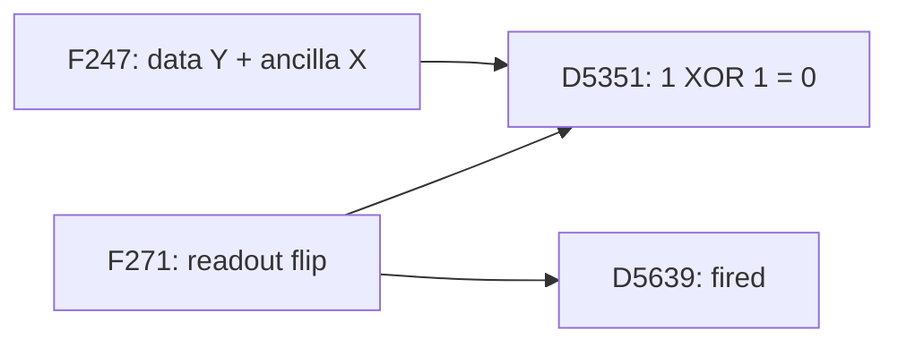

# Why correlated UF loses to correlated MWPM

The saved shots and new diagnostic replays point to **incorrect cluster formation
and logical assignment across patches**, together with some incorrect first-pass
correlation evidence. The physical examples involve interacting data, ancilla,
and readout faults. They are not explained by one Pauli type that UF always misses.

This compares the **joint correlated UF and joint correlated MWPM decoders** on
the existing SI1000 `p=0.003`, six-patch, two-ideal-yoke experiment, with
`d=7,9`, `rounds=4d`, and 100,000 seed-42 evaluation shots per distance.
No evaluation shots were resampled and no production decoder was changed.

## How large is the difference?

| Distance | Correlated UF failures | Correlated MWPM failures | UF normalized LER | MWPM normalized LER | UF relative excess |
|---|---:|---:|---:|---:|---:|
| 7 | 23,230 | 13,785 | 0.001598999 | 0.000890786 | 79.50% |
| 9 | 14,247 | 6,925 | 0.000718249 | 0.000333684 | 115.25% |

Failure means any of the 12 logical predictions is wrong. Normalized LER uses
the preceding experiment's Sinter conversion with `pieces=6*rounds, values=8`.
The paired comparison is more informative than subtracting these totals:

| Outcome on the same shot | d=7 | d=9 |
|---|---:|---:|
| Both succeed | 73,300 | 83,553 |
| **Correlated UF fails; correlated MWPM succeeds** | **12,915** | **9,522** |
| Correlated UF succeeds; correlated MWPM fails | 3,470 | 2,200 |
| Both fail | 10,315 | 4,725 |

MWPM does not succeed on every shot that UF decodes correctly. Its objective is
a minimum-weight correction for its reweighted graph, not exact inference of
the physical fault history or maximum-likelihood logical decoding.

Among the highlighted UF-only failures, **95.15% at d=7 and 96.57% at d=9 get
exactly two logical bits wrong**. X-only and Z-only failures are nearly equally
common. The two-bit mistakes are generally wrong assignments to two patches in
one sector. Both answers still satisfy the measured yoke parity. These are two
wrong *logical predictions*, not a count of physical faults.

## Separate the two passes

Both correlated decoders first infer a correction, lower weights of edges
correlated with that correction, and decode the original syndrome again. Their
first corrections, reweighted graphs, and final optimization procedures can
all differ. See the [PyMatching description of two-pass correlated matching](https://github.com/oscarhiggott/PyMatching#correlated-matching)
and the repository's [correlated UF implementation](../../src/yoked/decoders/_correlated_union_find.py).

To separate these effects, choose **128 shots uniformly without replacement
from the UF-only failure population at each distance**, with seeds `20260922`
and `20260924`. Hold the original syndrome and noise model fixed and swap one
pass at a time:

| First-pass evidence / final solver | d=7 correct / 128 | d=9 correct / 128 |
|---|---:|---:|
| UF / UF: original correlated UF | 0 | 0 |
| **UF / MWPM: change only the final solver** | **110 (85.94%)** | **105 (82.03%)** |
| MWPM / UF: change only the correlation evidence | 48 (37.50%) | 58 (45.31%) |
| MWPM / MWPM: reconstructed correlated matching | 128 | 128 |

The reconstruction uses the same repository correlation rules for all four
combinations. Its MWPM/MWPM logical predictions reproduce native correlated
PyMatching on every sampled shot, and on 13 additional traced cases.
This is a check on these cases, not an assertion of universal equality at
floating-point or matching ties.

The two interventions overlap: both repair 36 shots at d=7 and 46 at d=9;
neither alone repairs 6 and 11, respectively. The counts therefore cannot be
added to allocate percentages of the total LER gap to independent causes.
These are conditional diagnostic samples, not full-dataset LERs for the hybrids.

**The final UF solve is losing useful information even when its own correlation
weights would let MWPM find the correct answer.** Different first-pass evidence
also matters, particularly in the cases that final-solver replacement does not
repair. This gives a more specific explanation than saying UF ignores Y errors.

## Where the final UF pass commits to the wrong answer

The repository UF implementation grows odd clusters, merging them as edges
complete. A cluster stops initiating growth when it becomes even or touches an
unconstrained boundary. Peeling subsequently selects a correction from the
merge forest. It does not globally reconsider those cluster assignments.

For each of the 256 random diagnostic shots, inspect the **second, reweighted
UF pass**, rather than the original plain-UF pass. Permit every original graph
edge whose endpoints lie in the same final UF cluster, including edges absent
from the merge forest. Then ask whether any valid correction using those edges
can have the true logical prediction.

**All 128/128 cases at each distance exclude the correct logical answer even
under this enlarged edge set.** The space of possible logical changes has rank
zero in every case: all syndrome-valid corrections within the fixed partition
have the same wrong logical prediction. A different peeling root, or a better
optimizer confined to those clusters, cannot repair these particular cases.

The certificate computes the logical labels of the cycle space of the allowed
graph after identifying its unconstrained boundary terminals. Those labels
span all possible syndrome-preserving changes to a correction. An independent
DFS consistency check verifies the zero-rank certificate on eight sampled shots
per distance. The full graph has logical-change rank ten, as expected from 12
observable bits with two fixed yoke parities.

This result is strong evidence about the sampled failures, not a proof that
every correlated-UF failure has this mechanism. It implicates growth and
partition formation before peeling. Under the same UF-conditioned weights,
MWPM also finds a strictly lower-weight correction on all 256 shots; the median
total-cost differences are 28.77 and 56.29 nats. A lower cost alone does not
guarantee logical success; the hybrid success counts above measure that separately.

## Actual physical faults, with controlled deletions

The existing physical-fault archive observes the original Stim draws and
reproduces the saved detector and observable arrays. Thirteen previously traced
d=7 shots remain correlated-UF failures. Their complete fault-response XORs
were checked again against the saved shots, and the deletions below were decoded
with **correlated UF**, not the plain UF used in the earlier case notes.

| Saved d=7 shot | Actual physical event in its noisy context | Correlated UF's wrong bits | Controlled result |
|---|---|---|---|
| 16 | F283: data-qubit Y, patch 3, round 22, `DEPOLARIZE1(0.006)` | L5, L7 | Removing F283 makes both decoders succeed |
| 76890 | F90: ancilla Y from an IY two-qubit channel, patch 3, round 7 | L3, L7 | Removing F90 makes both succeed; removing the preceding F80 readout fault also makes both succeed |
| 44875 | F271: ancilla readout flip, patch 3, round 19; one endpoint cancels with a YX gate fault from round 18 | L6, L10 | Removing F271 makes both succeed |

Every listed fault is decoded correctly in isolation by both decoders.
These are interactions with the other sampled faults, not demonstrations that
an isolated readout error or Y error defeats correlated UF.

The local correlation mechanism can work and the full shot still fail. In shot
76890, both first passes select F90's supporting component and lower its partner
weight from 6.43615 to 4.10320. Both final decoders select both components of
that physical fault. Correlated UF nevertheless makes a wrong logical
assignment elsewhere in the complete correction. Simply adding that particular
correlation discount cannot explain or repair the remaining failure.

Likewise, two faults highlighted in the old plain-UF note for shot 128 no longer
repair correlated UF when removed, either singly or together. Physical examples
and growth traces must be rechecked for the decoder actually under comparison.

### A cancelled readout endpoint: shot 44875

The recovered physical events are:

- **F247:** round 18, patch 3: `Y` on data q176 and `X` on ancilla q466,
  following a two-qubit gate. Its detector footprint is
  `{D5061, D5350, D5351, D5355}`.
- **F271:** round 19, patch 3: a readout flip on ancilla q467. Its footprint
  is `{D5351, D5639}`.

They are the only contributors to D5351 in the original shot, so its two flips
cancel. The decoder sees D5351=0 and D5639=1:



This depicts two local fault footprints, not the complete error pattern.
MWPM selects their temporal connection D5351–D5639 even though D5351 is unfired.
Its weight is 3.67830 under the original, UF-conditioned, and MWPM-conditioned
models: the edge receives no correlation discount. In the original shot, final
correlated UF leaves D5351 as an unfired singleton and D5639 in a separate even
seven-vertex cluster. The connecting edge is absent from its forest.

Thus the loss here is not failure to lower that readout edge's weight. UF stops
with a partition that cannot make the correct logical assignment; MWPM can
route a correction through an unfired detector and coordinate the alternatives
across the graph. Removing F271 from the original noisy shot repairs correlated
UF while correlated MWPM remains correct.

## Smaller physical counterexamples

Starting from two recovered shots, deterministic deletion of faults produced
**10-event and 12-event counterexamples**. All other physical errors were
removed, while both decoders retained the original noisy graph and weights.
Both reduced circuits were independently simulated with ordinary Stim and
decoded again. These are constructed subsets of actual sampled events, not
new random samples.

| Source shot | Original events | Retained events | Actual logical flips | Correlated UF predicts | Correlated MWPM predicts |
|---|---:|---:|---|---|---|
| 76890 | 401 | 10 | None | Z-observable flips on patches 3 and 4 | None |
| 44875 | 408 | 12 | X-observable flip on patch 5 | X-observable flip on patch 3 | X-observable flip on patch 5 |

All constituent events decode correctly alone. **Removing any single retained
event makes both decoders succeed**, in each example. This establishes
irreducibility under a single deletion, not global minimum fault count, the
code distance, or a typical failure frequency. The 76890 reduction changes its
wrong patch pair from the original shot, so its reduced outcome is shown separately.

Both reduced examples still fail if UF receives the MWPM first-pass weights,
and both succeed if MWPM receives the UF first-pass weights. Their final UF
partitions exclude the correct answer. In the 12-event example, the readout
edge now enters the UF forest but remains unselected: reduction changes the
growth history, even though the failure and detector cancellation persist.

For the 12-event pattern, the yoke cannot distinguish the two answers:

| X-observable flip | Truth / correlated MWPM | Correlated UF |
|---|---:|---:|
| Patch 3 | 0 | 1 |
| Patch 5 | 1 | 0 |
| XOR across all six patches | 1 | 1 |

This is a concrete example of **assigning a logical flip to the wrong patch**
while satisfying every detector. It leaves a residual `Z_L,3 Z_L,5` logical
commutation pattern, up to phase.

The complete 12-event physical pattern follows. Qubit and patch IDs are
zero-based; noisy measurement rounds are numbered from one. Two-qubit Pauli
products in a row are a single physical fault event.

| Event | Patch | Round | Physical error |
|---|---:|---:|---|
| F230 | 5 | 17 | Y on data q296 |
| F231 | 5 | 17 | X on ancilla q581, from an IX gate fault |
| F234 | 3 | 17 | X on data q154 |
| F235 | 0 | 17 | Z on data q14 |
| F236 | 3 | 17 | Y on ancilla q458 |
| F244 | 5 | 18 | X on data q276 |
| F247 | 3 | 18 | Y on data q176 and X on ancilla q466 |
| F249 | 5 | 18 | Z on data q268 |
| F265 | 5 | 19 | Z on data q254; flips the patch-5 X observable |
| F271 | 3 | 19 | Readout flip on ancilla q467 |
| F274 | 3 | 19 | Y on data q199 |
| F280 | 3 | 20 | Z on data q185 |

The [12-event record](correlated_uf_mwpm_failure_analysis_d7_d9/reduced_44875.json)
and [10-event record](correlated_uf_mwpm_failure_analysis_d7_d9/reduced_76890.json)
include every location, Pauli, detector response, and single-deletion result.

## Interpretation and limits

The evidence supports investigating **how weighted UF forms and revisits
clusters in the presence of cancelled detector events, competing boundary
connections, and yoke-mediated patch assignment**. First-pass correlation
evidence also deserves attention. Improving only peeling inside the current
clusters cannot fix the sampled failures whose logical freedom is already zero.

This investigation does not estimate what fraction of all failures is caused
by data Y, ancilla faults, or readout faults. The physical traces are selected
d=7 examples, and real failing shots contain many fault types. The d=9 evidence
here is the full paired count and the 128-shot decoder/certificate analysis,
not reconstructed physical-fault histories.

## Artifacts and verification

Artifacts are in [the companion directory](correlated_uf_mwpm_failure_analysis_d7_d9).
The analysis uses code from commit `3f330c6`; production files were not edited.
Raw work and logs remain at
`/data2/s2chitni/.tmp/correlated-uf-mwpm-analysis-XOZZ7Y`.

- [d=7 summary](correlated_uf_mwpm_failure_analysis_d7_d9/d7/summary.json) and
  [d=9 summary](correlated_uf_mwpm_failure_analysis_d7_d9/d9/summary.json) record
  inputs, source hashes, package versions, and diagnostic counts.
- `selection.json` and `rows.json` retain cohort membership and every outcome.
- [Physical interventions](correlated_uf_mwpm_failure_analysis_d7_d9/physical_cases.json)
  and [readout interventions](correlated_uf_mwpm_failure_analysis_d7_d9/readout_cases.json)
  retain successful, unsuccessful, and changed-error counterfactuals.
- [Verification](correlated_uf_mwpm_failure_analysis_d7_d9/verification.json)
  checks 269 saved/rebuilt predictions, 16 independent DFS certificates,
  original sample hashes, random selections, and both reduced circuits.
- The two `.stim` artifacts contain the deterministic physical error subsets.
  **Decode their samples using the original noisy DEM**, as the supplied scripts
  do; deriving a new DEM from the deterministic circuit would change the problem.

The scripts take output paths explicitly. For example, from the repository root:

```bash
export PYTHONDONTWRITEBYTECODE=1 PYTHONPATH=src
export MPLCONFIGDIR="$TMPDIR/uf-soft-mpl"
export OPENBLAS_NUM_THREADS=1 OMP_NUM_THREADS=1
analysis_dir=docs/results/correlated_uf_mwpm_failure_analysis_d7_d9
work_dir=$(mktemp -d "$TMPDIR/correlated-failure-recheck-XXXXXX")
.venv/bin/python "$analysis_dir/analyze.py" --distance 7 --out "$work_dir/d7"
.venv/bin/python "$analysis_dir/analyze.py" --distance 9 --out "$work_dir/d9"
.venv/bin/python "$analysis_dir/physical.py" --out "$work_dir"
.venv/bin/python "$analysis_dir/readout.py" --root "$work_dir"
.venv/bin/python "$analysis_dir/reduce_faults.py" --shot 44875 --out "$work_dir"
.venv/bin/python "$analysis_dir/reduce_faults.py" --shot 76890 --out "$work_dir"
.venv/bin/python "$analysis_dir/edge_details.py" --root "$work_dir"
cp "$analysis_dir/analyze.py" "$work_dir/analyze.py"
.venv/bin/python "$analysis_dir/verify.py" --root "$work_dir"
```

These scripts reuse the input and physical-trace paths recorded above. They do
not modify or resample the original evaluation experiment.
