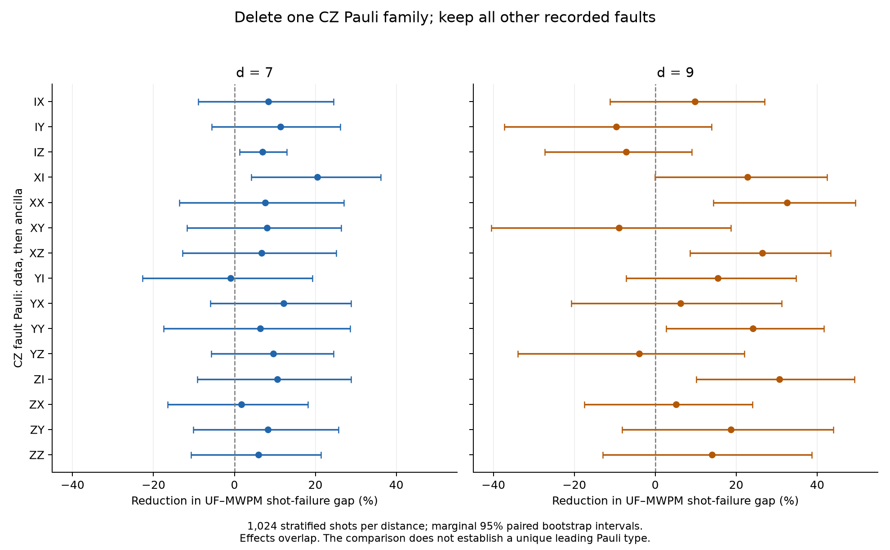

# Detailed CZ faults behind the correlated-UF / correlated-MWPM gap

Individual CZ faults in the recorded failures are correctable in isolation.
Their interaction with the rest of the noisy shot is what matters. In a new
conditional diagnostic sample, single-event deletions that repair UF are
enriched for **cancelled detector contributions and four-detector footprints**.
Many of those events already have all their direct graph components selected
by both original decoders. A locally represented physical fault can therefore
still participate in a globally wrong logical assignment.

All measurements use the existing SI1000 p=0.003, six-patch, two-ideal-yoke,
rounds=4d data at d=7 and d=9. No new evaluation shots were sampled, and no
production decoder was changed. Pauli products list **data first, ancilla
second**. The [artifact directory](cz_fault_analysis_d7_d9/README.md) contains
every intervention, prediction, physical response, and reproduction script.

## Delete each recorded CZ event individually

Before inspecting events, uniformly select 32 shots per distance from the
previous frozen 256-shot UF-only stratum. These are shots where correlated UF
fails and correlated MWPM succeeds. Test every realized CZ event in each shot:
remove only that event, update both detectors and true observables, and rerun
both complete correlated decoders with the original DEM. Also decode the
event alone.

| Measurement | d=7 | d=9 |
|---|---:|---:|
| Original UF-only failing shots examined | 32 | 32 |
| Individual CZ events tested | 2,751 | 6,179 |
| Events decoded correctly in isolation by both decoders | 2,751 / 2,751 | 6,179 / 6,179 |
| Single-event deletions making both decoders correct | 171 / 2,751 (6.22%) | 361 / 6,179 (5.84%) |
| Shots with at least one such deletion | 29 / 32 | 32 / 32 |

Several different deletions can repair the same shot. These 532 repairing
deletions are overlapping sensitivities, not 532 independent failure causes.
One other d=7 deletion repairs UF but makes MWPM fail; four at each distance
leave both failing. All other deletions retain the original UF-only failure.

The conditional sample cannot measure the net population LER effect of changing
a decoder or noise channel: it excludes originally UF-correct shots. Multiple
events from one shot are dependent. The uncertainty checks below resample
whole shots, preserving all their event interventions together.

## Detector cancellation is a strong observed association

A physical event's footprint lists the detectors it would flip alone. If one
of those detectors is zero in the original full shot, the event's contribution
has been cancelled by the combined contributions of other faults. This is a
statement about the recovered physical history; neither decoder receives it.

| Event characteristic | Deletion makes both correct, d=7 | d=9 |
|---|---:|---:|
| At least one cancelled footprint detector | 85 / 752 = **11.30%** | 212 / 1,584 = **13.38%** |
| No cancelled footprint detector | 86 / 1,999 = **4.30%** | 149 / 4,595 = **3.24%** |
| Four-detector footprint | 104 / 1,189 = **8.75%** | 206 / 2,607 = **7.90%** |
| Two-detector footprint | 55 / 1,131 = **4.86%** | 131 / 2,811 = **4.66%** |

The cancellation comparison gives 2.63x and 4.13x ratios of these pooled
event-level repair fractions. Marginal 95% paired bootstrap intervals for the
absolute rate difference are **3.83–10.48 percentage points at d=7** and
**6.90–13.55 points at d=9**. Four- versus two-detector intervals are
1.90–5.85 and 1.73–4.87 points. These are exploratory associations conditional
on UF-only failure, not isolated causal effects of cancellation or footprint
size. Footprint size, Pauli type, location, and cancellation can be related.

This supports investigating growth on overlapping fault patterns: observed
defects can form a locally satisfiable grouping while a better correction
needs routes through unfired detectors or other inactive clusters. It does
not imply that UF cannot traverse an unfired detector in general.

## A new d=9 example with a data-only X gate fault

In complete saved **shot 6249**, event **F210** is `XI` after the fourth CZ
slot of round 9, on **data q359 and ancilla q837**. It is one CZ-channel event
with an X error on data and no Pauli error on the ancilla at injection.

- Its standalone footprint is **D4665, D4674**, with no observable flips.
- D4665 is unfired in the full shot, demonstrating cancellation with other
  faults. D4674 fires.
- The final UF pass puts the two endpoints in different clusters and omits
  their direct edge 24729. Correlated MWPM selects that edge.
- Original truth/MWPM mask: **2820**; UF: **2340**. UF's wrong observable bits
  are 5 and 9, the Z observables of zero-based patches 2 and 4.
- Delete F210: both decoders predict **2820**, with truth unchanged.
- Decode F210 alone: both predict **0**, correctly.

This provides a non-Y example from the new uniformly selected d=9 cohort.
It demonstrates a local omitted connection alongside a controlled repair;
it does not establish that this is the only relevant route in that shot.
The full event record is in
[the saved case](cz_fault_analysis_d7_d9/d9/case_6249_F210.json), extracted from
the complete d=9 event archive as an illustrative example after analysis.

## Often both decoders already select the fault's components

For every tested event, partition its footprint by decoding sector and locate
its direct graph components. Independently verify both their detector and
observable labels. All 8,930 events map in this experiment, including empty
responses. Examine the original full-shot corrections before deleting anything:

| Status among events whose deletion repairs both decoders | d=7 | d=9 |
|---|---:|---:|
| Both original decoders select every direct component | **74 / 171 (43.3%)** | **148 / 361 (41.0%)** |
| Only MWPM selects every component | 39 / 171 | 71 / 361 |
| Only UF selects every component | 3 / 171 | 12 / 361 |
| Neither selects every component | 55 / 171 | 130 / 361 |
| At least one component crosses the final UF partition | 40 / 171 | 64 / 361 |

The last row overlaps the selection rows. Selecting or omitting an individual
event's components is not itself a correctness criterion: physical footprints
can cancel, and alternative equivalent corrections exist. Nevertheless, the
first row rules out interpreting every repairing deletion as a physical fault
whose local graph components UF simply failed to select. In many cases, the
remaining disagreement lies elsewhere in the combined correction.

That agrees with the [complete shot 76890 investigation](correlated_uf_failure_mechanisms_d7_d13.md#complete-d7-shot-76890-stopping-and-omitted-internal-routes):
both decoders select the local components, while UF's restricted routes still
exclude a cheaper, correct logical assignment.

## Resolve the CZ family into all 15 Pauli products

Separately, use all 1,024 previously selected stratified shots per distance:
256 from each original decoder-outcome stratum. Delete all realized events of
one Pauli product, leaving other faults in place. Population weighting gives
the change in the original shot-failure gap
`G=P(UF fails)-P(MWPM fails)`.

The last two columns below are the conditional **single-event** repair fractions
from the 32 UF-only shots. They have a different population and intervention
from the first two columns; the columns must not be read as interchangeable.

| CZ Pauli | Whole-family gap reduction, d=7 | d=9 | Single-event repair fraction, d=7 | d=9 |
|---|---:|---:|---:|---:|
| IX | 8.4% | 9.9% | 3.1% | 3.8% |
| IY | 11.3% | -9.7% | 6.5% | 4.4% |
| IZ | 7.0% | -7.2% | 2.3% | 1.0% |
| XI | 20.5% | 22.8% | 6.7% | 5.4% |
| XX | 7.6% | 32.6% | 7.0% | 6.7% |
| XY | 8.1% | -9.0% | 4.5% | 6.3% |
| XZ | 6.7% | 26.5% | 5.5% | 3.6% |
| YI | -0.9% | 15.5% | 12.4% | 9.7% |
| YX | 12.1% | 6.3% | 6.6% | 9.3% |
| YY | 6.4% | 24.1% | 8.9% | 6.6% |
| YZ | 9.6% | -3.9% | 4.8% | 10.5% |
| ZI | 10.6% | 30.7% | 7.0% | 6.4% |
| ZX | 1.8% | 5.1% | 3.1% | 2.7% |
| ZY | 8.3% | 18.7% | 6.3% | 4.7% |
| ZZ | 6.0% | 14.0% | 7.9% | 6.5% |

These are point estimates, with overlapping family effects. Approximately
5.4–5.8 events per shot are removed for each Pauli family at d=7, and 12.1–12.9
at d=9. Similar event counts make this comparison less imbalanced than the
previous nine-product versus three-product support groups, but do not equate
different locations or detector responses.

The plot shows marginal 95% paired bootstrap intervals. More conservative
finite-population bounds are also saved in each `summary_pauli.json`. The
intervals and paired comparisons do not establish a unique leading Pauli
product across both distances. Negative estimates mean the estimated residual
decoder gap increased after that removal; they do not establish protective
physical errors. The corresponding intervals include zero.

In the conditional individual-event sample, data-Y products collectively have
repair fractions 8.20% versus 5.46% for other data Paulis at d=7, and 9.03%
versus 4.67% at d=9. The d=7 marginal interval for the difference is approximately
0.005–5.55 percentage points, with no adjustment for the exploratory comparisons.
This is a narrower observation than a claim that Y faults dominate the
population gap.

CZ timing alone also does not identify a universal worst slot. Repair fractions
for slots 1–4 are respectively 6.10%, 5.02%, 9.29%, 4.69% at d=7, and 6.98%,
5.21%, 6.02%, 5.17% at d=9. Location and surrounding errors remain relevant.

## Change only the Pauli at a recorded gate location

At the original F90 location of complete d=7 shot 76890, replace that one event
while keeping the other 400 physical events fixed. All 16 products, including
II, decode correctly in isolation by both decoders. Some selected outcomes in
the original noisy background are:

| Replacement, data/ancilla | Standalone detector footprint size | UF | MWPM |
|---|---:|---|---|
| II: remove the event | 0 | Correct | Correct |
| IX | 2 | Wrong | Wrong |
| IY: original event | 4 | Wrong | Correct |
| IZ | 2 | Correct | Correct |

Thus a smaller isolated footprint does not necessarily make the complete shot
easier. At this location, the IY footprint is the XOR of the IX and IZ
footprints; the additional pair changes the decoding evidence and outcome.
UF fails on 10 of the 16 replacements and MWPM on six. At F247 of complete
shot 44875, UF fails on seven replacements and MWPM on none. These two selected
locations illustrate dependence on context, not population frequencies.

Circuit-frame propagation also clarifies the physical meaning of F90. The
recorded IY fault initially acts only on ancilla q468, after its second CZ.
Immediately before the round's ancilla measurement, an equivalent propagated
Pauli frame has X on data q173 and q180, X on ancilla q462, and Y on q468.
The two later CZ interactions and intervening basis rotations spread its
effect. For this ancilla, an X or Y injected after CZ slots 1, 2, 3, 4 produces
raw data support of 3, 2, 1, 0 qubits at that point; a Z produces none.
This support is not minimized modulo stabilizers and does not establish a
reduced circuit distance or an intrinsic ranking of slot harmfulness.

The [full replacement and propagation records](cz_fault_analysis_d7_d9/trace_cases.json)
retain every Pauli product, footprint, logical prediction, and propagated frame.

## Verification and scope

- Original detector payloads, circuit/DEM hashes, and frozen selections checked.
- All 2,048 family-ablation baselines and all-CZ controls reproduce saved results.
- The XOR of every selected shot's individual CZ responses equals the prior
  all-CZ response, including observable labels.
- Ordinary Stim checks all 15 products per distance independently for the
  single-event study, plus all 56 location/product probes in the two-case study,
  each with two seeds and two samples per seed.
- All original 64 single-event-study predictions reproduced. Every extracted
  UF and MWPM correction satisfies its supplied syndrome.
- All 8,930 isolated events are decoded correctly by both decoders, and all
  direct component mappings independently match detector and observable labels.
- Individual-event uncertainty uses 20,000 paired resamples of whole shots;
  family estimates use 20,000 paired stratified resamples. Reported exploratory
  intervals are marginal, without adjustment for all comparisons.

The measurements identify useful physical and algorithmic patterns, but they
do not implement a decoder repair. Ground truth and logged physical events are
used only for offline interventions and evaluation. The decoders receive the
counterfactual syndrome and the unchanged original noise model.
