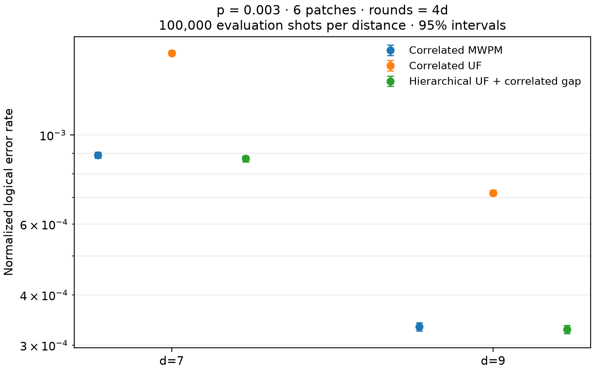

# Three-decoder comparison at d=7/9, p=0.003, 100,000 shots

**Exploratory result:** hierarchical UF with calibrated correlated confidence gaps
slightly outperforms correlated MWPM on these saved evaluation shots, and substantially
outperforms correlated UF. Its normalized LER is **1.95% lower at d=7** and
**1.58% lower at d=9** than correlated MWPM. Both paired 95% intervals favor the
hierarchy, conditional on the fitted calibrators. The normalized-LER reductions
against correlated UF are **45.38%** and **54.27%**, respectively.

**L2 follow-up:** production replay now uses weighted PyMatching MWPM.
Replaying the same records and calibrators gave identical predictions on all
200,000 evaluation shots; see the [backend validation](#mwpm-l2-follow-up).

The hypothesis was that correlated soft information could let patch-local UF
references, combined by the exact parity-constrained outer decoder, recover the
accuracy of joint correlated MWPM. These measurements support that accuracy hypothesis
at the two tested distances and noise strength. They do not establish a decoding
threshold or a latency advantage. Selective refinement remains deferred.



Configuration: SI1000 `p=0.003`, six patches, two ideal yokes, and `rounds=4d`. The hierarchical row is `uf:cluster_gap -> gap_correlated`, `all_refined`, with the mixed exact outer rule.

Evaluation uses all 100,000 saved seed-42 shots at each distance; calibration uses a separate 50,000-shot seed-142 call at that distance. All comparisons use the same evaluation shots within a distance. The two distances are separate sampling calls and are resampled independently; their row numbers are not paired. Intervals use 10,000 empirical whole-shot bootstrap replicates at seed 43; the eight joint decoder-failure states preserve pairing. Calibration is held fixed, so these intervals quantify evaluation-shot uncertainty conditional on the fitted calibrators. Block failure means any of the 12 observables is wrong; normalized LER is Sinter's aggregate conversion of that block rate, not a directly counted per-patch error rate.

## d=7

| Decoder | Failed shots | Block rate (95% CI) | Normalized LER (95% CI) |
|---|---:|---:|---:|
| Correlated MWPM | 13,785 / 100,000 | 0.137850 (0.135700, 0.139980) | 0.0008907859 (0.00087570, 0.00090578) |
| Correlated UF | 23,230 / 100,000 | 0.232300 (0.229690, 0.234940) | 0.0015989989 (0.00157814, 0.00162018) |
| Hierarchical UF + correlated gap | 13,537 / 100,000 | 0.135370 (0.133210, 0.137470) | 0.00087338275 (0.00085827, 0.00088812) |

Paired hierarchical comparisons:

| Baseline | Block-rate difference (95% CI) | Normalized-LER ratio (95% CI) |
|---|---:|---:|
| Correlated MWPM | -0.002480 (-0.003430, -0.001530) | 0.980463 (0.973148, 0.987888) |
| Correlated UF | -0.096930 (-0.099350, -0.094550) | 0.546206 (0.537747, 0.554659) |

Discordant and concordant shot counts:

| Baseline | Baseline succeeds / hierarchy fails | Baseline fails / hierarchy succeeds | Both succeed | Both fail |
|---|---:|---:|---:|---:|
| Correlated MWPM | 1,050 | 1,298 | 85,165 | 12,487 |
| Correlated UF | 3,271 | 12,964 | 73,499 | 10,266 |

## d=9

| Decoder | Failed shots | Block rate (95% CI) | Normalized LER (95% CI) |
|---|---:|---:|---:|
| Correlated MWPM | 6,925 / 100,000 | 0.069250 (0.067670, 0.070850) | 0.00033368442 (0.00032576, 0.00034172) |
| Correlated UF | 14,247 / 100,000 | 0.142470 (0.140270, 0.144660) | 0.00071824925 (0.00070616, 0.00073031) |
| Hierarchical UF + correlated gap | 6,820 / 100,000 | 0.068200 (0.066660, 0.069810) | 0.00032841945 (0.00032071, 0.00033650) |

Paired hierarchical comparisons:

| Baseline | Block-rate difference (95% CI) | Normalized-LER ratio (95% CI) |
|---|---:|---:|
| Correlated MWPM | -0.001050 (-0.001770, -0.000330) | 0.984222 (0.973527, 0.995062) |
| Correlated UF | -0.074270 (-0.076310, -0.072220) | 0.457250 (0.447196, 0.467667) |

Discordant and concordant shot counts:

| Baseline | Baseline succeeds / hierarchy fails | Baseline fails / hierarchy succeeds | Both succeed | Both fail |
|---|---:|---:|---:|---:|
| Correlated MWPM | 627 | 732 | 92,448 | 6,193 |
| Correlated UF | 2,089 | 9,516 | 83,664 | 4,731 |

## Distance scaling

Ratios are d=7 normalized LER divided by d=9 normalized LER, with the two distances bootstrapped independently.

| Decoder | d7 / d9 normalized-LER ratio (95% CI) |
|---|---:|
| Correlated MWPM | 2.669546 (2.593837, 2.749476) |
| Correlated UF | 2.226245 (2.178289, 2.275088) |
| Hierarchical UF + correlated gap | 2.659351 (2.581677, 2.738966) |

## Cost scope

`all_refined` is a cost-unconstrained endpoint, not a selective-refinement policy. The stored work counters count decoder operations rather than elapsed time, and no comparable end-to-end latency benchmark was run, so these results support no latency or speedup claim.

## Definitions and execution

The correlated MWPM and correlated UF rows are the original saved joint-decoder
predictions on the 100,000 evaluation shots at each distance. Their decoder source
hashes and package versions are identical across distances; the historical Git commit
fields alone are insufficient to identify the sources. A fixed 16-shot check at each
distance also reproduced the saved UF and correlated-UF predictions with the current
implementation.

The hierarchy fixes the per-patch UF reference bits, calibrates each patch-sector's
correlated matching gap into its residual-error probability, and refines all six
patches in both sectors. Calibration pools patches separately for each sector in an
isotonic fit. L2 selects the most likely residual pattern satisfying the frame-adjusted
yoke parity, then XORs it with the UF reference. L2 is exact for this factorized
six-bit parity model. The gap computation still uses matching; this is not a
matching-free decoder.

The normalized LER uses the existing comparison convention:
`sinter.shot_error_rate_to_piece_error_rate(block_rate, pieces=6*rounds, values=8)`.
Thus `pieces=168` at d=7 and `216` at d=9. Paired differences in the tables mean
hierarchy minus baseline; paired ratios mean hierarchy divided by baseline.
The multinomial bootstrap over the eight joint failure patterns is distributionally
identical to resampling whole evaluation shots with replacement. Reported intervals
are percentile intervals, with calibration held fixed. The distance ratios summarize
these two points at fixed p; rounds change with distance as specified.

The d=7 evaluation payload was reused byte for byte. Its older bundle layout was
verified and repackaged into the current importer format, preserving the original
circuit/DEM bytes and all four prediction hashes. The separate d=7 calibration call
sampled that exact saved circuit at seed 142. The d=9 50,000-shot calibration and
100,000-shot L1 records were reused. Replaying d=9 reproduced every previous replay
array exactly, and upgrading its baseline audit left `record.npz` unchanged.

Both new d=7 collections passed every graph and record gate: zero value or parity
violations, zero unexplained matching disagreements. The calibration's 4 and
evaluation's 14 joint-MWPM disagreements were cost ties within the required tolerance.
The baseline imports passed the mapped-shot parity and joint-MWPM tie checks at both
distances. The only changed source in the L1 decoder identity relative to saved d=9
was the record loader's provenance validation; numerical decoder sources are unchanged.

Before running, the two M2 review fixes were applied: baseline attachments now bind
mapped predictions and source provenance to a verified digest, and subset comparisons
check floating-point representations bit for bit. The full decoder/hierarchical suite
passed **737 tests, with 1 skipped**. Subsequent additional baseline regressions passed
the complete **45-test** baseline suite.

An independent calculation from the saved prediction arrays matched all six failure
counts and normalized LERs, and both eight-state contingency tables. Analytic
approximations to the paired and distance-ratio intervals agreed with the bootstrap.

## Artifacts and reproduction

Run on September 15, 2026 (America/Los_Angeles; completion September 16 UTC).
Raw shots, L1 records, calibrators, replay arrays, and timing logs remain under
`/data2/s2chitni/.tmp/hier-three-decoders-d7-d9-p003-100k-3MxG5S`.
The reused d=9 calibrator and its source record remain under
`/data2/s2chitni/.tmp/hier-d9-p003-m2`.

- [Machine-readable results and provenance](hierarchical_three_decoder_d7_d9_p003_100k/comparison.json)
- [Standalone plot](hierarchical_three_decoder_d7_d9_p003_100k/comparison.png)
- [Verified reporting script](hierarchical_three_decoder_d7_d9_p003_100k/compare.py)
- [Run-specific legacy adapter](hierarchical_three_decoder_d7_d9_p003_100k/build_d7_adapter.py)
- [Run-specific calibration sampler](hierarchical_three_decoder_d7_d9_p003_100k/generate_calibration.py)
- [d9 reuse verification](hierarchical_three_decoder_d7_d9_p003_100k/d9_reuse_verification.json)
- [Collection and import gates](hierarchical_three_decoder_d7_d9_p003_100k/verification.json)

The run-specific scripts preserve the paths used in this execution. From the
repository root, regenerate the statistical results and plot with:

```bash
RUN="$TMPDIR/hier-three-decoders-d7-d9-p003-100k-3MxG5S"
PYTHONPATH=src PYTHONDONTWRITEBYTECODE=1 MPLCONFIGDIR="$RUN/mpl" \
OPENBLAS_NUM_THREADS=1 .venv/bin/python \
  docs/results/hierarchical_three_decoder_d7_d9_p003_100k/compare.py \
  --d7-root "$RUN/d7" --d9-root "$RUN/d9" \
  --out "$RUN/regenerated-report" --replicates 10000 --seed 43
```

## MWPM L2 follow-up

The production L2 backend now constructs a weighted matching graph separately
for each shot and sector. Probabilities above one half are preflipped, and each
allowed patch has a distinct two-edge path to the boundary with its original
patch fault ID and absolute log-odds weight. Original-weight precision checks
and polynomial canonical tie resolution preserve the earlier `1e-9` tie rule.
The independent enumeration oracle remains in collection validation and tests;
it does not produce the new replay predictions.

Both distances reused the original evaluation records and fitted calibrators
without changing their bytes. New replay identities include the MWPM source,
PyMatching 2.4.0, and the backend/tie convention. The independent validator
compared every final bit, tie flag, sector parity, and MAP log weight:

| Distance | Shots | Changed final bits | Parity violations | Maximum log-weight difference | Failed shots | Normalized LER |
|---|---:|---:|---:|---:|---:|---:|
| 7 | 100,000 | 0 | 0 | 0 | 13,537 | 0.0008733827499732838 |
| 9 | 100,000 | 0 | 0 | 0 | 6,820 | 0.0003284194515928984 |

Tie flags also match exactly. Therefore the earlier paired comparisons and
confidence intervals apply unchanged to the MWPM replay. Neither evaluation
set contains an L2 tie; constructed tests exercise ties, multiple near-half
probabilities, restricted candidates, large patch counts, and an actual
PyMatching weight-quantization case. Randomized checks additionally compared
the backend with enumeration on restricted and near-tie inputs.

Regression validation covered 760 passing tests and one skipped test, including
a focused rerun of all 52 replay tests after updating their injected-decoder
hook to the new backend. Backend source and PyMatching-version changes are
tested to invalidate replay outputs while preserving reusable L1/calibrator
artifacts.

The new replay directories are under
`/data2/s2chitni/.tmp/hier-mwpm-l2-d7-d9-1f0KIx`. These local replays took
6.30 seconds at d=7 and 6.55 seconds at d=9, including verification and I/O;
those times exclude L1 collection and fitting and are not a controlled
end-to-end decoder benchmark.

- [Complete backend comparison](hierarchical_three_decoder_d7_d9_p003_100k/mwpm_l2/comparison.json)
- [Independent validation script](hierarchical_three_decoder_d7_d9_p003_100k/mwpm_l2/validate.py)
- [d7 replay provenance](hierarchical_three_decoder_d7_d9_p003_100k/mwpm_l2/d7_replay_manifest.json)
- [d9 replay provenance](hierarchical_three_decoder_d7_d9_p003_100k/mwpm_l2/d9_replay_manifest.json)
