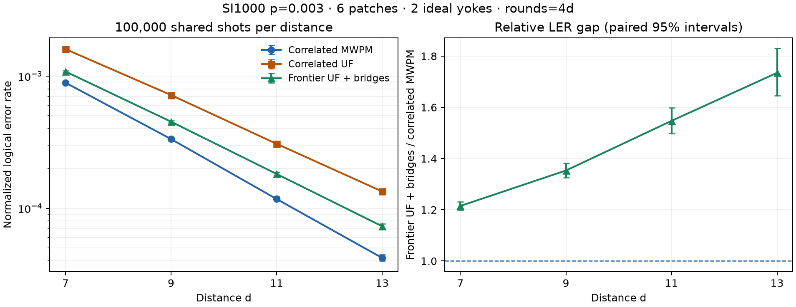

# Frozen frontier UF experiment: distance scaling through d=13

From d=7 to d=13, normalized LER falls by 14.82× for Frontier UF + bridges and 21.16× for correlated MWPM. The Frontier/MWPM LER ratio changes from 1.215 to 1.735.

The d=11 and d=13 runs each use 100,000 newly sampled shots, shared by all decoders at that distance. The d=7/9 results are reused unchanged. SI1000 p=0.003, six patches, two ideal yokes, CZ circuits, and rounds=4d throughout.

The native decoder and all settings are byte-for-byte the prior experiment: unchanged first-pass UF and correlation rules; frontier rates rounded down to powers of two; bridge eligibility at 0.5 nats remaining growth; two rounds of mutually best improving bridges. Neither truth nor MWPM predictions enter UF decoding. The new distances were evaluated without outcome-based parameter changes.

## LER and the remaining gap

Normalized LER uses `sinter.shot_error_rate_to_piece_error_rate(failures/100000, pieces=24*d, values=8)`, the same convention as the prior results. It is a normalization of whole-shot failure probability; raw counts below avoid relying on the normalization to assess the trend.

| d | Rounds | Correlated MWPM | Correlated UF | Frontier UF + bridges | Frontier/MWPM (95% paired CI) | Excess over MWPM |
|---:|---:|---:|---:|---:|---:|---:|
| 7 | 28 | 0.000890786 | 0.001598999 | 0.001082300 | 1.215 [1.199, 1.232] | 21.5% |
| 9 | 36 | 0.000333684 | 0.000718249 | 0.000451591 | 1.353 [1.325, 1.382] | 35.3% |
| 11 | 44 | 0.000117431 | 0.000307229 | 0.000181684 | 1.547 [1.497, 1.598] | 54.7% |
| 13 | 52 | 0.000042103 | 0.000133952 | 0.000073040 | 1.735 [1.645, 1.830] | 73.5% |

A suppression factor above one means LER fell when distance increased. The relative gap and absolute gap answer different questions:

| Distance step | MWPM suppression | UF suppression | Frontier + bridges suppression | Change in Frontier/MWPM ratio | Change in absolute LER gap |
|---|---:|---:|---:|---:|---:|
| 7 → 9 | 2.670× | 2.226× | 2.397× | +11.4% | -38.4% |
| 9 → 11 | 2.842× | 2.338× | 2.486× | +14.3% | -45.5% |
| 11 → 13 | 2.789× | 2.294× | 2.487× | +12.1% | -51.9% |

## All decoder variants

Each cell is whole-shot failures out of 100,000, followed by normalized LER. A shot fails if any of its 12 predicted observable bits differs from the sampled truth.

| Decoder | d=7 | d=9 | d=11 | d=13 |
|---|---:|---:|---:|---:|
| Correlated MWPM | 13,785; 0.000890786 | 6,925; 0.000333684 | 3,047; 0.000117431 | 1,304; 0.000042103 |
| Correlated UF | 23,230; 0.001598999 | 14,247; 0.000718249 | 7,754; 0.000307229 | 4,083; 0.000133952 |
| UF + forest-cost control | 23,230; 0.001598999 | 14,247; 0.000718249 | 7,754; 0.000307229 | 4,083; 0.000133952 |
| UF + bridges | 21,065; 0.001428312 | 12,776; 0.000638098 | 6,856; 0.000270192 | 3,562; 0.000116507 |
| Frontier UF | 17,263; 0.001140948 | 9,820; 0.000481532 | 5,015; 0.000195500 | 2,452; 0.000079690 |
| Frontier UF + forest-cost control | 17,263; 0.001140948 | 9,820; 0.000481532 | 5,015; 0.000195500 | 2,452; 0.000079690 |
| Frontier UF + bridges | 16,462; 0.001082300 | 9,242; 0.000451591 | 4,670; 0.000181684 | 2,250; 0.000073040 |

## Paired effect of the combined algorithm

| d | LER reduction from correlated UF | Original UF–MWPM LER gap closed | Repairs / regressions vs UF | Additional repairs / regressions vs frontier alone |
|---:|---:|---:|---:|---:|
| 7 | 32.3% | 73.0% | 9,271 / 2,503 | 1,697 / 896 |
| 9 | 37.1% | 69.3% | 6,615 / 1,610 | 1,113 / 535 |
| 11 | 40.9% | 66.1% | 4,031 / 947 | 641 / 296 |
| 13 | 45.5% | 66.3% | 2,336 / 503 | 340 / 138 |

## Algorithmic work at the new distances

These are second-pass algorithmic counters, not hardware cycles or FPGA latency. The event simulator uses floating-point weights and a heap. Tree message counts cover only the min-sum/traceback stage; they exclude growth and arbitration communication.

| d | Growth | Mean epochs | Mean edge evaluations | Mean frontier visits | Mean largest cluster | Mean bridges | p99 final tree depth |
|---:|---|---:|---:|---:|---:|---:|---:|
| 11 | Original UF | 549.2 | 331,480 | 989,039 | 790.3 | 2.11 | 40 |
| 11 | Frontier UF | 697.8 | 324,649 | 401,333 | 323.3 | 1.95 | 39 |
| 13 | Original UF | 772.5 | 567,131 | 1,978,934 | 1187.5 | 3.04 | 46 |
| 13 | Frontier UF | 1008.2 | 556,749 | 693,362 | 436.5 | 2.83 | 45 |

## Validation and limits

The current generator reproduces the earlier d=9 circuit and detector-error-model hashes. New samples retain exact circuit, model, packed data and version identities. Every new UF correction passes full-syndrome validation: 1,200,000 checks across six variants and two distances. All seven outputs also pass the ideal-yoke parity checks.

At each new distance, 32 predetermined random shots pass native/Python first-pass physical-edge and correlated-UF final-forest/correction comparisons. Four tree-cost outputs per shot agree with the independent Python forest solver. Two shots per distance additionally agree with an independent full-edge scan of frontier growth. Native outputs agree bit-for-bit between one and 64 threads; the same 32 MWPM predictions agree between serial unpacked and parallel packed inputs. The new 100k native baselines are not independently decoded in full by Python. The frozen kernel previously matched all 200k saved d=7/9 baseline predictions and passed its exhaustive small-graph checks.

Intervals are exploratory and unadjusted for multiple comparisons. The ratio intervals resample paired decoder outcomes, preserving their dependence. Earlier d=7/9 samples informed algorithm development; d=11/13 use fresh samples with the algorithm frozen. Four distances at one p and rounds=4d describe this finite-distance trend, not an asymptotic scaling law or a threshold estimate.

[Reproduction instructions](parallel_uf_clustering_d11_d13_p003_100k/README.md). [Full scaling statistics](parallel_uf_clustering_d11_d13_p003_100k/scaling.json).
