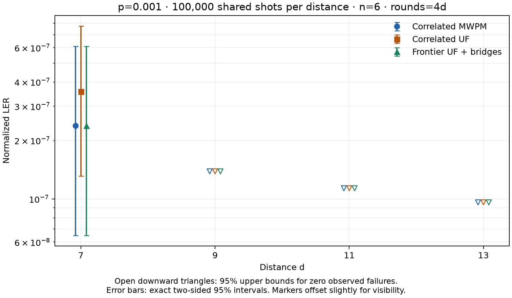

# Frozen UF clustering comparison at p=0.001

The observed relative LER gaps cannot be calculated at d=9, 11, 13: MWPM has zero failures in those 100,000-shot samples. The small counts at the other distances also limit precision. These runs do not establish that the decoders have equal true LER or that the p=0.003 gap has disappeared.

100,000 new shots at each of d=7,9,11,13, shared by every decoder at that distance. SI1000 p=0.001, n=6 patches, two ideal yokes, CZ circuits, rounds=4d. Seed 42 and one full packed Stim sampling call per distance. Decoder rules are unchanged from p=0.003; the model and correlation weights are rebuilt at the new physical noise probability.

## Failure counts and relative gaps

Relative gap is `(LER_decoder / LER_correlated_MWPM - 1) * 100%`, using the previous normalization. A zero MWPM count makes the observed ratio undefined. Equal zero counts do not establish equal true error rates.

| d | MWPM failures | Correlated UF failures | Frontier + bridges failures | UF gap vs MWPM | Frontier + bridges gap vs MWPM |
|---:|---:|---:|---:|---:|---:|
| 7 | 4 | 6 | 4 | +50.0% | +0.0% |
| 9 | 0 | 0 | 0 | N/A (zero MWPM failures) | N/A (zero MWPM failures) |
| 11 | 0 | 0 | 0 | N/A (zero MWPM failures) | N/A (zero MWPM failures) |
| 13 | 0 | 0 | 0 | N/A (zero MWPM failures) | N/A (zero MWPM failures) |

## Normalized LER and uncertainty

The normalization is `sinter.shot_error_rate_to_piece_error_rate(failures/100000, pieces=24*d, values=8)`. Intervals below are exact binomial intervals transformed through this monotone normalization. For zero failures, `< bound` denotes a one-sided 95% upper confidence bound, not a measured nonzero LER.

| d | Decoder | Observed normalized LER | Exact 95% interval or zero-count upper bound |
|---:|---|---:|---:|
| 7 | Correlated MWPM | 2.3810e-07 | [6.4874e-08, 6.0963e-07] |
| 7 | Correlated UF | 3.5715e-07 | [1.3107e-07, 7.7738e-07] |
| 7 | Frontier UF + bridges | 2.3810e-07 | [6.4874e-08, 6.0963e-07] |
| 9 | Correlated MWPM | 0.0000e+00 | < 1.3869e-07 (one-sided) |
| 9 | Correlated UF | 0.0000e+00 | < 1.3869e-07 (one-sided) |
| 9 | Frontier UF + bridges | 0.0000e+00 | < 1.3869e-07 (one-sided) |
| 11 | Correlated MWPM | 0.0000e+00 | < 1.1347e-07 (one-sided) |
| 11 | Correlated UF | 0.0000e+00 | < 1.1347e-07 (one-sided) |
| 11 | Frontier UF + bridges | 0.0000e+00 | < 1.1347e-07 (one-sided) |
| 13 | Correlated MWPM | 0.0000e+00 | < 9.6017e-08 (one-sided) |
| 13 | Correlated UF | 0.0000e+00 | < 9.6017e-08 (one-sided) |
| 13 | Frontier UF + bridges | 0.0000e+00 | < 9.6017e-08 (one-sided) |

Zero failures in 100,000 shots gives the same whole-shot 95% upper bound of 2.99569e-05 at every distance. Differences between normalized zero-count bounds are due to the rounds normalization; they do not measure distance suppression.

## Uncertainty in comparisons with MWPM

The ratio bounds conservatively combine two exact 97.5% marginal intervals, giving at least 95% simultaneous coverage by Bonferroni regardless of pairing. They are deliberately not a bootstrap that would treat an observed zero count as a known zero probability. Exact McNemar tests use only discordant paired outcomes. These are exploratory comparisons without multiplicity adjustment across distances and decoders.

| d | Decoder | LER-ratio 95% conservative interval | MWPM failures repaired | MWPM successes spoiled | Exact McNemar p |
|---:|---|---:|---:|---:|---:|
| 7 | Correlated UF | [0.166, 16.147] | 1 | 3 | 0.625 |
| 7 | Frontier UF + bridges | [0.078, 12.815] | 0 | 0 | 1 |
| 9 | Correlated UF | [0.000, unbounded] | 0 | 0 | 1 |
| 9 | Frontier UF + bridges | [0.000, unbounded] | 0 | 0 | 1 |
| 11 | Correlated UF | [0.000, unbounded] | 0 | 0 | 1 |
| 11 | Frontier UF + bridges | [0.000, unbounded] | 0 | 0 | 1 |
| 13 | Correlated UF | [0.000, unbounded] | 0 | 0 | 1 |
| 13 | Frontier UF + bridges | [0.000, unbounded] | 0 | 0 | 1 |

## All six UF variants

| Decoder | d=7 failures | d=9 failures | d=11 failures | d=13 failures |
|---|---:|---:|---:|---:|
| Correlated UF | 6 | 0 | 0 | 0 |
| UF + forest-cost control | 6 | 0 | 0 | 0 |
| UF + bridges | 4 | 0 | 0 | 0 |
| Frontier UF | 5 | 0 | 0 | 0 |
| Frontier UF + forest-cost control | 5 | 0 | 0 | 0 |
| Frontier UF + bridges | 4 | 0 | 0 | 0 |

## Validation and reproducibility

The original native kernel, growth rule, 0.5-nat bridge eligibility cap, two bridge rounds and first-pass UF correlation rules are frozen. No truth or MWPM output enters UF inference. Source hashes, full sample identities, per-shot predictions and operation counters are retained. The experiment makes no hardware timing or resource claims.

All 2,400,000 new UF corrections pass full-syndrome validation; all seven outputs pass yoke parity. At each distance, 32 predetermined random rows agree with production Python physical corrections and independent tree costs; two rows also match a full-edge frontier-growth scan. Native outputs agree between one and 64 threads, and MWPM agrees between packed parallel and unpacked serial decoding.

All 8 rows where any decoder failed were then independently rechecked against Python, including full-edge scans, and exactly reproduced the saved results. This outcome-selected validation changes neither decoder settings nor predictions. The failure-audit manifest records the exact rows and input hashes.

The archived `summary.json` files retain the legacy summary format for reproducibility. The small-count conclusions and intervals in this report use `analysis.json` and the exact procedures above, not the legacy normal intervals on paired changes.

[Reproduction instructions](parallel_uf_clustering_p001_100k/README.md). [Exact statistics](parallel_uf_clustering_p001_100k/analysis.json). [Failure-case validation](parallel_uf_clustering_p001_100k/failure_audit.json).
