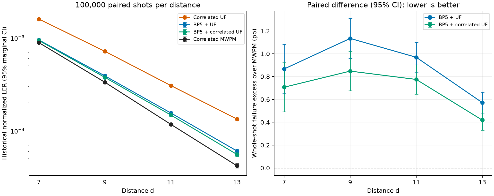

# BP5 improves UF, but correlated MWPM retains an accuracy advantage

Completed **100,000 paired shots at each of d=7,9,11,13**. BP5 followed by
correlated UF reduces whole-shot failures by **37.6–57.8%** relative to
current correlated UF. Correlated MWPM still has fewer failures at every
distance, with a statistically clear paired advantage. The relative gap to
MWPM increases across these four distances.

Settings are unchanged from the pilot: SI1000 p=0.003, six patches, two
ideal yokes, CZ circuits, and rounds=4d. These are the complete historical
100,000-shot parent samples, including the 5,000 previously tested BP rows.
The other 95,000 rows are also reported separately and show the same
accuracy ordering. No decoder parameters were tuned during this extension.

## Decoder composition

The original pilot's **BP5 + UF** uses five damped sum-product BP iterations
on joint DEM fault variables, projects the resulting evidence into the
original graph's weights, and runs UF once.

The additional **BP5 + correlated UF** variant first runs that same
BP-weighted UF. Its selected correction edges trigger the repository's
existing prior-derived correlation discounts, taking the minimum of each
target's BP weight and the implied weight. A second unchanged UF pass on
the original syndrome supplies the complete correction. Both variants
retain every original graph edge and detector. The additional discounts
are a heuristic that can double-count evidence already used by BP.

## Whole-shot failures

Every count is out of **100,000 shots**. A failure means that at least one
of the 12 predicted logical observables differs from truth. Ratios below
compare raw whole-shot failure rates.

| d | Current correlated UF | BP5 + UF | BP5 + correlated UF | Correlated MWPM | BP5+cUF / MWPM |
|---:|---:|---:|---:|---:|---:|
| 7 | 23,230 | 14,652 | 14,492 | 13,785 | 1.051 |
| 9 | 14,247 | 8,059 | 7,773 | 6,925 | 1.122 |
| 11 | 7,754 | 4,016 | 3,822 | 3,047 | 1.254 |
| 13 | 4,083 | 1,876 | 1,723 | 1,304 | 1.321 |

The extra correlation pass reduces BP5 + UF's failure count by **1.1%,
3.5%, 4.8%, and 8.2%**, respectively. Its paired McNemar p-values are
0.0111, 4.78e-8, 3.10e-6, and 8.06e-7. These tests are exploratory and
not adjusted for multiple comparisons.

BP5 + correlated UF has **5.1%, 12.2%, 25.4%, and 32.1% more failures than
correlated MWPM**, respectively. The paired absolute differences are:

| d | Excess whole-shot failure rate over MWPM, percentage points (95% CI) |
|---:|---:|
| 7 | 0.707 [0.492, 0.922] |
| 9 | 0.848 [0.676, 1.020] |
| 11 | 0.775 [0.647, 0.903] |
| 13 | 0.419 [0.330, 0.508] |

All four paired McNemar p-values against MWPM are below 1.3e-10. Absolute
failure rates fall with distance for all decoders, while the relative gap
between the BP variants and MWPM increases. One noise strength and four
finite distances do not establish an asymptotic threshold or suppression
law.

The result supports supplying UF with richer syndrome-dependent evidence.
It also shows a residual accuracy gap that this evidence layer and the
existing correlation pass do not remove. These are joint-decoder results
with ideal yokes, not a separate L1/L2 hierarchy experiment.

## Verification and saved artifacts

All **800,000 new UF corrections** pass complete-syndrome and ideal-yoke
checks. All **400,000 recomputed correlated-MWPM predictions** reproduce
the archived predictions on identical sample payloads. Current correlated
UF uses those verified samples' archived predictions, with predetermined
rows recomputed during validation. All **20,000 overlapping BP5
predictions and non-timing diagnostics** reproduce the pilot exactly.
Independent checks cover BP posteriors, physical correction edges, merge
forests, the additional correlation pass, and thread invariance.

The [detailed report](uf_evidence_predecoder_100k_d7_d13/report.md) includes
paired repairs/regressions, all marginal confidence intervals, historical
normalized LERs, the 95,000 non-pilot rows, and serial kernel timings.
The [fixed protocol and reproduction commands](uf_evidence_predecoder_100k_d7_d13/README.md)
define both decoder compositions and the data provenance. Per-shot arrays,
source and input hashes, verification records, and an artifact manifest
are retained in that directory. Scratch samples, builds, and checkpoints
remain under `$TMPDIR`.

Production decoder code and the original pilot are unchanged. Timing
measurements are software kernel measurements, not FPGA/ASIC performance.
