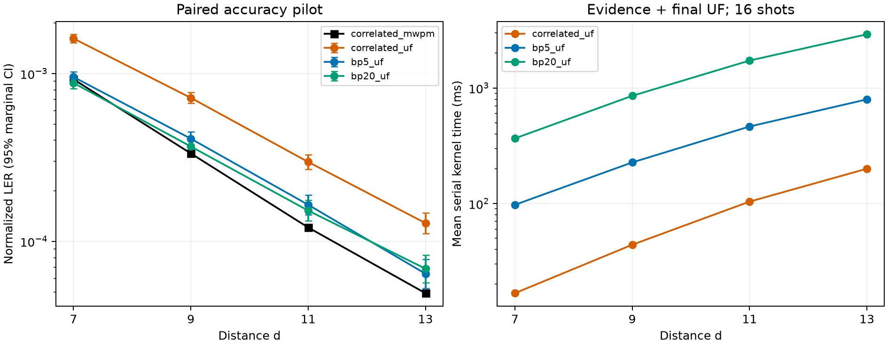

# Soft evidence before unchanged UF

This paired pilot changes the evidence supplied to UF while preserving its growth, stopping, and peeling rules. It uses SI1000 p=0.003, six patches, two ideal yokes, CZ circuits, and rounds=4d.

The BP variants run 5 or 20 fixed damped sum-product iterations over joint DEM fault mechanisms, then supply nonnegative weights to UF. No syndrome or graph pruning occurs, and BP never returns the final correction. Prior projection applies the same weight convention without syndrome evidence.

## Paired failure counts

| d | Shots | Plain UF | Correlated UF | Prior projection | BP5 + UF | BP20 + UF | Correlated MWPM |
|---:|---:|---:|---:|---:|---:|---:|---:|
| 7 | 5,000 | 2,335 | 1,173 | 2,334 | 734 | 681 | 713 |
| 9 | 5,000 | 2,027 | 711 | 2,027 | 421 | 380 | 347 |
| 11 | 5,000 | 1,584 | 376 | 1,588 | 213 | 197 | 157 |
| 13 | 5,000 | 1,256 | 196 | 1,256 | 99 | 106 | 76 |

## Evidence effect relative to current correlated UF

Positive reduction means fewer whole-shot failures. Intervals preserve the paired shot comparison. Both budgets were specified before evaluation.

| d | Evidence | Repairs | Regressions | Failure-rate reduction, percentage points (95% CI) |
|---:|---|---:|---:|---:|
| 7 | bp5_uf | 632 | 193 | 8.78 [7.68, 9.88] |
| 7 | bp20_uf | 710 | 218 | 9.84 [8.68, 11.00] |
| 9 | bp5_uf | 427 | 137 | 5.80 [4.88, 6.72] |
| 9 | bp20_uf | 505 | 174 | 6.62 [5.62, 7.62] |
| 11 | bp5_uf | 250 | 87 | 3.26 [2.55, 3.97] |
| 11 | bp20_uf | 288 | 109 | 3.58 [2.81, 4.35] |
| 13 | bp5_uf | 150 | 53 | 1.94 [1.38, 2.50] |
| 13 | bp20_uf | 156 | 66 | 1.80 [1.22, 2.38] |

## Evidence effect relative to the prior-projection control

| d | Evidence | Repairs | Regressions | Failure-rate reduction, percentage points (95% CI) |
|---:|---|---:|---:|---:|
| 7 | bp5_uf | 1703 | 103 | 32.00 [30.59, 33.41] |
| 7 | bp20_uf | 1816 | 163 | 33.06 [31.58, 34.54] |
| 9 | bp5_uf | 1669 | 63 | 32.12 [30.75, 33.49] |
| 9 | bp20_uf | 1767 | 120 | 32.94 [31.50, 34.38] |
| 11 | bp5_uf | 1421 | 46 | 27.50 [26.21, 28.79] |
| 11 | bp20_uf | 1459 | 68 | 27.82 [26.50, 29.14] |
| 13 | bp5_uf | 1185 | 28 | 23.14 [21.93, 24.35] |
| 13 | bp20_uf | 1196 | 46 | 23.00 [21.77, 24.23] |

## Normalized LER and distance trend

Normalization is `sinter.shot_error_rate_to_piece_error_rate(failures/shots, pieces=24*d, values=8)`, matching the earlier reports. This finite-distance pilot is not a threshold or asymptotic scaling measurement.

| d | Correlated UF | BP5 + UF | BP20 + UF | Correlated MWPM | BP5/MWPM | BP20/MWPM |
|---:|---:|---:|---:|---:|---:|---:|
| 7 | 0.00161745 | 0.0009540624 | 0.0008792009 | 0.000924276 | 1.032 | 0.951 |
| 9 | 0.0007167642 | 0.0004093788 | 0.0003676906 | 0.0003344371 | 1.224 | 1.099 |
| 11 | 0.0002975394 | 0.0001653373 | 0.0001526334 | 0.0001210805 | 1.366 | 1.261 |
| 13 | 0.0001284826 | 6.417623e-05 | 6.876888e-05 | 4.913773e-05 | 1.306 | 1.400 |

## Conditional logical-accessibility diagnostic

At each distance, uniformly select up to 32 pilot shots on which correlated UF fails and correlated MWPM succeeds. These are conditional diagnostics, not full-population rates. Restore every original edge internal to each final UF component and test whether the true logical class is reachable.

| d | Variant | Correct / diagnostic shots | Partition admits truth | Remaining failures excluding truth |
|---:|---|---:|---:|---:|
| 7 | correlated_uf | 0 / 32 | 0 / 32 | 32 |
| 7 | bp5_uf | 24 / 32 | 24 / 32 | 8 |
| 7 | bp20_uf | 30 / 32 | 30 / 32 | 2 |
| 9 | correlated_uf | 0 / 32 | 0 / 32 | 32 |
| 9 | bp5_uf | 25 / 32 | 25 / 32 | 7 |
| 9 | bp20_uf | 29 / 32 | 29 / 32 | 3 |
| 11 | correlated_uf | 0 / 32 | 0 / 32 | 32 |
| 11 | bp5_uf | 24 / 32 | 24 / 32 | 8 |
| 11 | bp20_uf | 25 / 32 | 25 / 32 | 7 |
| 13 | correlated_uf | 0 / 32 | 0 / 32 | 32 |
| 13 | bp5_uf | 25 / 32 | 25 / 32 | 7 |
| 13 | bp20_uf | 26 / 32 | 26 / 32 | 6 |

## Software preprocessing cost

Means over 16 predetermined serial shots per distance, measured inside the native kernel. Correlated-UF evidence time includes its first UF solve and reweighting; BP evidence time includes initialization, all message iterations and projection. The common model setup, Python orchestration, packing and post-solve syndrome audit are excluded. Shared BP work is charged in full to each budget. These small samples are not a tail-latency study or a hardware benchmark.

| d | Variant | Evidence ms | Final UF ms | Total ms |
|---:|---|---:|---:|---:|
| 7 | plain_uf | 0.000 | 8.255 | 8.255 |
| 7 | correlated_uf | 8.350 | 8.415 | 16.766 |
| 7 | prior_projection_uf | 0.000 | 8.282 | 8.282 |
| 7 | bp5_uf | 88.911 | 8.659 | 97.571 |
| 7 | bp20_uf | 358.389 | 7.895 | 366.285 |
| 9 | plain_uf | 0.000 | 23.495 | 23.495 |
| 9 | correlated_uf | 23.654 | 20.375 | 44.029 |
| 9 | prior_projection_uf | 0.000 | 24.680 | 24.680 |
| 9 | bp5_uf | 206.612 | 20.382 | 226.994 |
| 9 | bp20_uf | 836.310 | 19.139 | 855.449 |
| 11 | plain_uf | 0.000 | 53.176 | 53.176 |
| 11 | correlated_uf | 54.405 | 49.549 | 103.954 |
| 11 | prior_projection_uf | 0.000 | 53.983 | 53.983 |
| 11 | bp5_uf | 414.575 | 49.729 | 464.304 |
| 11 | bp20_uf | 1674.711 | 52.273 | 1726.983 |
| 13 | plain_uf | 0.000 | 113.081 | 113.081 |
| 13 | correlated_uf | 116.133 | 84.109 | 200.242 |
| 13 | prior_projection_uf | 0.000 | 119.041 | 119.041 |
| 13 | bp5_uf | 701.892 | 94.653 | 796.545 |
| 13 | bp20_uf | 2831.851 | 83.619 | 2915.470 |

## Validation and limits

The complete historical 100,000-shot sampling calls were regenerated and their packed payload hashes verified; model text matches exactly or differs only by one explicitly verified trailing newline. Pilot rows were selected uniformly by a fixed seed before outcomes, and archived truth matches the reproduced sample on all parent rows. These are historical evaluation shots, not a fresh independent confirmation set.

Every pilot correlated-UF prediction reproduces its saved baseline. Every new correction satisfies the full syndrome and every prediction satisfies the two ideal-yoke parities. Four predetermined real shots per distance compare all five physical forests and corrections with production Python UF, compare BP posteriors with an independent implementation, and reproduce correlated MWPM. Native outputs and physical corrections agree across thread counts. Synthetic checks include exact acyclic posteriors, zero messages, high-degree checks and correlated detector cancellations.

BP estimates on this loopy graph and the projection into edge weights are approximations. Improvements or regressions test this particular evidence layer and budget; they do not establish that all soft evidence helps or fails. This joint-decoder experiment also does not measure a separate L1/L2 hierarchy or confidence calibration. Intervals are exploratory, without multiplicity adjustment.

See the [protocol and reproduction instructions](README.md), the per-distance `request.json`, `verification.json`, `summary.json`, `diagnostic.json`, and `results.npz`. Source and artifact hashes are in `artifact_manifest.json`.
