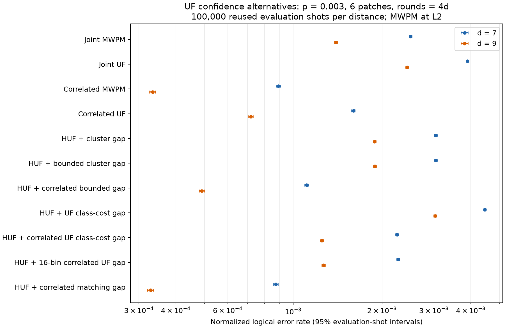

# UF confidence alternatives at d=7/9

**The strongest new candidate is a correlation-reweighted UF pass followed by a
bounded cluster gap.** Keeping the original UF L1 reference and MWPM at L2, it
reduces normalized LER relative to correlated UF by **30.55% at d=7** and
**31.80% at d=9**. Its LER remains **24.67% and 46.80% higher than correlated
MWPM**, respectively. The forced UF class-cost estimators perform substantially
worse.

This establishes an accuracy improvement over correlated UF for this setup.
**Cheaper hardware cost remains a hypothesis:** the new methods reuse UF
primitives, but their current Python implementations are slower than the
matching-based confidence implementation. No FPGA latency, area or power result
is claimed.

Configuration: SI1000 `p=0.003`, six patches, two ideal yokes, `d=7,9`, and
`rounds=4d`. Each distance uses the same **100,000 saved evaluation shots, seed
42**, and a separate **50,000-shot calibration sample, seed 142**. No new samples
were drawn. Every hierarchical row fixes the same original per-patch UF reference
bits; only confidence changes. L2 remains weighted PyMatching MWPM.

## All results

Every failure-count denominator is 100,000. HUF denotes the hierarchy with a fixed
plain-UF L1 reference and MWPM at L2. The final row is the previous expensive
matching-confidence endpoint, reused as an accuracy control.

| Decoder | d=7 failures | d=7 normalized LER | d=9 failures | d=9 normalized LER |
|---|---:|---:|---:|---:|
| Joint MWPM | 33,565 | 0.0024962756 | 25,660 | 0.0013981056 |
| Joint UF | 46,684 | 0.0038949057 | 39,847 | 0.0024296721 |
| Correlated MWPM | 13,785 | 0.0008907859 | 6,925 | 0.00033368442 |
| Correlated UF | 23,230 | 0.0015989989 | 14,247 | 0.00071824925 |
| HUF + cluster gap | 39,068 | 0.0030410356 | 32,809 | 0.0018870313 |
| HUF + bounded cluster gap | 39,091 | 0.0030434281 | 32,856 | 0.0018904377 |
| **HUF + correlated bounded gap** | **16,849** | **0.0011105562** | **9,980** | **0.00048985761** |
| HUF + UF class-cost gap | 51,124 | 0.0044595547 | 46,626 | 0.0030253854 |
| HUF + correlated UF class-cost gap | 30,867 | 0.0022475596 | 23,320 | 0.0012495266 |
| HUF + 16-bin correlated UF gap | 31,076 | 0.0022664310 | 23,608 | 0.0012675351 |
| HUF + correlated matching gap | 13,537 | 0.00087338275 | 6,820 | 0.00032841945 |



For the best new candidate:

| Distance | Normalized LER (95% CI) | LER ratio to correlated UF (paired 95% CI) |
|---|---:|---:|
| 7 | 0.00111056 (0.00109353, 0.00112735) | 0.69453 (0.68595, 0.70340) |
| 9 | 0.000489858 (0.000480024, 0.000499401) | 0.68202 (0.67086, 0.69292) |

Its normalized LER falls by a factor of **2.267** from d=7 to d=9. Its raw block
failure rate also falls, from **16.849% to 9.980%**. These are two distances at one
noise strength, rather than a threshold measurement.

[Full uncertainty tables](uf_soft_confidence_d7_d9_p003_100k/tables.md) include
every method and its paired comparison with correlated UF.

## What the successful candidate does

1. Decode each patch with plain UF and retain its reference bits and selected edges.
2. Apply the existing DEM correlation discounts using that UF correction.
3. Decode the original local syndrome with UF under the adjusted weights.
4. Compute each sector's cluster gap from this second UF growth state, stopping
   the shortest-path search at `ln(100)` nats, or 20 dB.
5. Give the score a positive sign when the second UF prediction agrees with the
   original reference and a negative sign when it disagrees.
6. Convert the score to the probability that the **original UF bit** was wrong,
   using calibration-only isotonic fits. Pass these probabilities to MWPM at L2.

There are two UF passes and two bounded searches per patch. The second UF
prediction supplies confidence evidence; the stored original reference remains
unchanged. No measured yoke bit is supplied to L1. All patches receive the chosen
estimator; selective refinement remains deferred.

The confidence improvement also appears in sectors with exactly one residual
error in the original UF reference:

| Confidence | d=7 remaining failures / eligible sectors | d=9 remaining failures / eligible sectors |
|---|---:|---:|
| Original cluster gap | 25,972 / 66,930 (38.80%) | 22,179 / 61,295 (36.18%) |
| Correlated bounded gap | 8,744 / 66,930 (13.06%) | 5,229 / 61,295 (8.53%) |
| Correlated matching gap | 6,804 / 66,930 (10.17%) | 3,462 / 61,295 (5.65%) |

The forced-class alternative estimates each logical class's correction cost with
UF, then subtracts the two costs. Unlike matching costs, those are suboptimal
correction costs. The poor results show that their difference is a weak
confidence estimator here, even after calibration. Binning that estimator into a
16-entry lookup table adds a modest further loss; it does not address the weak
underlying score. This does not test quantization of the successful bounded-gap
method.

The new correlated estimators condition weights on **UF's** first correction;
the previous correlated matching gap conditions on **MWPM's** first correction.
Their accuracy difference therefore includes both the conditioning correction
and the confidence estimator. The experiment does not isolate those two effects.

## Measured work and software cost

For the plain cluster-gap ablation, the bounded search settles **26.26% fewer
states at d=7** and **30.89% fewer at d=9** than the unbounded search. It adds
23 and 47 failed shots, respectively. This is a modest work saving at this noise
strength, not an order-of-magnitude reduction.

The separate software benchmark uses 32 calibration shots across all six patches
(192 patch instances per distance). It times CPU consumption with
`time.process_time`, excludes one-time graph setup and calibration, and runs
the minimum confidence path required by each method. The matching path uses
one unforced conditioning solve and four forced solves, excluding the extra
plain-gap and validation work of the historical collector.

| Confidence calculation | Total UF passes including reference | Incremental CPU ms/patch, d=7 | Incremental CPU ms/patch, d=9 |
|---|---:|---:|---:|
| UF class-cost gap | 3 | 27.54 | 71.83 |
| Correlated UF class-cost gap | 3 | 38.25 | 104.48 |
| Correlated bounded cluster gap | 2 | 27.30 | 71.55 |
| Correlated matching gap | 1, plus matching solves | 8.97 | 22.77 |

The common reference UF pass costs an additional 7.76 ms/patch at d=7 and
20.97 ms/patch at d=9. These are Python/C++ software measurements on an AMD EPYC
9374F system, Python 3.14.5, while parallel collection was active. They are not
isolated latency or hardware-throughput measurements. The complete experiment
collector shares work across candidates and performs six UF passes per patch;
its wall time is not the runtime of any one deployed candidate.

All 600,000 evaluation patch instances at each distance triggered correlation
reweighting. The new L1 confidence collection made **zero matching solves**.
Graph import still uses PyMatching for graph export, and L2 explicitly uses MWPM.

## Hardware direction

The evidence favors pursuing **correlation-reweighted UF with growth-based
confidence**. A useful next experiment is to replace the bounded shortest-path
search with bounded extra-cluster growth and recalibrate its score. That approach
is intended to reuse UF growth hardware; the present implementation uses bounded
Dijkstra and does not establish the extra-growth method's LER.
[Extra-cluster-growth paper](https://arxiv.org/abs/2602.03336)

Then test fixed-point edge arithmetic and a small confidence ROM on that
stronger estimator. The existing 16-bin experiment quantizes only the forced UF
class-cost score. ROM outputs and UF arithmetic remain floating point in this
run. Hardware validation should measure cycles, tail latency, memory traffic and
area, including the extra UF pass. Forced-class decoding also introduces check
hubs of degree 116 at d=7 and 185 at d=9, which weakens its hardware-locality case.

[Helios](https://arxiv.org/abs/2406.08491) demonstrates practical FPGA UF
decoding, but does not benchmark this confidence pipeline. A second research
direction is a fixed small number of min-sum BP iterations feeding weighted UF,
following [belief-find](https://arxiv.org/abs/2203.04948). Its message memory and
update cost would need a separate measurement.

## Statistics and verification

Block failure means any of the 12 predicted observable bits is wrong. Normalized
LER uses the existing convention:
`sinter.shot_error_rate_to_piece_error_rate(block_rate, pieces=6*rounds, values=8)`.
It is an aggregate conversion, not a directly counted per-patch event rate.

Each estimator has separate X/Z decreasing isotonic maps, pooling six patches
on calibration shots only, with probabilities clipped to `[1e-6, 1-1e-6]`.
Probabilities above one half are allowed. Intervals use 10,000 whole-shot paired
bootstrap replicates, seed 43, compressed to observed joint failure patterns.
Calibration is held fixed. These reused, previously examined evaluation samples
support an exploratory comparison, not a new confirmation experiment.

Verification completed:

- All 300,000 calibration/evaluation rows passed fresh-UF-reference and bounded
  plain-gap checks against the saved records.
- All reported counts and normalized LERs were independently recomputed from
  predictions. Artifact, input and analysis-source hashes passed verification.
- The correlated matching-gap control reproduced all previous final prediction
  bits at both distances; the saved joint baselines were reused unchanged.
- Every final hierarchical prediction satisfied the two yoke parities.
- **770 decoder/hierarchical tests passed; one existing test was skipped.** One
  parallel test needed a rerun with its local multiprocessing socket permitted.
  The two analysis tests also passed after the final ROM/diagnostic additions.
- The generated plot was visually checked and `git diff --check` passed.

## Artifacts and reproduction

The [experiment protocol and CLI](../uf_soft_confidence_experiment.md) describes
the algorithms and collection commands. Raw checkpoints, features, predictions,
probabilities, source snapshots and logs are retained under:

`/data2/s2chitni/.tmp/uf-soft-d7-d9-100k-QV55RQ`

- [Complete results and provenance](uf_soft_confidence_d7_d9_p003_100k/comparison.json)
- [Full uncertainty tables](uf_soft_confidence_d7_d9_p003_100k/tables.md)
- [Plot PNG](uf_soft_confidence_d7_d9_p003_100k/comparison.png) / [SVG](uf_soft_confidence_d7_d9_p003_100k/comparison.svg)
- [Independent verification](uf_soft_confidence_d7_d9_p003_100k/verification.json)
- [Collection driver](uf_soft_confidence_d7_d9_p003_100k/run.py)
- [Reporting and verification script](uf_soft_confidence_d7_d9_p003_100k/report.py)
- [Software benchmark script](uf_soft_confidence_d7_d9_p003_100k/benchmark.py), [measurements](uf_soft_confidence_d7_d9_p003_100k/benchmark.json), [environment](uf_soft_confidence_d7_d9_p003_100k/benchmark_environment.json)
- [d=7 calibrators](uf_soft_confidence_d7_d9_p003_100k/d7/calibrators.json) / [confidence ROM](uf_soft_confidence_d7_d9_p003_100k/d7/confidence_rom.json)
- [d=9 calibrators](uf_soft_confidence_d7_d9_p003_100k/d9/calibrators.json) / [confidence ROM](uf_soft_confidence_d7_d9_p003_100k/d9/confidence_rom.json)

The copied run scripts preserve the paths used in this execution. To reverify
and regenerate the report artifacts against the retained raw run:

```bash
PYTHONDONTWRITEBYTECODE=1 MPLCONFIGDIR="$TMPDIR/uf-soft-mpl" \
OPENBLAS_NUM_THREADS=1 OMP_NUM_THREADS=1 PYTHONPATH=src \
.venv/bin/python docs/results/uf_soft_confidence_d7_d9_p003_100k/report.py \
  --root "$TMPDIR/uf-soft-d7-d9-100k-QV55RQ" \
  --out docs/results/uf_soft_confidence_d7_d9_p003_100k
```
