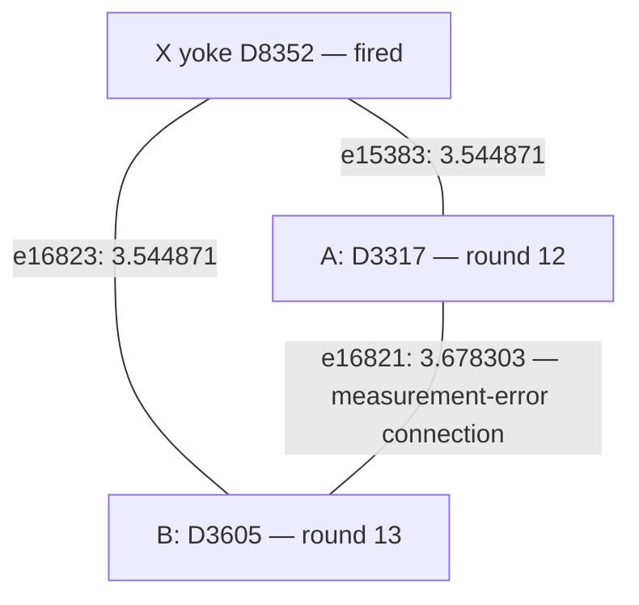
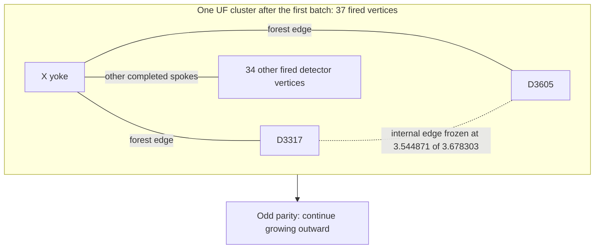

# Shot 0: a readout fault and a simultaneous UF merge at the yoke

Repository UF fails on this saved shot, while ordinary joint MWPM and
correlation-aware MWPM both succeed. A relevant physical event is **F194**, a
readout error on **check ancilla 449 in patch 3, round 12**. The fault produces
two detector events at the same check location in consecutive rounds. UF grows
their connections to the fired X yoke before the direct connection between
them completes.

The direct measurement-error edge receives **no correlation reweighting** in
this shot. This case illustrates a UF growth decision; the companion
[shot-10 YY-fault case](uf_correlated_mwpm_shot10.md) explains a case where
correlation reweighting helps.

The [shot-3148 boundary-choice case](uf_correlated_mwpm_shot3148.md) examines
peeling: changing only the terminal chosen as root fixes the logical prediction
within the same UF forest.

Browse the [full failure case collection](uf_failure_cases/README.md) for more
physical faults, correction exchanges, and verified interventions.

F194 alone is decoded correctly by both methods. Removing it from the original
shot fixes UF's incorrect X-logical predictions on patches 3 and 5, while two
other logical mistakes remain. The full error pattern matters.

**Experiment and physical event.**

| Parameter | Value |
|---|---|
| Circuit | 1D yoked surface-code memory; CZ gates; ideal preparation, final boundaries, and yoke measurements |
| Configuration | `d=7`, SI1000 `p=0.003`, 28 noisy measurement rounds |
| Patches and yokes | 6 physical patches; X and Z yokes |
| Original sampling | Seed 42; one 100,000-shot call |
| Selected shot | Index 0, the first row of the original batch |
| Versions | Stim 1.16.0, SSE2; PyMatching 2.4.0 |
| UF | Repository `UnionFindDecoder`, weighted growth and peeling |
| Shot contents | 404 physical fault events; 775 fired detectors |
| Yoke syndrome | X yoke D8352: 1; Z yoke D8353: 0 |
| Selected fault | F194, an intermediate ancilla measurement-result flip |
| Physical location | Ancilla 449, patch 3, local (0.5, 1.5), global (24.5, 1.5) |
| Circuit location | Round 12, after 120 `TICK`s, expanded instruction index 4244 |
| Readout channel probability | 0.015, equal to `5*p` in this SI1000 circuit |

Identifiers are zero-based; circuit rounds are numbered 1–28. Expanded
instruction indices count repeat iterations and retain `SHIFT_COORDS`
operations. F194 is a recovered physical event, not merely a compatible fault
suggested by a detector-error-model explanation.

**Why one readout error produces two detector events.**

Let `m_r` be the recorded result of this check in circuit round `r`. Its detector
compares consecutive results:

$$
d_r=m_r\oplus m_{r-1}.
$$

A readout error changes `m_12` to `m_12 XOR 1`. That changes both comparisons
containing `m_12`: `d_12` and `d_13`.

For illustration, suppose the true check result remains 0:

| Circuit round | True check result | Recorded result | Detector comparison |
|---|---:|---:|---|
| 11 | 0 | 0 | — |
| 12 | 0 | 1, due to the readout error | `1 XOR 0 = 1`: D3317 fires |
| 13 | 0 | 0 | `0 XOR 1 = 1`: D3605 fires |

This is an illustrative measurement sequence, not a claim that these were the
raw measurement values in the noisy shot. More generally, the readout fault
toggles both detector bits; it can also cancel detector contributions from
other faults. In this shot, D3317 and D3605 are both fired.

The round-13 measurement can be correct while its detector fires, because it
is compared with the corrupted round-12 record. No second physical fault is
needed. D3317 and D3605 have the same spatial coordinates and detector-time
coordinates `t11` and `t12`, corresponding to circuit rounds 12 and 13.

The graph edge `e16821`, connecting D3317–D3605, explains this pair as a
measurement error across time. Its observable mask is **0**. This particular
fault changes an intermediate ancilla record without changing the encoded data
state or flipping a final logical observable.

**The competing connections.**

Write `A = D3317`, `B = D3605`, and `Y = D8352`, the X yoke. All three are fired
in the original shot. The yoke defect comes from other errors; F194 does not
fire the yoke.

These are decoding-graph connections representing alternative error
explanations. A connection to the yoke does not mean that the ancilla physically
interacts with every patch.

Initially each fired vertex belongs to an active singleton cluster. Both ends
of each displayed edge are active, so each edge initially grows at rate 2:

| Connection | Weight | Initial completion time |
|---|---:|---:|
| A–Y | 3.5448709026673986 | 1.7724354513336993 |
| B–Y | 3.5448709026673986 | 1.7724354513336993 |
| A–B | 3.6783032971248018 | 1.8391516485624009 |

These are algorithmic growth units, not physical latency or circuit rounds.
The A–B time is when it would initially complete if its growth continued at
rate 2. It never completes in the actual UF run.

**One yoke, one cluster, and a tied batch.**

At growth time 1.7724354513336993, A–Y and B–Y complete simultaneously. The
implementation accepts both completed connections before updating cluster
activity for the batch. Starting from `{Y}`, `{A}`, and `{B}`, these connections
produce **one cluster `{Y,A,B}`**. They do not leave overlapping clusters
`{Y,A}` and `{Y,B}`. The yoke is represented once and its syndrome bit is counted
once.

In the actual first batch, 36 fired ordinary detector vertices join the fired
yoke, including A and B:

The final node inside the box aggregates 34 separate vertices for readability.
The yoke cluster touches all six physical patches after this first event.

A–B has accumulated only 3.5448709026673986 units of its required
3.6783032971248018 growth. Its endpoints now belong to the same cluster through
the yoke connections. Our UF implementation freezes internal edges, so A–B's
rate becomes zero and it never enters the merge forest.

**Why an odd merged cluster is allowed.**

`{Y,A,B}` has three fired vertices and remains unsatisfied. A UF merge is an
intermediate growth operation; it does not have to produce a satisfied cluster.
The odd cluster keeps growing. For example, absorbing a singleton fired vertex
`C` would produce `{Y,A,B,C}` with even parity.

A four-defect star could be satisfied by selecting edges Y–A, Y–B, and Y–C.
Each leaf would have one incident correction edge, and Y would have three. All
four incidences are odd, matching the four fired detector bits. A valid
syndrome correction therefore does not require each cluster to contain only
two fired vertices. Logical correctness is an additional requirement.

The actual first cluster has parity `37 mod 2 = 1` and continues growing
outward. Its recorded states are:

| Stage | Graph vertices | Fired vertices | Parity | Touches a boundary terminal? |
|---|---:|---:|---|---|
| After the first tied batch | 37 | 37 | Odd, active | No |
| End of growth | 137 | 114 | Even, inactive | No |

Parity counts fired vertices, not every vertex in the cluster. Unfired vertices
can join during growth and contribute zero to parity. In general, a cluster
can stop when its detector parity is even or when it reaches an unconstrained
boundary terminal. This shot's final X-yoke cluster stops with even parity.

Choosing only A–Y and suppressing the already completed B–Y connection would
change the tied-batch policy. Simply reversing their processing order does not
do this: our implementation merges both completed connections. The case does
not establish whether a different policy would improve accuracy.

**The forest and the final correction are different.**

Growth constructs the forest. Peeling subsequently selects a subset of its
edges to satisfy the syndrome:

| Edge | In UF's forest? | Selected by UF? | Selected by ordinary MWPM? | Selected by correlated MWPM? |
|---|---|---|---|---|
| `e15383`: A–Y | Yes | No | No | No |
| `e16823`: B–Y | Yes | Yes | No | No |
| `e16821`: A–B | No | No | Yes | Yes |
| `e16863`: A–D3324 | Yes | Yes | No | No |

D3324 is another defect in the surrounding shot. These rows show part of each
complete correction; other edges handle the remaining syndrome. Both UF and
MWPM satisfy every detector, including the yokes.

The A–B weight remains 3.6783032971248018 in the correlated second pass. Ordinary
MWPM selects it at that same weight and also succeeds. This example therefore
does not require a correlation discount for the readout edge.

Growth, tied-batch processing, and peeling are implemented in
[`_union_find.py`](../src/yoked/decoders/_union_find.py).

**The full-shot logical failure.**

Observable order is `(X0, Z0, X1, Z1, ..., X5, Z5)`. Bit `k` of a prediction
mask records whether observable `Lk` is predicted to flip.

| Result | Observable mask | Incorrect predictions |
|---|---:|---|
| Actual sampled outcome | 3554 | — |
| Repository UF | 2850 | L6, L7, L9, L10 |
| Ordinary joint MWPM | 3554 | None |
| Correlated MWPM | 3554 | None |

In the X-logical sector, the actual outcome and both MWPM predictions have
flips on patches **3, 4, and 5**. UF predicts a flip on **patch 4 only**. Both
have odd total parity, consistent with the fired X yoke, but UF gets patches
3 and 5 wrong. These errors contribute `Z_L,3 Z_L,5` to the residual logical
error. Including the two incorrect Z-logical predictions, UF's full residual
has the commutation pattern `Y_L,3 X_L,4 Z_L,5`, ignoring global phase.

The triangle above illustrates the local growth decision, not a complete
logical-failure proof by itself. Both yoke spokes carry observable L6, while
A–B carries no observable. The triangle cycle therefore has observable mask
`64 XOR 64 XOR 0 = 0`. Toggling that cycle preserves both the detector syndrome
and the logical prediction. Merely adding the missing A–B edge is consequently
insufficient to demonstrate a logical fix; the final cluster membership and
connections elsewhere also matter.

**Removing the fault while keeping the other events fixed.**

Deleting F194 toggles D3317 and D3605 in the syndrome and leaves the actual
observable mask at 3554. The other 403 physical fault events are retained:

| Error pattern | Actual mask | UF prediction | UF's incorrect predictions | Both MWPM variants |
|---|---:|---:|---|---|
| Original shot | 3554 | 2850 | L6, L7, L9, L10 | Correct |
| Original shot with F194 removed | 3554 | 3938 | L7, L9 | Correct |
| F194 alone | 0 | 0 | None | Correct |

Removing F194 fixes the X-logical predictions on patches 3 and 5. The remaining
wrong predictions are Z-logical observables on patches 3 and 4, corresponding
to residual `X_L,3 X_L,4`. Thus this intervention establishes the readout fault's
influence on the observed failure while also showing that it is neither a
standalone uncorrectable fault nor the sole relevant event in the shot.

**Provenance.**

The original local experiment bundle is
`out/union_find_correlated_comparison_d7_p003_100k_seed42`. Shot 0 is the same
row across its detector, actual-observable, and decoder-prediction arrays.

Read-only observation of the original Stim 1.16.0 SSE2 sampling path recovered
404 physical events for this shot. The regenerated 100,000-shot batch matched
the saved detector and observable arrays byte for byte. Replaying the recovered
events, and separately XORing their individual detector/observable responses,
both reproduced shot 0. A forced-fault circuit also reproduced it for eight
ordinary-sampler validation shots using seeds 1 and 123456.

Case-specific diagnostic outputs remain under
`$TMPDIR/uf-shot0-physical-zlygbog8`. The archived full-shot growth and
correlation traces are under
`$TMPDIR/yoked-analysis-archive-nwujbk8b/out/uf_failure_investigation_d7_p003_seed42`.
The original bundle and diagnostics are local data, not tracked repository
fixtures. This note contains the diagrams and numerical findings needed to
review the case independently of those temporary outputs.
