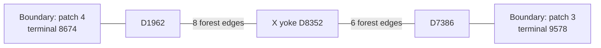

# Shot 3148: UF peeling chooses the wrong boundary terminal

Repository UF fails on this saved shot, while correlation-aware MWPM predicts
every logical observable correctly. The failure can be isolated to **which
boundary terminal UF chooses as the peeling root**. Changing only that root,
with the syndrome, graph, weights, and entire UF forest held fixed, produces a
valid correction with all logical predictions correct.

The companion [shot-10 YY-fault case](uf_correlated_mwpm_shot10.md) examines
correlation reweighting, and the [shot-0 readout-fault case](uf_correlated_mwpm_shot0.md)
examines tied growth at the yoke. This case demonstrates a consequential choice
after growth has already constructed the forest.

Browse the [full failure case collection](uf_failure_cases/README.md) for more
physical faults, correction exchanges, and verified interventions.

**Experiment and indexing.**

| Parameter | Value |
|---|---|
| Circuit | 1D yoked surface-code memory; CZ gates; ideal preparation, final boundaries, and yoke measurements |
| Configuration | `d=7`, SI1000 `p=0.003`, 28 noisy measurement rounds |
| Patches and yokes | 6 physical patches; X and Z yokes |
| Original sampling | Seed 42; one 100,000-shot call |
| Selected shot | Index 3148, the 3149th row of the original batch |
| Versions | Stim 1.16.0, SSE2; PyMatching 2.4.0 |
| UF | Repository `UnionFindDecoder`, weighted growth and peeling |
| Shot contents | 390 physical fault events; 737 fired detectors |
| Yoke syndrome | X yoke D8352: 1; Z yoke D8353: 1 |
| UF merge forest | 1469 edges |

Patch, qubit, detector, observable, shot, and fault identifiers are zero-based.
Circuit rounds are numbered 1–28. Ordinary detector coordinates `t6`, `t7`, and
`t25` correspond to noisy measurement rounds 7, 8, and 26, respectively.
Expanded instruction indices count repeat iterations and retain `SHIFT_COORDS`
operations.

**Two relevant physical faults.**

These are actual sampled events recovered from the original simulator draws.
Their individual detector responses were independently propagated through the
circuit.

| Event | Circuit location | Sampled Pauli error | Local qubit coordinates | Full detector response |
|---|---|---|---|---|
| F81 | Patch 4, round 7; tick 66; expanded instruction 2596 | `Y241 Z534` | Data qubit 241: (5, 5); check ancilla 534: (5.5, 4.5) | D1956, D1962, D2245, D2251 |
| F337 | Patch 3, round 25; tick 248; expanded instruction 8489 | `Y197 I485` | Data qubit 197: (6, 4); check ancilla 485: (5.5, 3.5) | D7385, D7386, D7391 |

Both events come from `DEPOLARIZE2(0.003)` channels. The identity on qubit 485
means that only the data qubit receives a nontrivial Pauli error in F337.
Neither event individually flips a logical observable or either yoke detector.

F81 is the sole physical-fault contributor to D1962 and D2245 in this shot.
F337 is the sole contributor to D7386. These detectors are all fired. Their
roles in the complete noisy shot matter: neither event alone causes UF to fail.

**The two boundary connections.**

The exported graph represents each boundary edge with its own virtual terminal
leaf. A terminal has no measured syndrome bit. It is distinct from a yoke,
which is a detector with a syndrome constraint.

Two boundary edges eventually belong to the same X-yoke tree:

| Edge | Ordinary detector | Detector coordinates | Virtual terminal | Weight |
|---|---|---|---|---:|
| `e8632` | D1962, patch 4 | Global (37.5, 4.5), detector time t6 | 8674 | 3.3909896213377015 |
| `e35752` | D7386, patch 3 | Global (29.5, 4.5), detector time t25 | 9578 | 3.3909896213377015 |

The relevant path in the completed UF forest is:



This is a 16-edge path, with other branches omitted. Every displayed
connection is available in the forest; the final correction selects only a
subset. The two long connections to the yoke denote graph paths, not physical
gates between the patches.

**How both terminals join one yoke cluster.**

At growth time **3.3909896213377015**, D1962 and D7386 each reach their respective
boundary terminal. They form separate boundary-containing clusters. Neither
terminal belongs to the X-yoke cluster yet.

At growth time **6.196301677675174**, the X-yoke cluster reaches both of those
clusters in the same tied batch. The connecting edges are `e10039`,
D1962–D2245, and `e35754`, D7381–D7386. The boundary edges themselves were
already present in the forest from the earlier event.

| X-yoke cluster state | Graph vertices | Fired detectors | Detector parity | Boundary terminals | Active? |
|---|---:|---:|---|---|---|
| Immediately before that batch | 970 | 135 | Odd | None | Yes |
| Immediately after that batch, also its final state | 974 | 137 | Odd | 8674 and 9578 | No |

The cluster touches all six patches. The two added ordinary detectors
contribute two more defects; the two terminals contribute no detector parity.
Thus its parity stays odd. It can nevertheless stop because it now touches a
boundary: an unconstrained terminal can absorb the unmatched parity.

Both connections complete in the same batch, so the forest retains both
terminal branches before activity is updated. The X yoke remains one vertex
in one cluster throughout. These numerical times are algorithmic growth units,
not circuit rounds or measured latency.

**Peeling chooses a terminal by its identifier.**

In [`_peel`](../src/yoked/decoders/_union_find.py), terminals are visited in
ascending identifier order before ordinary detectors:

```python
for root in chain(range(nd, len(tree)), range(nd)):
```

Consequently, a tree with terminals is rooted at its smallest terminal. Here
`8674 < 9578`, so UF roots this tree at the patch-4 boundary. Every non-root
terminal is a leaf with zero initial parity; the current peeling rule leaves
its incident edge unselected. The odd parity of this tree is absorbed at the
chosen root.

| Boundary connection | Repository UF | UF with alternate root | Correlated MWPM |
|---|---|---|---|
| D1962–terminal 8674, patch 4 | Selected | Unselected | Unselected |
| D7386–terminal 9578, patch 3 | Unselected | Selected | Selected |

The root rule is deterministic but does not compare the weights of the
resulting corrections. Correlated MWPM does not use this peeling rule; its
complete correction happens to choose the patch-3 boundary connection here.

**Changing only the root fixes the shot.**

For a controlled intervention, the existing peeling function was evaluated
with terminal 9578 visited first. The input syndrome, graph, original floating
point edge weights, and complete merge forest were unchanged. The root choices
in other trees were unchanged as well.

| Peeling choice | Total correction weight | Observable mask | Detector constraints | Logical result |
|---|---:|---:|---|---|
| Existing rule: terminal 8674 | 1795.189041576873 | 921 | All satisfied | Wrong on L6 and L8 |
| Alternate root: terminal 9578 | 1787.9192943773583 | 729 | All satisfied | All correct |

Both edge sets satisfy `H c = s`, and their observable masks were independently
computed as `L c`. The alternate correction is lighter by approximately
**7.269747** in the original graph weights. Its logical predictions match
correlated MWPM; this does not mean their complete selected edge sets are
identical.

This was an analysis intervention, not a change to the repository decoder.

**Why the syndrome stays fixed while the logical answer changes.**

The two UF corrections differ exactly on the following terminal-to-terminal
path. "Existing" and "Alternate" identify which correction selects each edge;
all correction edges outside this path are unchanged.

| Edge | Path endpoints | Selected by | Observable label |
|---|---|---|---|
| `e8632` | Terminal 8674–D1962 | Existing | None |
| `e10039` | D1962–D2245 | Alternate | None |
| `e11478` | D2245–D2533 | Existing | None |
| `e12913` | D2533–D2524 | Alternate | None |
| `e12872` | D2524–D2517 | Existing | None |
| `e12825` | D2517–D2508 | Alternate | None |
| `e11348` | D2508–D2220 | Existing | None |
| `e11343` | D2220–D2213 | Alternate | None |
| `e9863` | D2213–D8352 | Existing | L8: X observable of patch 4 |
| `e37004` | D8352–D7641 | Alternate | L6: X observable of patch 3 |
| `e37003` | D7641–D7358 | Existing | None |
| `e35632` | D7358–D7365 | Alternate | None |
| `e37112` | D7365–D7372 | Existing | None |
| `e37153` | D7372–D7381 | Existing | None |
| `e35754` | D7381–D7386 | Existing | None |
| `e35752` | D7386–terminal 9578 | Alternate | None |

Toggling this path changes two incident correction edges at every internal
vertex. Detector incidence parity is therefore unchanged, including at the
yoke. This argument applies to fired and unfired detectors alike; for example,
D7381 is unfired. The only vertices with one toggled incident edge are the two
unconstrained terminals.

The path's observable mask is nonzero because it includes one yoke edge with
label L8 and another with label L6:

```text
Path observable mask = 256 XOR 64 = 320
Alternate prediction = 921 XOR 320 = 729
Actual sampled mask = 729
```

The portions selected on this path have weights 38.54910893694734 under the
existing root and 31.27936173743221 under the alternate root. Their difference
accounts for the entire change in total correction weight.

**Logical outcome of the full shot.**

Observable order is `(X0, Z0, X1, Z1, ..., X5, Z5)`. Bit `k` of a mask indicates
whether observable `Lk` flips.

| Result | Observable mask | Incorrect observable predictions |
|---|---:|---|
| Actual sampled outcome | 729 | — |
| Repository UF | 921 | L6, L8 |
| Ordinary joint MWPM | 989 | L2, L8 |
| Correlated MWPM | 729 | None |
| UF with alternate peeling root | 729 | None |

Specifically, the actual X-logical flip on patch 3 is 1, while UF predicts 0.
The actual X-logical flip on patch 4 is 0, while UF predicts 1. The other ten
observable predictions are correct. UF's residual logical error has the
commutation pattern `Z_L,3 Z_L,4`, ignoring global phase. The two incorrect
X-logical predictions preserve total X-yoke parity as a pair.

The decoder returns logical-observable predictions; this notation describes
the residual error rather than a literal physical correction-gate sequence.

**Removing physical faults while holding the others fixed.**

Each removal retains the other 389 physical events and uses the original
decoder graph. Since neither removed event flips an observable, the actual
logical mask remains 729.

| Physical error pattern | Actual mask | UF prediction | Ordinary MWPM prediction | Correlated MWPM prediction |
|---|---:|---:|---:|---:|
| Original shot | 729 | 921 | 989 | 729 |
| Original shot with F81 removed | 729 | 729 | 729 | 729 |
| Original shot with F337 removed | 729 | 729 | 989 | 729 |
| F81 alone | 0 | 0 | 0 | 0 |
| F337 alone | 0 | 0 | 0 | 0 |

Removing either event fixes UF on this shot. Each event alone is also decoded
successfully. These interventions establish their influence in the surrounding
error pattern, not that either is intrinsically uncorrectable.

The root intervention establishes a specific limitation of the current
multi-terminal peeling policy: a successful correction can already exist in
the forest, while choosing its root by terminal ID yields the wrong logical
prediction. This case does not establish that boundary selection explains the
overall UF–MWPM accuracy gap, or that choosing a lighter correction always
improves logical accuracy.

**Provenance and replay.**

The original local experiment bundle is
`out/union_find_correlated_comparison_d7_p003_100k_seed42`. It retains the
circuit, DEM, graph, packed detector samples, actual observables, decoder
predictions, and manifest. Shot 3148 refers to the same row in every array.

The original sampling call was:

```python
detectors, actual_observables = circuit.compile_detector_sampler(seed=42).sample(
    shots=100000,
    separate_observables=True,
    bit_packed=False,
)
```

Use the saved arrays for exact shot replay. Regeneration depends on the
preserved circuit, Stim version, SIMD implementation, and sampling-call layout;
sampling 3149 shots with seed 42 is not equivalent to selecting row 3148 of the
original 100,000-shot batch.

Validation established that:

- Read-only observation of the Stim 1.16.0 SSE2 simulation recovered 390 physical
  events while preserving the original RNG calls. The regenerated batch
  matched all 100,000 saved detector and observable rows byte for byte.
- Replaying the recovered events and separately XORing their individual
  responses both reproduced this shot's detector syndrome and observables.
- A forced-fault circuit reproduced the shot for eight ordinary-sampler
  validation samples using seeds 1 and 123456.
- Replaying repository UF and both MWPM variants reproduced their saved
  predictions. Their graph corrections satisfied every detector constraint.
- Re-rooting the same UF forest changed exactly the 16 listed edges, preserved
  all detector constraints, and produced the correct observable mask.

Case-specific scripts and diagnostic outputs remain under
`$TMPDIR/uf-shot3148-terminal-p9hGXY6Q`. Earlier growth and correction traces
remain under
`$TMPDIR/yoked-analysis-archive-nwujbk8b/out/uf_failure_investigation_d7_p003_seed42`.
The original bundle and diagnostics are local data, not tracked repository
fixtures. This note records the diagram, physical events, correction exchange,
and verified outcomes for review without those temporary files.
