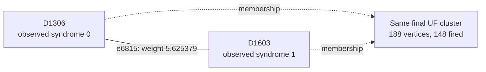

# Shot 12273: Even parity prevents root changes from using the needed boundaries

Both final yoke trees have even detector parity and multiple terminals. Testing all
combinations of their terminal roots leaves the prediction wrong. A correct forest
correction exists, but it is more expensive than the cheapest wrong-class correction
under the original weights.

This is row 12273 (zero-based) of the preserved seed-42, 100,000-shot experiment: 1D
YSC, d=7, SI1000 p=0.003, 28 noisy rounds, six physical patches, and two yokes. It
contains 387 sampled physical fault events and 760 fired detectors. The measured yoke
bits are X=1, Z=1.

[Collection, notation, and replay instructions](README.md).

**The full-shot logical outcome.**

| Result | Observable mask | Wrong logical predictions |
|---|---|---|
| Actual sampled outcome | 1590 | — |
| Repository UF | 1655 | L0, L6 |
| Ordinary joint MWPM | 1590 | None |
| Correlated MWPM | 1590 | None |

All three graph corrections satisfy every detector, including the yokes. UF's residual
has the logical commutation pattern `Z_L,0 Z_L,3`, ignoring global phase. The decoder
predicts observable flips; this notation does not describe literal physical correction
gates.

**Two actual physical events.**

| Event | Circuit location | Noise channel | Sampled error, local coordinates | Detector flips in isolation | Observable flips in isolation |
|---|---|---|---|---|---|
| F61 | patch 3, round 5; tick 45; instruction 1938 | DEPOLARIZE2(0.003) | Z on data q166 at (2, 1); Z on ancilla q462 at (2.5, 0.5) | D1306, D1314, D1602, D1603 | None |
| F60 | patch 3, round 5; tick 41; instruction 1925 | DEPOLARIZE1(0.006) | Y on data q196 at (6, 3) | D1336, D1337, D1342 | None |

Fault IDs are local to this shot. Qubit, patch, and detector IDs are zero-based; rounds
are numbered 1–28. Instruction indices expand repeat blocks and retain SHIFT_COORDS. An
I label means that target receives no Pauli error. These are recovered simulator draws,
not merely compatible DEM explanations. Individual detector flips can cancel when all
faults are combined.

**A local decoding decision.**

Focus on F61's component e6815, D1306–D1603. Its original weight is 5.625379320882, and
its observable label is None. Correlated MWPM selects this edge; UF does not. The full
detector footprint above also includes another graph component of the same event.

The solid line is the target graph edge, and the dashed arrows describe final UF
membership. This is not the full correction or a diagram of physical gates. Detector
time and circuit round are different from algorithmic growth time.

| Endpoint | Full syndrome bit | Detector coordinates (global x, y, t) | Final cluster |
|---|---|---|---|
| D1306 | 0 | [25.5, 0.5, 4.0] | 188 vertices, 148 fired; boundary terminal |
| D1603 | 1 | [26.5, 1.5, 5.0] | 188 vertices, 148 fired; boundary terminal |

At growth time 4.765862726329, other connections merge the endpoints into one cluster.
The edge has grown only 4.413465553554 of its required 5.625379320882; it freezes
internally and never enters the forest. Immediately before the merge, the endpoint
clusters contain 1 and 138 fired detectors.

| Endpoint | Incident edges selected by UF |
|---|---|
| D1306 | None |
| D1603 | e8300 |

| Unfired endpoint | Actual fault contributions | Resulting detector bit |
|---|---|---|
| D1306 | F51, F61 | 2 mod 2 = 0 |

Correlated MWPM may pass through an unfired detector using an even number of incident
correction edges. It does not need to interpret that detector as a defect. The absence
of a fired bit is not evidence that the corresponding physical faults were absent.

**What correlation changes locally.**

| Quantity | Value |
|---|---|
| Target | e6815: D1306–D1603 |
| First-pass selected source | e6811: D1314–D1602 |
| Original target weight | 5.625379320882 |
| Reweighted target weight | 4.804375740480 |
| Source marginal probability | 0.0246431772929301 |
| Shared DEM mechanism probability | 0.000200280561291177 |
| Clipped implied probability | 0.00812722153927106 |

The rule uses min(1/2, shared probability / source probability) to obtain the implied
probability, then lowers the target's log-odds weight if appropriate. The same recovered
physical fault supplies both graph components. The source is selected in the first pass;
it is inferred evidence, not knowledge of the physical-fault log.

Reconstructing all second-pass weights in floating point reproduces correlated MWPM's
saved observable mask 1590. As a separate intervention, running the repository UF growth
and peeling on those first-pass-adjusted weights returns mask 1590 (correct). This
intervention uses an MWPM first pass and is not an independently benchmarked UF decoder.
No single-edge-only weight intervention is claimed.

**The full growth result and the freedom left to peeling.**

| Yoke | First cluster: vertices / fired / parity | Final cluster: vertices / fired / parity | Final terminals | Final ordinary member-defect counts, patches 0–5 |
|---|---|---|---|---|
| X | 47 / 47 / 1 | 188 / 148 / 0 | T8569, T9458 | 31, 39, 17, 27, 12, 21 |
| Z | 34 / 34 / 0 | 299 / 152 / 0 | T8951, T8999 | 39, 26, 19, 28, 17, 22 |

The yoke belongs to one cluster and is counted once. Vertex count includes unfired
vertices and terminals; detector parity counts only fired detectors. A cluster can stop
with even detector parity or by touching an unconstrained terminal. For a yoke cluster
without terminals, its per-patch member-defect parities fix that sector of the UF
prediction.

| Allowed correction edges | Logical-change rank | Correct logical answer exists? | Restricted MWPM prediction |
|---|---|---|---|
| UF forest | 1 | Yes | 1655 |
| All original edges within each final UF cluster | 1 | Yes | 1590 |

| Forest logical prediction | Compared with actual outcome | Minimum forest cost at original float weights |
|---|---|---|
| 1590 | Correct | 1938.818957898017 |
| 1655 | Incorrect | 1930.080362599798 |

The correct logical class is available in the forest but its cheapest realization costs
8.738595298220 more than the cheapest incorrect class. This comparison comes from an
independent tree dynamic program using the original float weights, with free boundary
terminals and explicit logical-mask tracking. A correct answer's existence is therefore
different from its preference under these weights.

All 4 combinations of terminal roots for the two yoke trees were tested with the
existing peeling function. 0 choices are correct. All tested roots leave the logical
answer wrong. The relevant even tree needs boundary branches that single-root peeling
leaves unused; changing the root alone does not enable them.

| Terminal in a yoke tree | Attached detector | Patch | UF correction | Cheapest correct forest correction |
|---|---|---|---|---|
| T8569 | D1336 | 3 | Unused | Selected |
| T8951 | D3643 | 3 | Unused | Unused |
| T8999 | D3931 | 3 | Unused | Unused |
| T9458 | D6666 | 0 | Unused | Selected |

The cheapest correct forest solution can be reproduced by toggling these 21 edges
relative to the original UF correction: e5500, e6740, e6770, e6906, e8209, e8253, e8300,
e8341, e16060, e17499, e17500, e19900, e21339, e21340, e32152, e33393, e33431, e33470,
e33541, e33587, e34905. All are already in the UF forest. Their combined detector
incidence is zero, and their observable mask is 65, changing prediction 1655 to 1590.
The full reconstructed correction and its weight were checked explicitly.

Restoring all original graph edges internal to the fixed clusters makes restricted MWPM
return the correct answer. The forest already admitted that answer; the extra edges
change the costs of available realizations. This experiment does not show that the
correct logical class was absent from the forest.

**Physical interventions.**

| Physical error pattern | Actual mask | UF mask | Correlated MWPM mask | UF wrong predictions |
|---|---|---|---|---|
| Original | 1590 | 1655 | 1590 | L0, L6 |
| F61 removed | 1590 | 1590 | 1590 | None |
| F60 removed | 1590 | 1590 | 1590 | None |
| F61 and F60 removed | 1590 | 1590 | 1590 | None |
| F61 alone | 0 | 0 | 0 | None |
| F60 alone | 0 | 0 | 0 | None |
| F61 and F60 alone | 0 | 0 | 0 | None |

Each deletion retains all other sampled events and the original decoder graph. The
syndrome and actual observables are changed by the removed events' independently
verified responses. Every resulting decoder correction still satisfies its input
syndrome. These counterfactuals distinguish a full repair, a partial repair, and a
change to a different wrong answer.

The selected ZZ fault supplies an edge that freezes internally before completion.
Allowing all internal graph edges makes restricted MWPM correct, whereas merely changing
the peeling roots does not. The result combines a limitation of the one-root policy with
the costs imposed by the retained forest paths.

**An explicit logical correction exchange.**

| Wrong observable | Patch observable | Boundary endpoint | Path from its yoke, edge IDs in order |
|---|---|---|---|
| L0 | X0 | T9458 | e33393, e33392, e33428, e34905, e33470, e33541, e33587, e32152 |
| L6 | X3 | T8569 | e3863, e3895, e5337, e6815, e8300, e8341, e6906, e5500 |

Every listed edge belongs to the symmetric difference of the complete UF and correlated
MWPM corrections. Toggle the paths in pairs within each sector; doing this for all
listed paths changes mask 1655 to 1590. Internal detector incidences change by an even
number, the paired paths cancel their yoke incidence, and only the virtual boundary
endpoints are unconstrained. The resulting correction was explicitly checked against
every detector and all 12 observables. A single yoke-to-boundary path is not by itself a
valid syndrome-preserving toggle.

The local edge example illustrates one decision, while these complete paths supply a
valid logical repair. Restoring just the highlighted edge, or deleting one selected
fault, is not asserted to reproduce the entire correlated MWPM correction.

**Replay and scope.**

The original arrays are in `out/union_find_correlated_comparison_d7_p003_100k_seed42`;
select row 12273 consistently across detector, actual-observable, and prediction arrays.
The original 100,000-shot call was regenerated byte for byte using Stim 1.16.0 SSE2. All
387 recovered events reproduce this shot, both in aggregate and by XORing their
individual responses. A forced-fault circuit also reproduces it for eight checks with
the ordinary sampler using seeds 1 and 123456. Graph corrections and prediction masks
reproduce the saved results with PyMatching 2.4.0.

Detailed scripts, fault traces, and numerical records are local temporary data under
`$TMPDIR/uf-case-collection-9pbSDiuL/shot_12273`. [The collection guide](README.md)
records common hashes, the method, and the limits of the diagnostic interventions. These
are deliberately selected case studies; they do not estimate mechanism frequencies or
establish a decoder change's accuracy. The repository decoder was not modified.

[All cases](README.md) · [Previous: shot 6269](shot_6269.md) · [Next: shot 15986](shot_15986.md)
