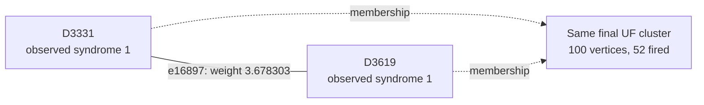

# Shot 125: An ancilla X fault with an unfired X yoke

The selected ancilla X fault has a temporal two-detector response. Its direct edge is
present in the UF forest but is not selected by peeling. A data-Y fault in the same
patch supplies a different correction edge whose endpoints remain in different UF
clusters.

This is row 125 (zero-based) of the preserved seed-42, 100,000-shot experiment: 1D YSC,
d=7, SI1000 p=0.003, 28 noisy rounds, six physical patches, and two yokes. It contains
364 sampled physical fault events and 730 fired detectors. The measured yoke bits are
X=0, Z=1.

[Collection, notation, and replay instructions](README.md).

**The full-shot logical outcome.**

| Result | Observable mask | Wrong logical predictions |
|---|---|---|
| Actual sampled outcome | 2585 | — |
| Repository UF | 2905 | L6, L8 |
| Ordinary joint MWPM | 2905 | L6, L8 |
| Correlated MWPM | 2585 | None |

All three graph corrections satisfy every detector, including the yokes. UF's residual
has the logical commutation pattern `Z_L,3 Z_L,4`, ignoring global phase. The decoder
predicts observable flips; this notation does not describe literal physical correction
gates.

**Two actual physical events.**

| Event | Circuit location | Noise channel | Sampled error, local coordinates | Detector flips in isolation | Observable flips in isolation |
|---|---|---|---|---|---|
| F124 | patch 3, round 12; tick 111; instruction 4212 | X_ERROR(0.006) | X on ancilla q463 at (2.5, 1.5) | D3331, D3619 | None |
| F140 | patch 3, round 13; tick 121; instruction 4541 | DEPOLARIZE1(0.006) | Y on data q193 at (6, 0) | D3638, D3645, D8353 | L7 |

Fault IDs are local to this shot. Qubit, patch, and detector IDs are zero-based; rounds
are numbered 1–28. Instruction indices expand repeat blocks and retain SHIFT_COORDS. An
I label means that target receives no Pauli error. These are recovered simulator draws,
not merely compatible DEM explanations. Individual detector flips can cancel when all
faults are combined.

**A local decoding decision.**

Focus on F124's component e16897, D3331–D3619. Its original weight is 3.678303297125,
and its observable label is None. Correlated MWPM selects this edge; UF does not. This
component accounts for the event's entire detector response.

The solid line is the target graph edge, and the dashed arrows describe final UF
membership. This is not the full correction or a diagram of physical gates. Detector
time and circuit round are different from algorithmic growth time.

| Endpoint | Full syndrome bit | Detector coordinates (global x, y, t) | Final cluster |
|---|---|---|---|
| D3331 | 1 | [26.5, 1.5, 11.0] | 100 vertices, 52 fired; boundary terminal |
| D3619 | 1 | [26.5, 1.5, 12.0] | 100 vertices, 52 fired; boundary terminal |

The edge enters the forest at growth time 1.839151648562; peeling subsequently leaves it
unselected. Having the physical event's direct edge available is therefore insufficient
to identify the final correction. The UF edges incident to its endpoints are shown
below.

| Endpoint | Incident edges selected by UF |
|---|---|
| D3331 | e15455 |
| D3619 | e16900 |

**What correlation changes locally.**

This edge receives no correlation discount: its weight remains 3.678303297125.
Correlated MWPM still selects it as part of its global solution. Its success cannot be
attributed to lowering this particular edge's cost. Correlation updates elsewhere and
the choice of a complete correction must be considered separately.

Reconstructing all second-pass weights in floating point reproduces correlated MWPM's
saved observable mask 2585. As a separate intervention, running the repository UF growth
and peeling on those first-pass-adjusted weights returns mask 2585 (correct). This
intervention uses an MWPM first pass and is not an independently benchmarked UF decoder.
No single-edge-only weight intervention is claimed.

**The full growth result and the freedom left to peeling.**

| Yoke | First cluster: vertices / fired / parity | Final cluster: vertices / fired / parity | Final terminals | Final ordinary member-defect counts, patches 0–5 |
|---|---|---|---|---|
| X | 7 / 6 / 0 | 100 / 52 / 0 | T8576 | 3, 0, 3, 19, 19, 8 |
| Z | 39 / 39 / 1 | 96 / 88 / 0 | None | 8, 5, 12, 16, 15, 31 |

The yoke belongs to one cluster and is counted once. Vertex count includes unfired
vertices and terminals; detector parity counts only fired detectors. A cluster can stop
with even detector parity or by touching an unconstrained terminal. For a yoke cluster
without terminals, its per-patch member-defect parities fix that sector of the UF
prediction.

| Allowed correction edges | Logical-change rank | Correct logical answer exists? | Restricted MWPM prediction |
|---|---|---|---|
| UF forest | 0 | No | 2905 |
| All original edges within each final UF cluster | 0 | No | 2905 |

An exhaustive GF(2) cycle-space certificate shows that the required logical change, mask
320, is unavailable even if every original edge internal to the final clusters is
restored. The same syndrome and partition therefore cannot be repaired by a different
peeling choice. A correct answer requires connections beyond that partition. This is
stronger than merely observing that restricted MWPM returns the wrong answer.

**Physical interventions.**

| Physical error pattern | Actual mask | UF mask | Correlated MWPM mask | UF wrong predictions |
|---|---|---|---|---|
| Original | 2585 | 2905 | 2585 | L6, L8 |
| F124 removed | 2585 | 2585 | 2585 | None |
| F140 removed | 2713 | 2713 | 2713 | None |
| F124 and F140 removed | 2713 | 2713 | 2713 | None |
| F124 alone | 0 | 0 | 0 | None |
| F140 alone | 128 | 128 | 128 | None |
| F124 and F140 alone | 128 | 128 | 128 | None |

Each deletion retains all other sampled events and the original decoder graph. The
syndrome and actual observables are changed by the removed events' independently
verified responses. Every resulting decoder correction still satisfies its input
syndrome. These counterfactuals distinguish a full repair, a partial repair, and a
change to a different wrong answer.

The ancilla event comes from an X_ERROR channel, rather than a classical readout flip.
The X yoke is unfired in this shot, but it still joins a cluster through incoming
growth. Removing either highlighted event makes UF correct; the correct full-shot
prediction is impossible within the original final cluster partition.

**An explicit logical correction exchange.**

| Wrong observable | Patch observable | Boundary endpoint | Path from its yoke, edge IDs in order |
|---|---|---|---|
| L6 | X3 | T8952 | e12503, e13941, e13975, e15455, e16897, e16900, e18303, e16855, e18299, e16929, e16930, e18411, e18414, e17012 |
| L8 | X4 | T9682 | e32924, e34362, e34404, e34432, e35869, e37354, e38836, e40278, e40314, e40311, e38872 |

Every listed edge belongs to the symmetric difference of the complete UF and correlated
MWPM corrections. Toggle the paths in pairs within each sector; doing this for all
listed paths changes mask 2905 to 2585. Internal detector incidences change by an even
number, the paired paths cancel their yoke incidence, and only the virtual boundary
endpoints are unconstrained. The resulting correction was explicitly checked against
every detector and all 12 observables. A single yoke-to-boundary path is not by itself a
valid syndrome-preserving toggle.

The local edge example illustrates one decision, while these complete paths supply a
valid logical repair. Restoring just the highlighted edge, or deleting one selected
fault, is not asserted to reproduce the entire correlated MWPM correction.

**Replay and scope.**

The original arrays are in `out/union_find_correlated_comparison_d7_p003_100k_seed42`;
select row 125 consistently across detector, actual-observable, and prediction arrays.
The original 100,000-shot call was regenerated byte for byte using Stim 1.16.0 SSE2. All
364 recovered events reproduce this shot, both in aggregate and by XORing their
individual responses. A forced-fault circuit also reproduces it for eight checks with
the ordinary sampler using seeds 1 and 123456. Graph corrections and prediction masks
reproduce the saved results with PyMatching 2.4.0.

Detailed scripts, fault traces, and numerical records are local temporary data under
`$TMPDIR/uf-case-collection-9pbSDiuL/shot_125`. [The collection guide](README.md)
records common hashes, the method, and the limits of the diagnostic interventions. These
are deliberately selected case studies; they do not estimate mechanism frequencies or
establish a decoder change's accuracy. The repository decoder was not modified.

[All cases](README.md) · [Previous: shot 75](shot_75.md) · [Next: shot 129](shot_129.md)
