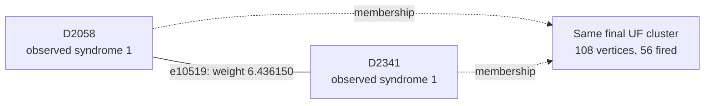

# Shot 128: Correlation-adjusted UF repeats the original wrong X pair

UF and ordinary MWPM make the same L0 and L8 mistake, while correlated MWPM succeeds.
The highlighted YZ connection becomes internal before its growth completes. Its
correlation discount is substantial, but rerunning UF on all first-pass-adjusted weights
still returns the original wrong pair.

This is row 128 (zero-based) of the preserved seed-42, 100,000-shot experiment: 1D YSC,
d=7, SI1000 p=0.003, 28 noisy rounds, six physical patches, and two yokes. It contains
399 sampled physical fault events and 781 fired detectors. The measured yoke bits are
X=0, Z=1.

[Collection, notation, and replay instructions](README.md).

**The full-shot logical outcome.**

| Result | Observable mask | Wrong logical predictions |
|---|---|---|
| Actual sampled outcome | 2150 | — |
| Repository UF | 2407 | L0, L8 |
| Ordinary joint MWPM | 2407 | L0, L8 |
| Correlated MWPM | 2150 | None |

All three graph corrections satisfy every detector, including the yokes. UF's residual
has the logical commutation pattern `Z_L,0 Z_L,4`, ignoring global phase. The decoder
predicts observable flips; this notation does not describe literal physical correction
gates.

**Reading the logical result by patch.**

| Patch | Actual flips (X, Z) | UF predicts (X, Z) | Wrong observable sector |
|---|---|---|---|
| 0 | (0, 1) | (1, 1) | X |
| 1 | (1, 0) | (1, 0) | None |
| 2 | (0, 1) | (0, 1) | None |
| 3 | (1, 0) | (1, 0) | None |
| 4 | (0, 0) | (1, 0) | X |
| 5 | (0, 1) | (0, 1) | None |

These are flip indicators relative to the ideal logical measurements: 1 means a flip and
0 means no flip. They are not the absolute encoded-state bits. Correlated MWPM matches
the actual column on every patch. A correction can satisfy every detector while
predicting the wrong logical flips; that leaves a residual logical error when its
correction or Pauli frame is used.

**Two actual physical events.**

| Event | Circuit location | Noise channel | Sampled error, local coordinates | Detector flips in isolation | Observable flips in isolation |
|---|---|---|---|---|---|
| F104 | patch 0, round 8; tick 76; instruction 2923 | DEPOLARIZE2(0.003) | Y on data q41 at (5, 5); Z on ancilla q342 at (5.5, 4.5) | D2052, D2058, D2341, D2347 | None |
| F262 | patch 4, round 19; tick 181; instruction 6503 | DEPOLARIZE1(0.006) | Y on data q224 at (3, 2) | D5395, D5396, D5401, D5402 | None |

Fault IDs are local to this shot. Qubit, patch, and detector IDs are zero-based; rounds
are numbered 1–28. Instruction indices expand repeat blocks and retain SHIFT_COORDS. An
I label means that target receives no Pauli error. These are recovered simulator draws,
not merely compatible DEM explanations. Individual detector flips can cancel when all
faults are combined.

**A local decoding decision.**

Focus on F104's component e10519, D2058–D2341. Its original weight is 6.436150368370,
and its observable label is None. Correlated MWPM selects this edge; UF does not. The
full detector footprint above also includes another graph component of the same event.

The solid line is the target graph edge, and the dashed arrows describe final UF
membership. This is not the full correction or a diagram of physical gates. Detector
time and circuit round are different from algorithmic growth time.

| Endpoint | Full syndrome bit | Detector coordinates (global x, y, t) | Final cluster |
|---|---|---|---|
| D2058 | 1 | [5.5, 4.5, 7.0] | 108 vertices, 56 fired; boundary terminal |
| D2341 | 1 | [4.5, 5.5, 8.0] | 108 vertices, 56 fired; boundary terminal |

At growth time 3.344061379206, other connections merge the endpoints into one cluster.
The edge has grown only 5.471196889635 of its required 6.436150368370; it freezes
internally and never enters the forest. Immediately before the merge, the endpoint
clusters contain 13 and 2 fired detectors.

| Endpoint | Incident edges selected by UF |
|---|---|
| D2058 | e10547 |
| D2341 | e11953 |

| Decoder | Selects the highlighted target edge? |
|---|---|
| repository_uf | No |
| joint_mwpm_uncorrelated | No |
| joint_mwpm_correlated | Yes |

**Recorded growth transitions for the highlighted edge.**

The initial rate is 2, counting active detector endpoints; a virtual terminal never
initiates growth. The table records changes in this edge's rate or internal status.
Other unions and parity-preserving size changes are omitted. Times are algorithmic
growth coordinates, not circuit rounds or software latency.

| Growth time | Accumulated growth | First endpoint cluster | Second endpoint cluster | Rate after event | Edge event |
|---|---|---|---|---|---|
| 2.281317942 | 4.562635883 | 1 fired, odd; active | 2 fired, even; inactive | 1 | Activity changed |
| 2.962738696 | 5.244056638 | 12 fired, even; inactive | 2 fired, even; inactive | 0 | Activity changed |
| 3.116921128 | 5.244056638 | 13 fired, odd; active | 2 fired, even; inactive | 1 | Activity changed |
| 3.344061379 | 5.471196890 | 15 fired, odd; active | 15 fired, odd; active | 0 | Frozen internally |

Required growth is 6.436150368370; final accumulated growth is 5.471196889635. Final
edge status: frozen inside cluster before completion.

**What correlation changes locally.**

| Quantity | Value |
|---|---|
| Target | e10519: D2058–D2341 |
| First-pass selected source | e10555: D2052–D2347 |
| Original target weight | 6.436150368370 |
| Reweighted target weight | 2.075662859961 |
| Source marginal probability | 0.00359224460718038 |
| Shared DEM mechanism probability | 0.000400480897975892 |
| Clipped implied probability | 0.111484863022799 |

The rule uses min(1/2, shared probability / source probability) to obtain the implied
probability, then lowers the target's log-odds weight if appropriate. The same recovered
physical fault supplies both graph components. The source is selected in the first pass;
it is inferred evidence, not knowledge of the physical-fault log.

Reconstructing all second-pass weights in floating point reproduces correlated MWPM's
saved observable mask 2150. As a separate intervention, running the repository UF growth
and peeling on those first-pass-adjusted weights returns mask 2407 (wrong on L0, L8).
This intervention uses an MWPM first pass and is not an independently benchmarked UF
decoder. No single-edge-only weight intervention is claimed.

**The other traced physical connection.**

For F262, the selected diagnostic component is e27260, D5395–D5402. Its observable label
is None, and its weight is 4.562635883352. Its growth outcome is: forest edge; unused by
peeling.

| Decoder | Selects this target edge? |
|---|---|
| repository_uf | No |
| joint_mwpm_uncorrelated | No |
| joint_mwpm_correlated | Yes |

| Endpoint | Observed bit | Final cluster |
|---|---|---|
| D5395 | 1 | 6 vertices, 6 fired; even detector parity |
| D5402 | 1 | 6 vertices, 6 fired; even detector parity |

The selected first-pass source is e25821 (D5396–D5401); it lowers the target weight from
4.562635883352 to 0.713850186433. That source is another component of this same
recovered physical event.

**The full growth result and the freedom left to peeling.**

| Yoke | First cluster: vertices / fired / parity | Final cluster: vertices / fired / parity | Final terminals | Final ordinary member-defect counts, patches 0–5 |
|---|---|---|---|---|
| X | 19 / 18 / 0 | 108 / 56 / 0 | T8690 | 37, 3, 12, 1, 1, 2 |
| Z | 41 / 41 / 1 | 126 / 122 / 0 | T8541 | 27, 26, 13, 16, 26, 13 |

The yoke belongs to one cluster and is counted once. Vertex count includes unfired
vertices and terminals; detector parity counts only fired detectors. A cluster can stop
with even detector parity or by touching an unconstrained terminal. For a yoke cluster
without terminals, its per-patch member-defect parities fix that sector of the UF
prediction.

| Yoke tree | Terminal | Attached detector | Patch | Boundary edge selected by UF? |
|---|---|---|---|---|
| X | T8690 | D2058 | 0 | No |
| Z | T8541 | D1167 | 0 | No |

Several terminals can attach to the same patch. Their count does not determine the
number of independent logical changes; the logical-space calculation below tracks their
observable labels.

| Allowed correction edges | Logical-change rank | Correct logical answer exists? | Restricted MWPM prediction |
|---|---|---|---|
| UF forest | 0 | No | 2407 |
| All original edges within each final UF cluster | 0 | No | 2407 |

An exhaustive GF(2) cycle-space certificate shows that the required logical change, mask
257, is unavailable even if every original edge internal to the final clusters is
restored. The same syndrome and partition therefore cannot be repaired by a different
peeling choice. A correct answer requires connections beyond that partition. This is
stronger than merely observing that restricted MWPM returns the wrong answer.

**Physical interventions.**

| Physical error pattern | Actual mask | UF mask | Correlated MWPM mask | UF wrong predictions |
|---|---|---|---|---|
| Original | 2150 | 2407 | 2150 | L0, L8 |
| F104 removed | 2150 | 2407 | 2150 | L0, L8 |
| F262 removed | 2150 | 2150 | 2150 | None |
| F104 and F262 removed | 2150 | 2150 | 2150 | None |
| F104 alone | 0 | 0 | 0 | None |
| F262 alone | 0 | 0 | 0 | None |
| F104 and F262 alone | 0 | 0 | 0 | None |

Each deletion retains all other sampled events and the original decoder graph. The
syndrome and actual observables are changed by the removed events' independently
verified responses. Every resulting decoder correction still satisfies its input
syndrome. These counterfactuals distinguish a full repair, a partial repair, and a
change to a different wrong answer.

Removing F104 leaves the original UF error. Removing the data-Y event F262 fixes UF, and
removing both also succeeds. The complete correlated matching solution therefore cannot
be reduced to the claim that this one discounted YZ edge repairs UF. The original
cluster partition has no correction with the required logical answer.

**An explicit logical correction exchange.**

| Wrong observable | Patch observable | Boundary endpoint | Path from its yoke, edge IDs in order |
|---|---|---|---|
| L0 | X0 | T8689 | e8913, e10396, e8961, e9000, e10442, e10479, e11953, e10519, e10547, e9102, e9100 |
| L8 | X4 | T9297 | e25713, e25751, e25780, e27260, e25856, e27293, e28775, e27340 |

Every listed edge belongs to the symmetric difference of the complete UF and correlated
MWPM corrections. Toggle the paths in pairs within each sector; doing this for all
listed paths changes mask 2407 to 2150. Internal detector incidences change by an even
number, the paired paths cancel their yoke incidence, and only the virtual boundary
endpoints are unconstrained. The resulting correction was explicitly checked against
every detector and all 12 observables. A single yoke-to-boundary path is not by itself a
valid syndrome-preserving toggle.

The local edge example illustrates one decision, while these complete paths supply a
valid logical repair. Restoring just the highlighted edge, or deleting one selected
fault, is not asserted to reproduce the entire correlated MWPM correction.

**Replay and scope.**

The original arrays are in `out/union_find_correlated_comparison_d7_p003_100k_seed42`;
select row 128 consistently across detector, actual-observable, and prediction arrays.
The original 100,000-shot call was regenerated byte for byte using Stim 1.16.0 SSE2. All
399 recovered events reproduce this shot, both in aggregate and by XORing their
individual responses. A forced-fault circuit also reproduces it for eight checks with
the ordinary sampler using seeds 1 and 123456. Graph corrections and prediction masks
reproduce the saved results with PyMatching 2.4.0.

Detailed scripts, fault traces, and numerical records are local temporary data under
`$TMPDIR/uf-case-collection-next-6a0xaw4f/shot_128`. [The collection guide](README.md)
records common hashes, the method, and the limits of the diagnostic interventions. These
are deliberately selected case studies; they do not estimate mechanism frequencies or
establish a decoder change's accuracy. The repository decoder was not modified.

[All cases](README.md) · [Previous: shot 97](shot_97.md) · [Next: shot 144](shot_144.md)
