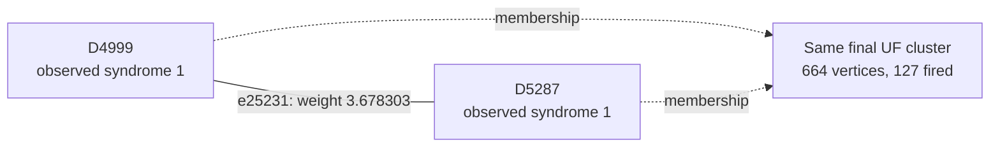

# Shot 144: A first-batch yoke merge freezes an ancilla-fault edge

The temporal connection associated with ancilla X fault F259 freezes inside the first
fired-X-yoke batch after growing 3.544871 of its required 3.678303. Both first yoke
clusters contain 42 vertices and are even. The final partition still excludes the
correct X-logical answer.

This is row 144 (zero-based) of the preserved seed-42, 100,000-shot experiment: 1D YSC,
d=7, SI1000 p=0.003, 28 noisy rounds, six physical patches, and two yokes. It contains
413 sampled physical fault events and 770 fired detectors. The measured yoke bits are
X=1, Z=1.

[Collection, notation, and replay instructions](README.md).

**The full-shot logical outcome.**

| Result | Observable mask | Wrong logical predictions |
|---|---|---|
| Actual sampled outcome | 2361 | — |
| Repository UF | 2349 | L2, L4 |
| Ordinary joint MWPM | 2361 | None |
| Correlated MWPM | 2361 | None |

All three graph corrections satisfy every detector, including the yokes. UF's residual
has the logical commutation pattern `Z_L,1 Z_L,2`, ignoring global phase. The decoder
predicts observable flips; this notation does not describe literal physical correction
gates.

**Reading the logical result by patch.**

| Patch | Actual flips (X, Z) | UF predicts (X, Z) | Wrong observable sector |
|---|---|---|---|
| 0 | (1, 0) | (1, 0) | None |
| 1 | (0, 1) | (1, 1) | X |
| 2 | (1, 1) | (0, 1) | X |
| 3 | (0, 0) | (0, 0) | None |
| 4 | (1, 0) | (1, 0) | None |
| 5 | (0, 1) | (0, 1) | None |

These are flip indicators relative to the ideal logical measurements: 1 means a flip and
0 means no flip. They are not the absolute encoded-state bits. Correlated MWPM matches
the actual column on every patch. A correction can satisfy every detector while
predicting the wrong logical flips; that leaves a residual logical error when its
correction or Pauli frame is used.

**Two actual physical events.**

| Event | Circuit location | Noise channel | Sampled error, local coordinates | Detector flips in isolation | Observable flips in isolation |
|---|---|---|---|---|---|
| F259 | patch 2, round 18; tick 171; instruction 6174 | X_ERROR(0.006) | X on ancilla q403 at (0.5, 3.5) | D4999, D5287 | None |
| F270 | patch 1, round 18; tick 180; instruction 6498 | DEPOLARIZE1(0.006) | Y on data q72 at (3, 0) | D5249, D5250, D5256, D8353 | L3 |

Fault IDs are local to this shot. Qubit, patch, and detector IDs are zero-based; rounds
are numbered 1–28. Instruction indices expand repeat blocks and retain SHIFT_COORDS. An
I label means that target receives no Pauli error. These are recovered simulator draws,
not merely compatible DEM explanations. Individual detector flips can cancel when all
faults are combined.

**A local decoding decision.**

Focus on F259's component e25231, D4999–D5287. Its original weight is 3.678303297125,
and its observable label is None. Correlated MWPM selects this edge; UF does not. This
component accounts for the event's entire detector response.

The solid line is the target graph edge, and the dashed arrows describe final UF
membership. This is not the full correction or a diagram of physical gates. Detector
time and circuit round are different from algorithmic growth time.

| Endpoint | Full syndrome bit | Detector coordinates (global x, y, t) | Final cluster |
|---|---|---|---|
| D4999 | 1 | [16.5, 3.5, 17.0] | 664 vertices, 127 fired; boundary terminal |
| D5287 | 1 | [16.5, 3.5, 18.0] | 664 vertices, 127 fired; boundary terminal |

At growth time 1.772435451334, other connections merge the endpoints into one cluster.
The edge has grown only 3.544870902667 of its required 3.678303297125; it freezes
internally and never enters the forest. Immediately before the merge, the endpoint
clusters contain 1 and 1 fired detectors.

| Endpoint | Incident edges selected by UF |
|---|---|
| D4999 | e23792 |
| D5287 | e25233 |

| Decoder | Selects the highlighted target edge? |
|---|---|
| repository_uf | No |
| joint_mwpm_uncorrelated | Yes |
| joint_mwpm_correlated | Yes |

**Recorded growth transitions for the highlighted edge.**

The initial rate is 2, counting active detector endpoints; a virtual terminal never
initiates growth. The table records changes in this edge's rate or internal status.
Other unions and parity-preserving size changes are omitted. Times are algorithmic
growth coordinates, not circuit rounds or software latency.

| Growth time | Accumulated growth | First endpoint cluster | Second endpoint cluster | Rate after event | Edge event |
|---|---|---|---|---|---|
| 1.772435451 | 3.544870903 | 42 fired, even; inactive (yoke) | 42 fired, even; inactive (yoke) | 0 | Frozen internally |

Required growth is 3.678303297125; final accumulated growth is 3.544870902667. Final
edge status: frozen inside cluster before completion.

**What correlation changes locally.**

This edge receives no correlation discount: its weight remains 3.678303297125.
Correlated MWPM still selects it as part of its global solution. Its success cannot be
attributed to lowering this particular edge's cost. Correlation updates elsewhere and
the choice of a complete correction must be considered separately.

Reconstructing all second-pass weights in floating point reproduces correlated MWPM's
saved observable mask 2361. As a separate intervention, running the repository UF growth
and peeling on those first-pass-adjusted weights returns mask 2361 (correct). This
intervention uses an MWPM first pass and is not an independently benchmarked UF decoder.
No single-edge-only weight intervention is claimed.

**The other traced physical connection.**

For F270, the selected diagnostic component is e26528, D5249–D5256. Its observable label
is None, and its weight is 4.562635883352. Its growth outcome is: incomplete between
final clusters.

| Decoder | Selects this target edge? |
|---|---|
| repository_uf | No |
| joint_mwpm_uncorrelated | No |
| joint_mwpm_correlated | Yes |

| Endpoint | Observed bit | Final cluster |
|---|---|---|
| D5249 | 1 | 664 vertices, 127 fired; boundary terminal |
| D5256 | 0 | 8 vertices, 3 fired; boundary terminal |

At D5256, the recovered contributions are F270, F276; 2 contributions have even parity,
leaving the observed bit zero.

The selected first-pass source is e25052 (D5250–D8353); it lowers the target weight from
4.562635883352 to 1.483109493224. That source is another component of this same
recovered physical event.

**The full growth result and the freedom left to peeling.**

| Yoke | First cluster: vertices / fired / parity | Final cluster: vertices / fired / parity | Final terminals | Final ordinary member-defect counts, patches 0–5 |
|---|---|---|---|---|
| X | 42 / 42 / 0 | 664 / 127 / 1 | T8730, T8778 | 19, 23, 22, 10, 23, 29 |
| Z | 42 / 42 / 0 | 167 / 121 / 1 | T8847 | 28, 31, 28, 10, 12, 11 |

The yoke belongs to one cluster and is counted once. Vertex count includes unfired
vertices and terminals; detector parity counts only fired detectors. A cluster can stop
with even detector parity or by touching an unconstrained terminal. For a yoke cluster
without terminals, its per-patch member-defect parities fix that sector of the UF
prediction.

| Yoke tree | Terminal | Attached detector | Patch | Boundary edge selected by UF? |
|---|---|---|---|---|
| X | T8730 | D2298 | 5 | Yes |
| X | T8778 | D2586 | 5 | No |
| Z | T8847 | D3019 | 2 | Yes |

Several terminals can attach to the same patch. Their count does not determine the
number of independent logical changes; the logical-space calculation below tracks their
observable labels.

| Allowed correction edges | Logical-change rank | Correct logical answer exists? | Restricted MWPM prediction |
|---|---|---|---|
| UF forest | 0 | No | 2349 |
| All original edges within each final UF cluster | 0 | No | 2349 |

An exhaustive GF(2) cycle-space certificate shows that the required logical change, mask
20, is unavailable even if every original edge internal to the final clusters is
restored. The same syndrome and partition therefore cannot be repaired by a different
peeling choice. A correct answer requires connections beyond that partition. This is
stronger than merely observing that restricted MWPM returns the wrong answer.

**Physical interventions.**

| Physical error pattern | Actual mask | UF mask | Correlated MWPM mask | UF wrong predictions |
|---|---|---|---|---|
| Original | 2361 | 2349 | 2361 | L2, L4 |
| F259 removed | 2361 | 3389 | 2361 | L2, L10 |
| F270 removed | 2353 | 3371 | 2353 | L1, L3, L4, L10 |
| F259 and F270 removed | 2353 | 3371 | 2353 | L1, L3, L4, L10 |
| F259 alone | 0 | 0 | 0 | None |
| F270 alone | 8 | 8 | 8 | None |
| F259 and F270 alone | 8 | 8 | 8 | None |

Each deletion retains all other sampled events and the original decoder graph. The
syndrome and actual observables are changed by the removed events' independently
verified responses. Every resulting decoder correction still satisfies its input
syndrome. These counterfactuals distinguish a full repair, a partial repair, and a
change to a different wrong answer.

Among the remaining eligible shots after the other selections, this has the largest
original-weight UF correction excess over ordinary MWPM: approximately 183.627637. That
is a graph-cost statistic, not a latency or failure-probability ratio. Removing either
highlighted fault does not fix UF; the deletions change the wrong logical pattern, and
after one deletion UF is wrong in both sectors. The conspicuous first star is therefore
not a complete one-fault causal account.

**An explicit logical correction exchange.**

| Wrong observable | Patch observable | Boundary endpoint | Path from its yoke, edge IDs in order |
|---|---|---|---|
| L2 | X1 | T9224 | e27884, e27924, e27952, e27948, e27933, e26460, e26528, e26536, e26604, e25172 |
| L4 | X2 | T9187 | e25233, e25231, e23792, e23865, e23914, e25356, e26833, e25398, e25438, e24011 |

Every listed edge belongs to the symmetric difference of the complete UF and correlated
MWPM corrections. Toggle the paths in pairs within each sector; doing this for all
listed paths changes mask 2349 to 2361. Internal detector incidences change by an even
number, the paired paths cancel their yoke incidence, and only the virtual boundary
endpoints are unconstrained. The resulting correction was explicitly checked against
every detector and all 12 observables. A single yoke-to-boundary path is not by itself a
valid syndrome-preserving toggle.

The local edge example illustrates one decision, while these complete paths supply a
valid logical repair. Restoring just the highlighted edge, or deleting one selected
fault, is not asserted to reproduce the entire correlated MWPM correction.

**Replay and scope.**

The original arrays are in `out/union_find_correlated_comparison_d7_p003_100k_seed42`;
select row 144 consistently across detector, actual-observable, and prediction arrays.
The original 100,000-shot call was regenerated byte for byte using Stim 1.16.0 SSE2. All
413 recovered events reproduce this shot, both in aggregate and by XORing their
individual responses. A forced-fault circuit also reproduces it for eight checks with
the ordinary sampler using seeds 1 and 123456. Graph corrections and prediction masks
reproduce the saved results with PyMatching 2.4.0.

Detailed scripts, fault traces, and numerical records are local temporary data under
`$TMPDIR/uf-case-collection-next-6a0xaw4f/shot_144`. [The collection guide](README.md)
records common hashes, the method, and the limits of the diagnostic interventions. These
are deliberately selected case studies; they do not estimate mechanism frequencies or
establish a decoder change's accuracy. The repository decoder was not modified.

[All cases](README.md) · [Previous: shot 128](shot_128.md) · [Next: shot 156](shot_156.md)
