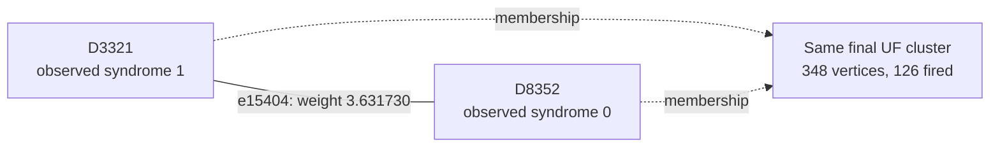

# Shot 145: A completed yoke edge is discarded in a tied batch

Both yokes are unfired, yet the X-yoke cluster forms and contributes to a wrong logical
pair. The highlighted yoke edge completes its growth but is discarded because other
edges in the same batch have already joined its endpoints. This is different from an
edge freezing before completion.

This is row 145 (zero-based) of the preserved seed-42, 100,000-shot experiment: 1D YSC,
d=7, SI1000 p=0.003, 28 noisy rounds, six physical patches, and two yokes. It contains
415 sampled physical fault events and 800 fired detectors. The measured yoke bits are
X=0, Z=0.

[Collection, notation, and replay instructions](README.md).

**The full-shot logical outcome.**

| Result | Observable mask | Wrong logical predictions |
|---|---|---|
| Actual sampled outcome | 257 | — |
| Repository UF | 337 | L4, L6 |
| Ordinary joint MWPM | 257 | None |
| Correlated MWPM | 257 | None |

All three graph corrections satisfy every detector, including the yokes. UF's residual
has the logical commutation pattern `Z_L,2 Z_L,3`, ignoring global phase. The decoder
predicts observable flips; this notation does not describe literal physical correction
gates.

**Two actual physical events.**

| Event | Circuit location | Noise channel | Sampled error, local coordinates | Detector flips in isolation | Observable flips in isolation |
|---|---|---|---|---|---|
| F168 | patch 3, round 11; tick 110; instruction 4209 | DEPOLARIZE1(0.006) | Y on data q156 at (0, 5) | D3314, D3320, D3321, D8352 | L6 |
| F199 | patch 2, round 14; tick 138; instruction 4892 | DEPOLARIZE2(0.003) | Y on data q125 at (3, 3); Z on ancilla q416 at (2.5, 2.5) | D3860, D4149, D4154, D4155 | None |

Fault IDs are local to this shot. Qubit, patch, and detector IDs are zero-based; rounds
are numbered 1–28. Instruction indices expand repeat blocks and retain SHIFT_COORDS. An
I label means that target receives no Pauli error. These are recovered simulator draws,
not merely compatible DEM explanations. Individual detector flips can cancel when all
faults are combined.

**A local decoding decision.**

Focus on F168's component e15404, D3321–D8352. Its original weight is 3.631730297402,
and its observable label is L6. Correlated MWPM selects this edge; UF does not. The full
detector footprint above also includes another graph component of the same event.

The solid line is the target graph edge, and the dashed arrows describe final UF
membership. This is not the full correction or a diagram of physical gates. Detector
time and circuit round are different from algorithmic growth time.

| Endpoint | Full syndrome bit | Detector coordinates (global x, y, t) | Final cluster |
|---|---|---|---|
| D3321 | 1 | [24.5, 5.5, 11.0] | 348 vertices, 126 fired; boundary terminal |
| D8352 | 0 | [0.0, -2.0, 28.0] | 348 vertices, 126 fired; boundary terminal |

At growth time 4.042581103176, e15404 is among the completed edges, but it does not
enter the forest. Other edges in the tied batch have already joined its endpoints when
this edge is processed, so including it would create a cycle. Its completed growth is
3.631730297402.

| Endpoint | Incident edges selected by UF |
|---|---|
| D3321 | e15402 |
| D8352 | e4100, e7724, e10100, e11553, e12983, e17564, e22113, e23804, e26420, e26903, e26913, e29793, e32663, e34124, e36513, e37473 |

| Unfired endpoint | Actual fault contributions | Resulting detector bit |
|---|---|---|
| D8352 | F28, F68, F84, F110, F122, F168, F195, F214, F238, F239, F254, F276, F337, F350, F365, F366, F380, F394 | 18 mod 2 = 0 |

Correlated MWPM may pass through an unfired detector using an even number of incident
correction edges. It does not need to interpret that detector as a defect. The absence
of a fired bit is not evidence that the corresponding physical faults were absent.

**What correlation changes locally.**

| Quantity | Value |
|---|---|
| Target | e15404: D3321–D8352 |
| First-pass selected source | e16840: D3314–D3320 |
| Original target weight | 3.631730297402 |
| Reweighted target weight | 0.403477675336 |
| Source marginal probability | 0.0134545656584025 |
| Shared DEM mechanism probability | 0.00538824514769302 |
| Clipped implied probability | 0.400477078524494 |

The rule uses min(1/2, shared probability / source probability) to obtain the implied
probability, then lowers the target's log-odds weight if appropriate. The same recovered
physical fault supplies both graph components. The source is selected in the first pass;
it is inferred evidence, not knowledge of the physical-fault log.

Reconstructing all second-pass weights in floating point reproduces correlated MWPM's
saved observable mask 257. As a separate intervention, running the repository UF growth
and peeling on those first-pass-adjusted weights returns mask 257 (correct). This
intervention uses an MWPM first pass and is not an independently benchmarked UF decoder.
No single-edge-only weight intervention is claimed.

**The full growth result and the freedom left to peeling.**

| Yoke | First cluster: vertices / fired / parity | Final cluster: vertices / fired / parity | Final terminals | Final ordinary member-defect counts, patches 0–5 |
|---|---|---|---|---|
| X | 10 / 9 / 1 | 348 / 126 / 0 | T8714, T8762, T8810 | 13, 20, 7, 33, 27, 26 |
| Z | 12 / 11 / 1 | 138 / 63 / 1 | T8885 | 2, 15, 12, 8, 12, 14 |

The yoke belongs to one cluster and is counted once. Vertex count includes unfired
vertices and terminals; detector parity counts only fired detectors. A cluster can stop
with even detector parity or by touching an unconstrained terminal. For a yoke cluster
without terminals, its per-patch member-defect parities fix that sector of the UF
prediction.

| Allowed correction edges | Logical-change rank | Correct logical answer exists? | Restricted MWPM prediction |
|---|---|---|---|
| UF forest | 0 | No | 337 |
| All original edges within each final UF cluster | 0 | No | 337 |

An exhaustive GF(2) cycle-space certificate shows that the required logical change, mask
80, is unavailable even if every original edge internal to the final clusters is
restored. The same syndrome and partition therefore cannot be repaired by a different
peeling choice. A correct answer requires connections beyond that partition. This is
stronger than merely observing that restricted MWPM returns the wrong answer.

**Physical interventions.**

| Physical error pattern | Actual mask | UF mask | Correlated MWPM mask | UF wrong predictions |
|---|---|---|---|---|
| Original | 257 | 337 | 257 | L4, L6 |
| F168 removed | 321 | 321 | 321 | None |
| F199 removed | 257 | 257 | 257 | None |
| F168 and F199 removed | 321 | 321 | 321 | None |
| F168 alone | 64 | 64 | 64 | None |
| F199 alone | 0 | 0 | 0 | None |
| F168 and F199 alone | 64 | 64 | 64 | None |

Each deletion retains all other sampled events and the original decoder graph. The
syndrome and actual observables are changed by the removed events' independently
verified responses. Every resulting decoder correction still satisfies its input
syndrome. These counterfactuals distinguish a full repair, a partial repair, and a
change to a different wrong answer.

F168 carries logical observable L6 itself, so removing it changes the actual observable
mask as well as the syndrome. The intervention table compares each decoder against that
changed truth. The completed local cycle does not by itself establish a logical repair;
the full cluster certificate and the paired correction paths below establish the
limitation.

**An explicit logical correction exchange.**

| Wrong observable | Patch observable | Boundary endpoint | Path from its yoke, edge IDs in order |
|---|---|---|---|
| L4 | X2 | T9088 | e19473, e20956, e19552, e19587, e19616, e21053, e21088, e21092 |
| L6 | X3 | T8810 | e15404, e15402, e14004, e15477, e14043, e14113, e12714, e12712 |

Every listed edge belongs to the symmetric difference of the complete UF and correlated
MWPM corrections. Toggle the paths in pairs within each sector; doing this for all
listed paths changes mask 337 to 257. Internal detector incidences change by an even
number, the paired paths cancel their yoke incidence, and only the virtual boundary
endpoints are unconstrained. The resulting correction was explicitly checked against
every detector and all 12 observables. A single yoke-to-boundary path is not by itself a
valid syndrome-preserving toggle.

The local edge example illustrates one decision, while these complete paths supply a
valid logical repair. Restoring just the highlighted edge, or deleting one selected
fault, is not asserted to reproduce the entire correlated MWPM correction.

**Replay and scope.**

The original arrays are in `out/union_find_correlated_comparison_d7_p003_100k_seed42`;
select row 145 consistently across detector, actual-observable, and prediction arrays.
The original 100,000-shot call was regenerated byte for byte using Stim 1.16.0 SSE2. All
415 recovered events reproduce this shot, both in aggregate and by XORing their
individual responses. A forced-fault circuit also reproduces it for eight checks with
the ordinary sampler using seeds 1 and 123456. Graph corrections and prediction masks
reproduce the saved results with PyMatching 2.4.0.

Detailed scripts, fault traces, and numerical records are local temporary data under
`$TMPDIR/uf-case-collection-9pbSDiuL/shot_145`. [The collection guide](README.md)
records common hashes, the method, and the limits of the diagnostic interventions. These
are deliberately selected case studies; they do not estimate mechanism frequencies or
establish a decoder change's accuracy. The repository decoder was not modified.

[All cases](README.md) · [Previous: shot 129](shot_129.md) · [Next: shot 146](shot_146.md)
