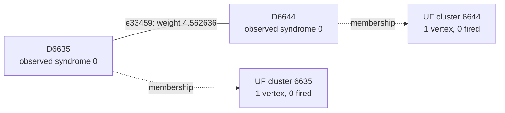

# Shot 146: Correlated MWPM traverses detectors whose physical flips cancel

The highlighted physical fault flips two detectors that are both zero in the full
syndrome. Other faults cancel its contributions. UF leaves those vertices as inactive
singletons and never grows their connecting edge, while correlated MWPM uses the edge as
part of a valid correction through unfired detectors.

This is row 146 (zero-based) of the preserved seed-42, 100,000-shot experiment: 1D YSC,
d=7, SI1000 p=0.003, 28 noisy rounds, six physical patches, and two yokes. It contains
384 sampled physical fault events and 730 fired detectors. The measured yoke bits are
X=0, Z=0.

[Collection, notation, and replay instructions](README.md).

**The full-shot logical outcome.**

| Result | Observable mask | Wrong logical predictions |
|---|---|---|
| Actual sampled outcome | 1210 | — |
| Repository UF | 3256 | L1, L11 |
| Ordinary joint MWPM | 3256 | L1, L11 |
| Correlated MWPM | 1210 | None |

All three graph corrections satisfy every detector, including the yokes. UF's residual
has the logical commutation pattern `X_L,0 X_L,5`, ignoring global phase. The decoder
predicts observable flips; this notation does not describe literal physical correction
gates.

**Two actual physical events.**

| Event | Circuit location | Noise channel | Sampled error, local coordinates | Detector flips in isolation | Observable flips in isolation |
|---|---|---|---|---|---|
| F309 | patch 0, round 24; tick 233; instruction 8144 | DEPOLARIZE2(0.003) | X on data q17 at (2, 2); Y on ancilla q320 at (2.5, 2.5) | D6635, D6636, D6643, D6644 | None |
| F54 | patch 5, round 4; tick 40; instruction 1920 | DEPOLARIZE1(0.006) | Y on data q278 at (3, 6) | D1415, D1421, D1422 | None |

Fault IDs are local to this shot. Qubit, patch, and detector IDs are zero-based; rounds
are numbered 1–28. Instruction indices expand repeat blocks and retain SHIFT_COORDS. An
I label means that target receives no Pauli error. These are recovered simulator draws,
not merely compatible DEM explanations. Individual detector flips can cancel when all
faults are combined.

**A local decoding decision.**

Focus on F309's component e33459, D6635–D6644. Its original weight is 4.562635883352,
and its observable label is None. Correlated MWPM selects this edge; UF does not. The
full detector footprint above also includes another graph component of the same event.

The solid line is the target graph edge, and the dashed arrows describe final UF
membership. This is not the full correction or a diagram of physical gates. Detector
time and circuit round are different from algorithmic growth time.

| Endpoint | Full syndrome bit | Detector coordinates (global x, y, t) | Final cluster |
|---|---|---|---|
| D6635 | 0 | [1.5, 1.5, 23.0] | 1 vertex, 0 fired; even detector parity |
| D6644 | 0 | [2.5, 2.5, 23.0] | 1 vertex, 0 fired; even detector parity |

The endpoints finish in different inactive clusters. The connection has grown
0.000000000000 of its required 4.562635883352 and never enters the forest. One side
stops because of even detector parity; the other stops because of even detector parity.

| Endpoint | Incident edges selected by UF |
|---|---|
| D6635 | None |
| D6644 | None |

| Unfired endpoint | Actual fault contributions | Resulting detector bit |
|---|---|---|
| D6635 | F309, F310 | 2 mod 2 = 0 |
| D6644 | F305, F309 | 2 mod 2 = 0 |

Correlated MWPM may pass through an unfired detector using an even number of incident
correction edges. It does not need to interpret that detector as a defect. The absence
of a fired bit is not evidence that the corresponding physical faults were absent.

**What correlation changes locally.**

| Quantity | Value |
|---|---|
| Target | e33459: D6635–D6644 |
| First-pass selected source | e32020: D6636–D6643 |
| Original target weight | 4.562635883352 |
| Reweighted target weight | 0.713850186433 |
| Source marginal probability | 0.0157881144111313 |
| Shared DEM mechanism probability | 0.00519032127620351 |
| Clipped implied probability | 0.328748648574785 |

The rule uses min(1/2, shared probability / source probability) to obtain the implied
probability, then lowers the target's log-odds weight if appropriate. The same recovered
physical fault supplies both graph components. The source is selected in the first pass;
it is inferred evidence, not knowledge of the physical-fault log.

Reconstructing all second-pass weights in floating point reproduces correlated MWPM's
saved observable mask 1210. As a separate intervention, running the repository UF growth
and peeling on those first-pass-adjusted weights returns mask 1210 (correct). This
intervention uses an MWPM first pass and is not an independently benchmarked UF decoder.
No single-edge-only weight intervention is claimed.

**The full growth result and the freedom left to peeling.**

| Yoke | First cluster: vertices / fired / parity | Final cluster: vertices / fired / parity | Final terminals | Final ordinary member-defect counts, patches 0–5 |
|---|---|---|---|---|
| X | 9 / 8 / 0 | 22 / 14 / 0 | None | 0, 0, 5, 2, 0, 7 |
| Z | 14 / 13 / 1 | 209 / 80 / 0 | T8582 | 14, 17, 5, 3, 14, 27 |

The yoke belongs to one cluster and is counted once. Vertex count includes unfired
vertices and terminals; detector parity counts only fired detectors. A cluster can stop
with even detector parity or by touching an unconstrained terminal. For a yoke cluster
without terminals, its per-patch member-defect parities fix that sector of the UF
prediction.

| Allowed correction edges | Logical-change rank | Correct logical answer exists? | Restricted MWPM prediction |
|---|---|---|---|
| UF forest | 0 | No | 3256 |
| All original edges within each final UF cluster | 0 | No | 3256 |

An exhaustive GF(2) cycle-space certificate shows that the required logical change, mask
2050, is unavailable even if every original edge internal to the final clusters is
restored. The same syndrome and partition therefore cannot be repaired by a different
peeling choice. A correct answer requires connections beyond that partition. This is
stronger than merely observing that restricted MWPM returns the wrong answer.

**Physical interventions.**

| Physical error pattern | Actual mask | UF mask | Correlated MWPM mask | UF wrong predictions |
|---|---|---|---|---|
| Original | 1210 | 3256 | 1210 | L1, L11 |
| F309 removed | 1210 | 1210 | 1210 | None |
| F54 removed | 1210 | 3256 | 1210 | L1, L11 |
| F309 and F54 removed | 1210 | 1210 | 1210 | None |
| F309 alone | 0 | 0 | 0 | None |
| F54 alone | 0 | 0 | 0 | None |
| F309 and F54 alone | 0 | 0 | 0 | None |

Each deletion retains all other sampled events and the original decoder graph. The
syndrome and actual observables are changed by the removed events' independently
verified responses. Every resulting decoder correction still satisfies its input
syndrome. These counterfactuals distinguish a full repair, a partial repair, and a
change to a different wrong answer.

At D6635, contributions from F309 and F310 cancel. At D6644, F305 and F309 cancel. A
zero detector bit therefore does not establish that no physical fault affected that
check. Removing F309 fixes UF, while removing the separate boundary fault F54 does not
fix the original logical pair.

**An explicit logical correction exchange.**

| Wrong observable | Patch observable | Boundary endpoint | Path from its yoke, edge IDs in order |
|---|---|---|---|
| L1 | Z0 | T9455 | e33452, e33450, e33459, e33506, e33547, e33593, e32122 |
| L11 | Z5 | T8582 | e1592, e3087, e3122, e1682, e3106, e4546, e4548, e5952, e5954, e5886 |

Every listed edge belongs to the symmetric difference of the complete UF and correlated
MWPM corrections. Toggle the paths in pairs within each sector; doing this for all
listed paths changes mask 3256 to 1210. Internal detector incidences change by an even
number, the paired paths cancel their yoke incidence, and only the virtual boundary
endpoints are unconstrained. The resulting correction was explicitly checked against
every detector and all 12 observables. A single yoke-to-boundary path is not by itself a
valid syndrome-preserving toggle.

The local edge example illustrates one decision, while these complete paths supply a
valid logical repair. Restoring just the highlighted edge, or deleting one selected
fault, is not asserted to reproduce the entire correlated MWPM correction.

**Replay and scope.**

The original arrays are in `out/union_find_correlated_comparison_d7_p003_100k_seed42`;
select row 146 consistently across detector, actual-observable, and prediction arrays.
The original 100,000-shot call was regenerated byte for byte using Stim 1.16.0 SSE2. All
384 recovered events reproduce this shot, both in aggregate and by XORing their
individual responses. A forced-fault circuit also reproduces it for eight checks with
the ordinary sampler using seeds 1 and 123456. Graph corrections and prediction masks
reproduce the saved results with PyMatching 2.4.0.

Detailed scripts, fault traces, and numerical records are local temporary data under
`$TMPDIR/uf-case-collection-9pbSDiuL/shot_146`. [The collection guide](README.md)
records common hashes, the method, and the limits of the diagnostic interventions. These
are deliberately selected case studies; they do not estimate mechanism frequencies or
establish a decoder change's accuracy. The repository decoder was not modified.

[All cases](README.md) · [Previous: shot 145](shot_145.md) · [Next: shot 295](shot_295.md)
