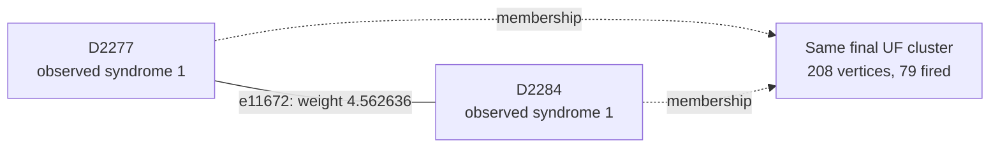

# Shot 15986: Equal-cost forest corrections predict different X-logical pairs

The cheapest correct and incorrect logical classes in the forest have equal weight at
the reported precision. UF and ordinary MWPM choose the wrong class; correlated MWPM
succeeds. A different peeling root can also produce the correct logical answer.

This is row 15986 (zero-based) of the preserved seed-42, 100,000-shot experiment: 1D
YSC, d=7, SI1000 p=0.003, 28 noisy rounds, six physical patches, and two yokes. It
contains 400 sampled physical fault events and 753 fired detectors. The measured yoke
bits are X=0, Z=1.

[Collection, notation, and replay instructions](README.md).

**The full-shot logical outcome.**

| Result | Observable mask | Wrong logical predictions |
|---|---|---|
| Actual sampled outcome | 122 | — |
| Repository UF | 1082 | L6, L10 |
| Ordinary joint MWPM | 1082 | L6, L10 |
| Correlated MWPM | 122 | None |

All three graph corrections satisfy every detector, including the yokes. UF's residual
has the logical commutation pattern `Z_L,3 Z_L,5`, ignoring global phase. The decoder
predicts observable flips; this notation does not describe literal physical correction
gates.

**Two actual physical events.**

| Event | Circuit location | Noise channel | Sampled error, local coordinates | Detector flips in isolation | Observable flips in isolation |
|---|---|---|---|---|---|
| F96 | patch 5, round 7; tick 68; instruction 2603 | DEPOLARIZE2(0.003) | Y on data q276 at (3, 4); X on ancilla q561 at (2.5, 3.5) | D2277, D2278, D2283, D2284 | None |
| F276 | patch 3, round 18; tick 180; instruction 6498 | DEPOLARIZE1(0.006) | Y on data q182 at (4, 3) | D5354, D5355, D5362, D5363 | None |

Fault IDs are local to this shot. Qubit, patch, and detector IDs are zero-based; rounds
are numbered 1–28. Instruction indices expand repeat blocks and retain SHIFT_COORDS. An
I label means that target receives no Pauli error. These are recovered simulator draws,
not merely compatible DEM explanations. Individual detector flips can cancel when all
faults are combined.

**A local decoding decision.**

Focus on F96's component e11672, D2277–D2284. Its original weight is 4.562635883352, and
its observable label is None. Correlated MWPM selects this edge; UF does not. The full
detector footprint above also includes another graph component of the same event.

The solid line is the target graph edge, and the dashed arrows describe final UF
membership. This is not the full correction or a diagram of physical gates. Detector
time and circuit round are different from algorithmic growth time.

| Endpoint | Full syndrome bit | Detector coordinates (global x, y, t) | Final cluster |
|---|---|---|---|
| D2277 | 1 | [42.5, 3.5, 7.0] | 208 vertices, 79 fired; boundary terminal |
| D2284 | 1 | [43.5, 4.5, 7.0] | 208 vertices, 79 fired; boundary terminal |

The edge enters the forest at growth time 2.926396066306; peeling subsequently leaves it
unselected. Having the physical event's direct edge available is therefore insufficient
to identify the final correction. The UF edges incident to its endpoints are shown
below.

| Endpoint | Incident edges selected by UF |
|---|---|
| D2277 | e10192 |
| D2284 | e10268 |

**What correlation changes locally.**

| Quantity | Value |
|---|---|
| Target | e11672: D2277–D2284 |
| First-pass selected source | e10233: D2278–D2283 |
| Original target weight | 4.562635883352 |
| Reweighted target weight | 0.713850186433 |
| Source marginal probability | 0.0157881144111313 |
| Shared DEM mechanism probability | 0.00519032127620351 |
| Clipped implied probability | 0.328748648574785 |

The rule uses min(1/2, shared probability / source probability) to obtain the implied
probability, then lowers the target's log-odds weight if appropriate. The same recovered
physical fault supplies both graph components. The source is selected in the first pass;
it is inferred evidence, not knowledge of the physical-fault log.

Reconstructing all second-pass weights in floating point reproduces correlated MWPM's
saved observable mask 122. As a separate intervention, running the repository UF growth
and peeling on those first-pass-adjusted weights returns mask 122 (correct). This
intervention uses an MWPM first pass and is not an independently benchmarked UF decoder.
No single-edge-only weight intervention is claimed.

**The full growth result and the freedom left to peeling.**

| Yoke | First cluster: vertices / fired / parity | Final cluster: vertices / fired / parity | Final terminals | Final ordinary member-defect counts, patches 0–5 |
|---|---|---|---|---|
| X | 23 / 22 / 0 | 208 / 79 / 1 | T8777, T9242 | 16, 12, 15, 14, 12, 10 |
| Z | 39 / 39 / 1 | 213 / 131 / 1 | T9207 | 19, 25, 15, 24, 10, 37 |

The yoke belongs to one cluster and is counted once. Vertex count includes unfired
vertices and terminals; detector parity counts only fired detectors. A cluster can stop
with even detector parity or by touching an unconstrained terminal. For a yoke cluster
without terminals, its per-patch member-defect parities fix that sector of the UF
prediction.

| Allowed correction edges | Logical-change rank | Correct logical answer exists? | Restricted MWPM prediction |
|---|---|---|---|
| UF forest | 1 | Yes | 1082 |
| All original edges within each final UF cluster | 1 | Yes | 1082 |

| Forest logical prediction | Compared with actual outcome | Minimum forest cost at original float weights |
|---|---|---|
| 122 | Correct | 1823.257635219590 |
| 1082 | Incorrect | 1823.257635219590 |

An independent tree dynamic program, allowing every terminal to absorb parity, finds
correct and incorrect forest logical classes tied within 1e-9. Each recovered optimum
was checked against every detector and its logical mask. A fixed-weight optimum does not
select a unique logical answer in this forest.

All 2 combinations of terminal roots for the two yoke trees were tested with the
existing peeling function. 1 choice is correct. One successful choice visits T9242,
T9207 first, and returns mask 122.

| Terminal in a yoke tree | Attached detector | Patch | UF correction | Cheapest correct forest correction |
|---|---|---|---|---|
| T8777 | D2584 | 5 | Selected | Unused |
| T9207 | D5179 | 5 | Selected | Selected |
| T9242 | D5370 | 3 | Unused | Selected |

The cheapest correct forest solution can be reproduced by toggling these 22 edges
relative to the original UF correction: e10113, e10192, e10268, e11596, e11672, e11705,
e11740, e11742, e18442, e19882, e19917, e25672, e26903, e27024, e27027, e27061, e27107,
e28060, e28383, e28425, e29499, e29500. All are already in the UF forest. Their combined
detector incidence is zero, and their observable mask is 1088, changing prediction 1082
to 122. The full reconstructed correction and its weight were checked explicitly.

**Physical interventions.**

| Physical error pattern | Actual mask | UF mask | Correlated MWPM mask | UF wrong predictions |
|---|---|---|---|---|
| Original | 122 | 1082 | 122 | L6, L10 |
| F96 removed | 122 | 122 | 122 | None |
| F276 removed | 122 | 122 | 122 | None |
| F96 and F276 removed | 122 | 122 | 122 | None |
| F96 alone | 0 | 0 | 0 | None |
| F276 alone | 0 | 0 | 0 | None |
| F96 and F276 alone | 0 | 0 | 0 | None |

Each deletion retains all other sampled events and the original decoder graph. The
syndrome and actual observables are changed by the removed events' independently
verified responses. Every resulting decoder correction still satisfies its input
syndrome. These counterfactuals distinguish a full repair, a partial repair, and a
change to a different wrong answer.

Original-weight optimality alone cannot distinguish the tied forest explanations in this
case. The highlighted physical faults supply cross-sector correlation evidence, and the
reconstructed correlated second pass matches the saved result. This is a weight
degeneracy example, not proof that UF simply chose a strictly more expensive correction.

**An explicit logical correction exchange.**

| Wrong observable | Patch observable | Boundary endpoint | Path from its yoke, edge IDs in order |
|---|---|---|---|
| L6 | X3 | T9242 | e26903, e28383, e28425, e27027, e27024, e27061, e27107, e25672 |
| L10 | X5 | T8777 | e10113, e11596, e10192, e11672, e10268, e11705, e11742, e11740 |

Every listed edge belongs to the symmetric difference of the complete UF and correlated
MWPM corrections. Toggle the paths in pairs within each sector; doing this for all
listed paths changes mask 1082 to 122. Internal detector incidences change by an even
number, the paired paths cancel their yoke incidence, and only the virtual boundary
endpoints are unconstrained. The resulting correction was explicitly checked against
every detector and all 12 observables. A single yoke-to-boundary path is not by itself a
valid syndrome-preserving toggle.

The local edge example illustrates one decision, while these complete paths supply a
valid logical repair. Restoring just the highlighted edge, or deleting one selected
fault, is not asserted to reproduce the entire correlated MWPM correction.

**Replay and scope.**

The original arrays are in `out/union_find_correlated_comparison_d7_p003_100k_seed42`;
select row 15986 consistently across detector, actual-observable, and prediction arrays.
The original 100,000-shot call was regenerated byte for byte using Stim 1.16.0 SSE2. All
400 recovered events reproduce this shot, both in aggregate and by XORing their
individual responses. A forced-fault circuit also reproduces it for eight checks with
the ordinary sampler using seeds 1 and 123456. Graph corrections and prediction masks
reproduce the saved results with PyMatching 2.4.0.

Detailed scripts, fault traces, and numerical records are local temporary data under
`$TMPDIR/uf-case-collection-9pbSDiuL/shot_15986`. [The collection guide](README.md)
records common hashes, the method, and the limits of the diagnostic interventions. These
are deliberately selected case studies; they do not estimate mechanism frequencies or
establish a decoder change's accuracy. The repository decoder was not modified.

[All cases](README.md) · [Previous: shot 12273](shot_12273.md) · [Next: shot 26285](shot_26285.md)
