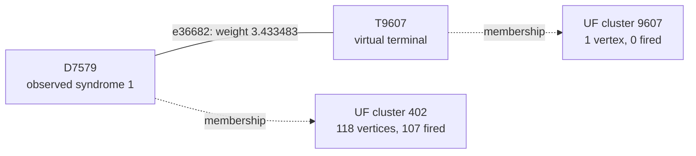

# Shot 26898: Four terminal-root combinations reduce to two logical answers

Both yoke trees have odd detector parity and two terminals. All four combinations of
their terminal roots were tested, and two are correct. The forest has only one
independent logical-change direction: the required Z-logical pair L1 and L3. The number
of terminal choices is therefore different from the number of distinct logical answers.

This is row 26898 (zero-based) of the preserved seed-42, 100,000-shot experiment: 1D
YSC, d=7, SI1000 p=0.003, 28 noisy rounds, six physical patches, and two yokes. It
contains 420 sampled physical fault events and 820 fired detectors. The measured yoke
bits are X=1, Z=1.

[Collection, notation, and replay instructions](README.md).

**The full-shot logical outcome.**

| Result | Observable mask | Wrong logical predictions |
|---|---|---|
| Actual sampled outcome | 3259 | — |
| Repository UF | 3249 | L1, L3 |
| Ordinary joint MWPM | 3259 | None |
| Correlated MWPM | 3259 | None |

All three graph corrections satisfy every detector, including the yokes. UF's residual
has the logical commutation pattern `X_L,0 X_L,1`, ignoring global phase. The decoder
predicts observable flips; this notation does not describe literal physical correction
gates.

**Reading the logical result by patch.**

| Patch | Actual flips (X, Z) | UF predicts (X, Z) | Wrong observable sector |
|---|---|---|---|
| 0 | (1, 1) | (1, 0) | Z |
| 1 | (0, 1) | (0, 0) | Z |
| 2 | (1, 1) | (1, 1) | None |
| 3 | (0, 1) | (0, 1) | None |
| 4 | (0, 0) | (0, 0) | None |
| 5 | (1, 1) | (1, 1) | None |

These are flip indicators relative to the ideal logical measurements: 1 means a flip and
0 means no flip. They are not the absolute encoded-state bits. Correlated MWPM matches
the actual column on every patch. A correction can satisfy every detector while
predicting the wrong logical flips; that leaves a residual logical error when its
correction or Pauli frame is used.

**Two actual physical events.**

| Event | Circuit location | Noise channel | Sampled error, local coordinates | Detector flips in isolation | Observable flips in isolation |
|---|---|---|---|---|---|
| F391 | patch 1, round 27; tick 261; instruction 9119 | DEPOLARIZE1(0.006) | Y on data q99 at (6, 6) | D7579, D7580 | None |
| F111 | patch 0, round 8; tick 78; instruction 2930 | DEPOLARIZE2(0.003) | Y on data q25 at (3, 3); Z on ancilla q320 at (2.5, 2.5) | D2036, D2325, D2330, D2331 | None |

Fault IDs are local to this shot. Qubit, patch, and detector IDs are zero-based; rounds
are numbered 1–28. Instruction indices expand repeat blocks and retain SHIFT_COORDS. An
I label means that target receives no Pauli error. These are recovered simulator draws,
not merely compatible DEM explanations. Individual detector flips can cancel when all
faults are combined.

**A local decoding decision.**

Focus on F391's component e36682, D7579–boundary. Its original weight is 3.433482966390,
and its observable label is None. Correlated MWPM selects this edge; UF does not. The
full detector footprint above also includes another graph component of the same event.

The solid line is the target graph edge, and the dashed arrows describe final UF
membership. This is not the full correction or a diagram of physical gates. Detector
time and circuit round are different from algorithmic growth time.

| Endpoint | Full syndrome bit | Detector coordinates (global x, y, t) | Final cluster |
|---|---|---|---|
| D7579 | 1 | [13.5, 5.5, 26.0] | 118 vertices, 107 fired; boundary terminal |
| T9607 | Unconstrained | Virtual boundary | 1 vertex, 0 fired; boundary terminal |

The endpoints finish in different inactive clusters. The connection has grown
3.390989621338 of its required 3.433482966390 and never enters the forest. One side
stops because of a boundary terminal; the other stops because of a boundary terminal.

| Endpoint | Incident edges selected by UF |
|---|---|
| D7579 | e36717 |
| T9607 | None |

| Decoder | Selects the highlighted target edge? |
|---|---|
| repository_uf | No |
| joint_mwpm_uncorrelated | No |
| joint_mwpm_correlated | Yes |

**Recorded growth transitions for the highlighted edge.**

The initial rate is 1, counting active detector endpoints; a virtual terminal never
initiates growth. The table records changes in this edge's rate or internal status.
Other unions and parity-preserving size changes are omitted. Times are algorithmic
growth coordinates, not circuit rounds or software latency.

| Growth time | Accumulated growth | First endpoint cluster | Second endpoint cluster | Rate after event | Edge event |
|---|---|---|---|---|---|
| 3.218075184 | 3.218075184 | 8 fired, even; inactive | 0 fired, boundary; inactive | 0 | Activity changed |
| 3.648127267 | 3.218075184 | 9 fired, odd; active | 0 fired, boundary; inactive | 1 | Activity changed |
| 3.678303297 | 3.248251214 | 104 fired, even; inactive (yoke) | 0 fired, boundary; inactive | 0 | Activity changed |
| 3.746708642 | 3.248251214 | 105 fired, odd; active (yoke) | 0 fired, boundary; inactive | 1 | Activity changed |
| 3.889447049 | 3.390989621 | 107 fired, boundary; inactive (yoke) | 0 fired, boundary; inactive | 0 | Activity changed |

Required growth is 3.433482966390; final accumulated growth is 3.390989621338. Final
edge status: incomplete between final clusters.

**What correlation changes locally.**

| Quantity | Value |
|---|---|
| Target | e36682: D7579–boundary |
| First-pass selected source | e36731: D7580–boundary |
| Original target weight | 3.433482966390 |
| Reweighted target weight | 0.461179597522 |
| Source marginal probability | 0.0159817991653669 |
| Shared DEM mechanism probability | 0.00618025807349817 |
| Clipped implied probability | 0.386706027872695 |

The rule uses min(1/2, shared probability / source probability) to obtain the implied
probability, then lowers the target's log-odds weight if appropriate. The same recovered
physical fault supplies both graph components. The source is selected in the first pass;
it is inferred evidence, not knowledge of the physical-fault log.

Reconstructing all second-pass weights in floating point reproduces correlated MWPM's
saved observable mask 3259. As a separate intervention, running the repository UF growth
and peeling on those first-pass-adjusted weights returns mask 3259 (correct). This
intervention uses an MWPM first pass and is not an independently benchmarked UF decoder.
No single-edge-only weight intervention is claimed.

**The other traced physical connection.**

For F111, the selected diagnostic component is e10468, D2036–D2331. Its observable label
is None, and its weight is 5.625379320882. Its growth outcome is: forest edge; unused by
peeling.

| Decoder | Selects this target edge? |
|---|---|
| repository_uf | No |
| joint_mwpm_uncorrelated | Yes |
| joint_mwpm_correlated | Yes |

| Endpoint | Observed bit | Final cluster |
|---|---|---|
| D2036 | 1 | 118 vertices, 107 fired; boundary terminal |
| D2331 | 1 | 118 vertices, 107 fired; boundary terminal |

The selected first-pass source is e10467 (D2325–D2330); it lowers the target weight from
5.625379320882 to 3.069848658846. That source is another component of this same
recovered physical event.

**The full growth result and the freedom left to peeling.**

| Yoke | First cluster: vertices / fired / parity | Final cluster: vertices / fired / parity | Final terminals | Final ordinary member-defect counts, patches 0–5 |
|---|---|---|---|---|
| X | 32 / 32 / 0 | 153 / 125 / 1 | T8913, T8961 | 23, 14, 11, 28, 19, 29 |
| Z | 32 / 32 / 0 | 118 / 107 / 1 | T8734, T9462 | 19, 28, 11, 9, 28, 11 |

The yoke belongs to one cluster and is counted once. Vertex count includes unfired
vertices and terminals; detector parity counts only fired detectors. A cluster can stop
with even detector parity or by touching an unconstrained terminal. For a yoke cluster
without terminals, its per-patch member-defect parities fix that sector of the UF
prediction.

| Yoke tree | Terminal | Attached detector | Patch | Boundary edge selected by UF? |
|---|---|---|---|---|
| X | T8913 | D3400 | 4 | Yes |
| X | T8961 | D3688 | 4 | No |
| Z | T8734 | D2333 | 0 | Yes |
| Z | T9462 | D6701 | 1 | No |

Several terminals can attach to the same patch. Their count does not determine the
number of independent logical changes; the logical-space calculation below tracks their
observable labels.

| Allowed correction edges | Logical-change rank | Correct logical answer exists? | Restricted MWPM prediction |
|---|---|---|---|
| UF forest | 1 | Yes | 3259 |
| All original edges within each final UF cluster | 1 | Yes | 3259 |

| Forest logical prediction | Compared with actual outcome | Minimum forest cost at original float weights |
|---|---|---|
| 3249 | Incorrect | 1927.506991955643 |
| 3259 | Correct | 1919.748766314470 |

The cheapest correct forest class is lighter by 7.758225641173. An independent tree
dynamic program recovers it using the same forest and original float weights. Thus the
current peeling policy misses an available, lower-cost correction with the right logical
answer.

All 4 combinations of terminal roots for the two yoke trees were tested with the
existing peeling function. 2 choices are correct. One successful choice visits T8913,
T9462 first, and returns mask 3259.

| Terminal in a yoke tree | Attached detector | Patch | UF correction | Cheapest correct forest correction |
|---|---|---|---|---|
| T8734 | D2333 | 0 | Selected | Unused |
| T8913 | D3400 | 4 | Selected | Unused |
| T8961 | D3688 | 4 | Unused | Selected |
| T9462 | D6701 | 1 | Unused | Selected |

The cheapest correct forest solution can be reproduced by toggling these 33 edges
relative to the original UF correction: e1087, e2619, e2620, e3648, e5127, e6528, e6567,
e7420, e8859, e8860, e9021, e9048, e9050, e10446, e10468, e10514, e11947, e15820,
e17259, e17260, e30888, e32286, e32369, e33741, e33791, e33814, e35186, e35218, e35227,
e35254, e35492, e36930, e36932. All are already in the UF forest. Their combined
detector incidence is zero, and their observable mask is 10, changing prediction 3249 to
3259. The full reconstructed correction and its weight were checked explicitly.

**Physical interventions.**

| Physical error pattern | Actual mask | UF mask | Correlated MWPM mask | UF wrong predictions |
|---|---|---|---|---|
| Original | 3259 | 3249 | 3259 | L1, L3 |
| F391 removed | 3259 | 3249 | 3259 | L1, L3 |
| F111 removed | 3259 | 3259 | 3259 | None |
| F391 and F111 removed | 3259 | 3259 | 3259 | None |
| F391 alone | 0 | 0 | 0 | None |
| F111 alone | 0 | 0 | 0 | None |
| F391 and F111 alone | 0 | 0 | 0 | None |

Each deletion retains all other sampled events and the original decoder graph. The
syndrome and actual observables are changed by the removed events' independently
verified responses. Every resulting decoder correction still satisfies its input
syndrome. These counterfactuals distinguish a full repair, a partial repair, and a
change to a different wrong answer.

Removing the late data-Y fault F391 leaves the original UF mistake. Removing the earlier
YZ fault F111 fixes it, and removing both also fixes it. The late fault's boundary
connection remains incomplete, but the original forest already contains a cheaper
correct correction through other available edges. Ordinary MWPM succeeds without
selecting that late boundary edge.

**An explicit logical correction exchange.**

| Wrong observable | Patch observable | Boundary endpoint | Path from its yoke, edge IDs in order |
|---|---|---|---|
| L1 | Z0 | T8734 | e7532, e9013, e9021, e10468, e11947, e10514, e10446 |
| L3 | Z1 | T9607 | e30888, e32369, e33814, e35254, e35218, e33741, e35186, e35227, e35273, e35277, e36717, e36682 |

Every listed edge belongs to the symmetric difference of the complete UF and correlated
MWPM corrections. Toggle the paths in pairs within each sector; doing this for all
listed paths changes mask 3249 to 3259. Internal detector incidences change by an even
number, the paired paths cancel their yoke incidence, and only the virtual boundary
endpoints are unconstrained. The resulting correction was explicitly checked against
every detector and all 12 observables. A single yoke-to-boundary path is not by itself a
valid syndrome-preserving toggle.

The local edge example illustrates one decision, while these complete paths supply a
valid logical repair. Restoring just the highlighted edge, or deleting one selected
fault, is not asserted to reproduce the entire correlated MWPM correction.

**Replay and scope.**

The original arrays are in `out/union_find_correlated_comparison_d7_p003_100k_seed42`;
select row 26898 consistently across detector, actual-observable, and prediction arrays.
The original 100,000-shot call was regenerated byte for byte using Stim 1.16.0 SSE2. All
420 recovered events reproduce this shot, both in aggregate and by XORing their
individual responses. A forced-fault circuit also reproduces it for eight checks with
the ordinary sampler using seeds 1 and 123456. Graph corrections and prediction masks
reproduce the saved results with PyMatching 2.4.0.

Detailed scripts, fault traces, and numerical records are local temporary data under
`$TMPDIR/uf-case-collection-next-6a0xaw4f/shot_26898`. [The collection guide](README.md)
records common hashes, the method, and the limits of the diagnostic interventions. These
are deliberately selected case studies; they do not estimate mechanism frequencies or
establish a decoder change's accuracy. The repository decoder was not modified.

[All cases](README.md) · [Previous: shot 26074](shot_26074.md) · [Next: shot 44875](shot_44875.md)
