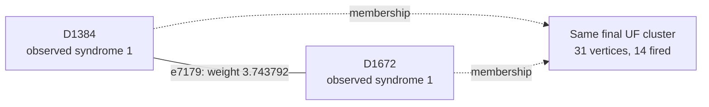

# Shot 295: Removing a readout fault fixes only the X-sector mistake

The highlighted round-5 readout error has its direct temporal edge in the UF forest, and
that edge receives no correlation discount. Nevertheless, removing the readout fault
repairs the wrong X-logical pair. A separate wrong Z-logical pair remains.

This is row 295 (zero-based) of the preserved seed-42, 100,000-shot experiment: 1D YSC,
d=7, SI1000 p=0.003, 28 noisy rounds, six physical patches, and two yokes. It contains
405 sampled physical fault events and 755 fired detectors. The measured yoke bits are
X=0, Z=1.

[Collection, notation, and replay instructions](README.md).

**The full-shot logical outcome.**

| Result | Observable mask | Wrong logical predictions |
|---|---|---|
| Actual sampled outcome | 1610 | — |
| Repository UF | 1860 | L1, L2, L3, L8 |
| Ordinary joint MWPM | 1870 | L2, L8 |
| Correlated MWPM | 1610 | None |

All three graph corrections satisfy every detector, including the yokes. UF's residual
has the logical commutation pattern `X_L,0 Y_L,1 Z_L,4`, ignoring global phase. The
decoder predicts observable flips; this notation does not describe literal physical
correction gates.

**Two actual physical events.**

| Event | Circuit location | Noise channel | Sampled error, local coordinates | Detector flips in isolation | Observable flips in isolation |
|---|---|---|---|---|---|
| F74 | patch 4, round 5; tick 50; instruction 1955 | M(0.015) | readout on ancilla q532 at (5.5, 2.5) | D1384, D1672 | None |
| F90 | patch 4, round 7; tick 63; instruction 2585 | DEPOLARIZE2(0.003) | X on data q211 at (1, 3); Y on ancilla q505 at (1.5, 3.5) | D1926, D1927, D1932, D1933 | None |

Fault IDs are local to this shot. Qubit, patch, and detector IDs are zero-based; rounds
are numbered 1–28. Instruction indices expand repeat blocks and retain SHIFT_COORDS. An
I label means that target receives no Pauli error. These are recovered simulator draws,
not merely compatible DEM explanations. Individual detector flips can cancel when all
faults are combined.

**A local decoding decision.**

Focus on F74's component e7179, D1384–D1672. Its original weight is 3.743791874133, and
its observable label is None. Correlated MWPM selects this edge; UF does not. This
component accounts for the event's entire detector response.

The solid line is the target graph edge, and the dashed arrows describe final UF
membership. This is not the full correction or a diagram of physical gates. Detector
time and circuit round are different from algorithmic growth time.

| Endpoint | Full syndrome bit | Detector coordinates (global x, y, t) | Final cluster |
|---|---|---|---|
| D1384 | 1 | [37.5, 2.5, 4.0] | 31 vertices, 14 fired; boundary terminal |
| D1672 | 1 | [37.5, 2.5, 5.0] | 31 vertices, 14 fired; boundary terminal |

The edge enters the forest at growth time 1.871895937066; peeling subsequently leaves it
unselected. Having the physical event's direct edge available is therefore insufficient
to identify the final correction. The UF edges incident to its endpoints are shown
below.

| Endpoint | Incident edges selected by UF |
|---|---|
| D1384 | e5742 |
| D1672 | e8619 |

**What correlation changes locally.**

This edge receives no correlation discount: its weight remains 3.743791874133.
Correlated MWPM still selects it as part of its global solution. Its success cannot be
attributed to lowering this particular edge's cost. Correlation updates elsewhere and
the choice of a complete correction must be considered separately.

Reconstructing all second-pass weights in floating point reproduces correlated MWPM's
saved observable mask 1610. As a separate intervention, running the repository UF growth
and peeling on those first-pass-adjusted weights returns mask 1610 (correct). This
intervention uses an MWPM first pass and is not an independently benchmarked UF decoder.
No single-edge-only weight intervention is claimed.

**The full growth result and the freedom left to peeling.**

| Yoke | First cluster: vertices / fired / parity | Final cluster: vertices / fired / parity | Final terminals | Final ordinary member-defect counts, patches 0–5 |
|---|---|---|---|---|
| X | 28 / 27 / 1 | 173 / 63 / 1 | T8840 | 8, 18, 22, 1, 7, 7 |
| Z | 30 / 30 / 0 | 623 / 88 / 0 | T8453, T8501, T8549 | 26, 18, 12, 14, 13, 4 |

The yoke belongs to one cluster and is counted once. Vertex count includes unfired
vertices and terminals; detector parity counts only fired detectors. A cluster can stop
with even detector parity or by touching an unconstrained terminal. For a yoke cluster
without terminals, its per-patch member-defect parities fix that sector of the UF
prediction.

| Allowed correction edges | Logical-change rank | Correct logical answer exists? | Restricted MWPM prediction |
|---|---|---|---|
| UF forest | 0 | No | 1860 |
| All original edges within each final UF cluster | 0 | No | 1860 |

An exhaustive GF(2) cycle-space certificate shows that the required logical change, mask
270, is unavailable even if every original edge internal to the final clusters is
restored. The same syndrome and partition therefore cannot be repaired by a different
peeling choice. A correct answer requires connections beyond that partition. This is
stronger than merely observing that restricted MWPM returns the wrong answer.

**Physical interventions.**

| Physical error pattern | Actual mask | UF mask | Correlated MWPM mask | UF wrong predictions |
|---|---|---|---|---|
| Original | 1610 | 1860 | 1610 | L1, L2, L3, L8 |
| F74 removed | 1610 | 1600 | 1610 | L1, L3 |
| F90 removed | 1610 | 1600 | 1610 | L1, L3 |
| F74 and F90 removed | 1610 | 1600 | 1610 | L1, L3 |
| F74 alone | 0 | 0 | 0 | None |
| F90 alone | 0 | 0 | 0 | None |
| F74 and F90 alone | 0 | 0 | 0 | None |

Each deletion retains all other sampled events and the original decoder graph. The
syndrome and actual observables are changed by the removed events' independently
verified responses. Every resulting decoder correction still satisfies its input
syndrome. These counterfactuals distinguish a full repair, a partial repair, and a
change to a different wrong answer.

Removing the second highlighted fault, or removing both faults together, leaves the same
Z-sector discrepancy. These are useful limits on the diagnosis: a relevant readout event
need not be the sole source of a full-shot failure, and the presence of its direct edge
in the forest does not guarantee a good final correction.

**An explicit logical correction exchange.**

| Wrong observable | Patch observable | Boundary endpoint | Path from its yoke, edge IDs in order |
|---|---|---|---|
| L1 | Z0 | T9069 | e17688, e17686, e17659, e19099, e20575, e19142, e19113, e19078, e20487, e20448 |
| L2 | X1 | T8792 | e12033, e13516, e12081, e10672, e10707, e10736, e12173, e12208, e12212 |
| L3 | Z1 | T8453 | e371, e373, e337, e1990, e349, e353, e1998, e3443, e1968 |
| L8 | X4 | T8673 | e8433, e8471, e9945, e8509, e7070, e7141, e5742, e7179, e8619, e8620 |

Every listed edge belongs to the symmetric difference of the complete UF and correlated
MWPM corrections. Toggle the paths in pairs within each sector; doing this for all
listed paths changes mask 1860 to 1610. Internal detector incidences change by an even
number, the paired paths cancel their yoke incidence, and only the virtual boundary
endpoints are unconstrained. The resulting correction was explicitly checked against
every detector and all 12 observables. A single yoke-to-boundary path is not by itself a
valid syndrome-preserving toggle.

The local edge example illustrates one decision, while these complete paths supply a
valid logical repair. Restoring just the highlighted edge, or deleting one selected
fault, is not asserted to reproduce the entire correlated MWPM correction.

**Replay and scope.**

The original arrays are in `out/union_find_correlated_comparison_d7_p003_100k_seed42`;
select row 295 consistently across detector, actual-observable, and prediction arrays.
The original 100,000-shot call was regenerated byte for byte using Stim 1.16.0 SSE2. All
405 recovered events reproduce this shot, both in aggregate and by XORing their
individual responses. A forced-fault circuit also reproduces it for eight checks with
the ordinary sampler using seeds 1 and 123456. Graph corrections and prediction masks
reproduce the saved results with PyMatching 2.4.0.

Detailed scripts, fault traces, and numerical records are local temporary data under
`$TMPDIR/uf-case-collection-9pbSDiuL/shot_295`. [The collection guide](README.md)
records common hashes, the method, and the limits of the diagnostic interventions. These
are deliberately selected case studies; they do not estimate mechanism frequencies or
establish a decoder change's accuracy. The repository decoder was not modified.

[All cases](README.md) · [Previous: shot 146](shot_146.md) · [Next: shot 964](shot_964.md)
