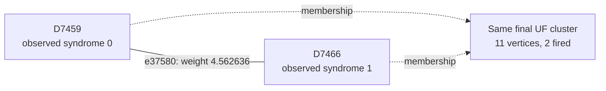

# Shot 45: A cancelled detector lies on a retained YZ-fault connection

The YZ fault F359 supplies a connection with one unfired endpoint. UF retains the edge
in its forest but does not select it; both matching decoders select it, yet ordinary
MWPM still fails elsewhere. Correlated MWPM succeeds on the complete shot.

This is row 45 (zero-based) of the preserved seed-42, 100,000-shot experiment: 1D YSC,
d=7, SI1000 p=0.003, 28 noisy rounds, six physical patches, and two yokes. It contains
406 sampled physical fault events and 715 fired detectors. The measured yoke bits are
X=1, Z=1.

[Collection, notation, and replay instructions](README.md).

**The full-shot logical outcome.**

| Result | Observable mask | Wrong logical predictions |
|---|---|---|
| Actual sampled outcome | 2995 | — |
| Repository UF | 4083 | L6, L10 |
| Ordinary joint MWPM | 955 | L3, L11 |
| Correlated MWPM | 2995 | None |

All three graph corrections satisfy every detector, including the yokes. UF's residual
has the logical commutation pattern `Z_L,3 Z_L,5`, ignoring global phase. The decoder
predicts observable flips; this notation does not describe literal physical correction
gates.

**Reading the logical result by patch.**

| Patch | Actual flips (X, Z) | UF predicts (X, Z) | Wrong observable sector |
|---|---|---|---|
| 0 | (1, 1) | (1, 1) | None |
| 1 | (0, 0) | (0, 0) | None |
| 2 | (1, 1) | (1, 1) | None |
| 3 | (0, 1) | (1, 1) | X |
| 4 | (1, 1) | (1, 1) | None |
| 5 | (0, 1) | (1, 1) | X |

These are flip indicators relative to the ideal logical measurements: 1 means a flip and
0 means no flip. They are not the absolute encoded-state bits. Correlated MWPM matches
the actual column on every patch. A correction can satisfy every detector while
predicting the wrong logical flips; that leaves a residual logical error when its
correction or Pauli frame is used.

**Two actual physical events.**

| Event | Circuit location | Noise channel | Sampled error, local coordinates | Detector flips in isolation | Observable flips in isolation |
|---|---|---|---|---|---|
| F359 | patch 5, round 26; tick 253; instruction 8798 | DEPOLARIZE2(0.003) | Y on data q274 at (3, 2); Z on ancilla q566 at (3.5, 2.5) | D7459, D7460, D7465, D7466 | None |
| F158 | patch 3, round 12; tick 117; instruction 4235 | DEPOLARIZE1(0.0003) | Y on ancilla q485 at (5.5, 3.5) | D3353, D3641, D3642 | None |

Fault IDs are local to this shot. Qubit, patch, and detector IDs are zero-based; rounds
are numbered 1–28. Instruction indices expand repeat blocks and retain SHIFT_COORDS. An
I label means that target receives no Pauli error. These are recovered simulator draws,
not merely compatible DEM explanations. Individual detector flips can cancel when all
faults are combined.

**A local decoding decision.**

Focus on F359's component e37580, D7459–D7466. Its original weight is 4.562635883352,
and its observable label is None. Correlated MWPM selects this edge; UF does not. The
full detector footprint above also includes another graph component of the same event.

The solid line is the target graph edge, and the dashed arrows describe final UF
membership. This is not the full correction or a diagram of physical gates. Detector
time and circuit round are different from algorithmic growth time.

| Endpoint | Full syndrome bit | Detector coordinates (global x, y, t) | Final cluster |
|---|---|---|---|
| D7459 | 0 | [42.5, 1.5, 25.0] | 11 vertices, 2 fired; boundary terminal |
| D7466 | 1 | [43.5, 2.5, 25.0] | 11 vertices, 2 fired; boundary terminal |

The edge enters the forest at growth time 4.562635883352; peeling subsequently leaves it
unselected. Having the physical event's direct edge available is therefore insufficient
to identify the final correction. The UF edges incident to its endpoints are shown
below.

| Endpoint | Incident edges selected by UF |
|---|---|
| D7459 | None |
| D7466 | e37621 |

| Unfired endpoint | Actual fault contributions | Resulting detector bit |
|---|---|---|
| D7459 | F357, F359 | 2 mod 2 = 0 |

Correlated MWPM may pass through an unfired detector using an even number of incident
correction edges. It does not need to interpret that detector as a defect. The absence
of a fired bit is not evidence that the corresponding physical faults were absent.

| Decoder | Selects the highlighted target edge? |
|---|---|
| repository_uf | No |
| joint_mwpm_uncorrelated | Yes |
| joint_mwpm_correlated | Yes |

**Recorded growth transitions for the highlighted edge.**

The initial rate is 1, counting active detector endpoints; a virtual terminal never
initiates growth. The table records changes in this edge's rate or internal status.
Other unions and parity-preserving size changes are omitted. Times are algorithmic
growth coordinates, not circuit rounds or software latency.

| Growth time | Accumulated growth | First endpoint cluster | Second endpoint cluster | Rate after event | Edge event |
|---|---|---|---|---|---|
| 4.562635883 | 4.562635883 | 1 fired, odd; active | 1 fired, odd; active | 0 | Entered forest |

Required growth is 4.562635883352; final accumulated growth is 4.562635883352. Final
edge status: forest edge; unused by peeling.

**Why a grown edge can be unused.**

Growing adds an edge to the available forest; peeling chooses a subset of that forest as
the correction. Cutting the highlighted tree edge splits its final tree into these two
components:

| Side containing | Vertices | Fired detectors | Boundary terminals | Yokes |
|---|---|---|---|---|
| D7459 | 1 | 0 | None | None |
| D7466 | 10 | 2 | T9594 | None |

The D7459 side has 0 fired detectors and no boundary terminal. Its even parity requires
zero selected correction edges across this one-edge cut. Thus peeling cannot simply
select the highlighted edge while leaving this forest and syndrome otherwise unchanged.

**What correlation changes locally.**

| Quantity | Value |
|---|---|
| Target | e37580: D7459–D7466 |
| First-pass selected source | e36141: D7460–D7465 |
| Original target weight | 4.562635883352 |
| Reweighted target weight | 0.713850186433 |
| Source marginal probability | 0.0157881144111313 |
| Shared DEM mechanism probability | 0.00519032127620351 |
| Clipped implied probability | 0.328748648574785 |

The rule uses min(1/2, shared probability / source probability) to obtain the implied
probability, then lowers the target's log-odds weight if appropriate. The same recovered
physical fault supplies both graph components. The source is selected in the first pass;
it is inferred evidence, not knowledge of the physical-fault log.

Reconstructing all second-pass weights in floating point reproduces correlated MWPM's
saved observable mask 2995. As a separate intervention, running the repository UF growth
and peeling on those first-pass-adjusted weights returns mask 2995 (correct). This
intervention uses an MWPM first pass and is not an independently benchmarked UF decoder.
No single-edge-only weight intervention is claimed.

**The other traced physical connection.**

For F158, the selected diagnostic component is e17032, D3642–boundary. Its observable
label is None, and its weight is 3.390989621338. Its growth outcome is: incomplete
between final clusters.

| Decoder | Selects this target edge? |
|---|---|
| repository_uf | No |
| joint_mwpm_uncorrelated | Yes |
| joint_mwpm_correlated | Yes |

| Endpoint | Observed bit | Final cluster |
|---|---|---|
| D3642 | 1 | 144 vertices, 117 fired; boundary terminal |
| T8954 | Unconstrained | 1 vertex, 0 fired; boundary terminal |

The selected first-pass source is e17026 (D3353–D3641); it lowers the target weight from
3.390989621338 to 3.272089780257. That source is another component of this same
recovered physical event.

**The full growth result and the freedom left to peeling.**

| Yoke | First cluster: vertices / fired / parity | Final cluster: vertices / fired / parity | Final terminals | Final ordinary member-defect counts, patches 0–5 |
|---|---|---|---|---|
| X | 37 / 37 / 1 | 144 / 117 / 1 | T8848 | 13, 18, 20, 27, 23, 15 |
| Z | 31 / 31 / 1 | 164 / 102 / 0 | None | 17, 22, 17, 13, 15, 17 |

The yoke belongs to one cluster and is counted once. Vertex count includes unfired
vertices and terminals; detector parity counts only fired detectors. A cluster can stop
with even detector parity or by touching an unconstrained terminal. For a yoke cluster
without terminals, its per-patch member-defect parities fix that sector of the UF
prediction.

| Yoke tree | Terminal | Attached detector | Patch | Boundary edge selected by UF? |
|---|---|---|---|---|
| X | T8848 | D3014 | 2 | Yes |

Several terminals can attach to the same patch. Their count does not determine the
number of independent logical changes; the logical-space calculation below tracks their
observable labels.

| Allowed correction edges | Logical-change rank | Correct logical answer exists? | Restricted MWPM prediction |
|---|---|---|---|
| UF forest | 0 | No | 4083 |
| All original edges within each final UF cluster | 0 | No | 4083 |

An exhaustive GF(2) cycle-space certificate shows that the required logical change, mask
1088, is unavailable even if every original edge internal to the final clusters is
restored. The same syndrome and partition therefore cannot be repaired by a different
peeling choice. A correct answer requires connections beyond that partition. This is
stronger than merely observing that restricted MWPM returns the wrong answer.

**Physical interventions.**

| Physical error pattern | Actual mask | UF mask | Correlated MWPM mask | UF wrong predictions |
|---|---|---|---|---|
| Original | 2995 | 4083 | 2995 | L6, L10 |
| F359 removed | 2995 | 2995 | 2995 | None |
| F158 removed | 2995 | 4003 | 2995 | L4, L10 |
| F359 and F158 removed | 2995 | 2995 | 2995 | None |
| F359 alone | 0 | 0 | 0 | None |
| F158 alone | 0 | 0 | 0 | None |
| F359 and F158 alone | 0 | 0 | 0 | None |

Each deletion retains all other sampled events and the original decoder graph. The
syndrome and actual observables are changed by the removed events' independently
verified responses. Every resulting decoder correction still satisfies its input
syndrome. These counterfactuals distinguish a full repair, a partial repair, and a
change to a different wrong answer.

Removing F359 fixes UF. Removing the earlier data-Y event F158 changes the wrong
X-logical pair without repairing it, while removing both is correct. The incomplete
boundary connection associated with F158 is not the sole explanation of the failure. A
successful local component choice and a successful full logical correction are separate
observations.

**An explicit logical correction exchange.**

| Wrong observable | Patch observable | Boundary endpoint | Path from its yoke, edge IDs in order |
|---|---|---|---|
| L6 | X3 | T8954 | e18273, e18311, e18308, e16868, e16905, e16952, e15516, e15553, e15558, e15594, e17031, e17032 |
| L10 | X5 | T9594 | e36020, e36049, e34615, e36021, e37506, e37509, e37580, e37621, e37667, e36232 |

Every listed edge belongs to the symmetric difference of the complete UF and correlated
MWPM corrections. Toggle the paths in pairs within each sector; doing this for all
listed paths changes mask 4083 to 2995. Internal detector incidences change by an even
number, the paired paths cancel their yoke incidence, and only the virtual boundary
endpoints are unconstrained. The resulting correction was explicitly checked against
every detector and all 12 observables. A single yoke-to-boundary path is not by itself a
valid syndrome-preserving toggle.

The local edge example illustrates one decision, while these complete paths supply a
valid logical repair. Restoring just the highlighted edge, or deleting one selected
fault, is not asserted to reproduce the entire correlated MWPM correction.

**Replay and scope.**

The original arrays are in `out/union_find_correlated_comparison_d7_p003_100k_seed42`;
select row 45 consistently across detector, actual-observable, and prediction arrays.
The original 100,000-shot call was regenerated byte for byte using Stim 1.16.0 SSE2. All
406 recovered events reproduce this shot, both in aggregate and by XORing their
individual responses. A forced-fault circuit also reproduces it for eight checks with
the ordinary sampler using seeds 1 and 123456. Graph corrections and prediction masks
reproduce the saved results with PyMatching 2.4.0.

Detailed scripts, fault traces, and numerical records are local temporary data under
`$TMPDIR/uf-case-collection-next-6a0xaw4f/shot_45`. [The collection guide](README.md)
records common hashes, the method, and the limits of the diagnostic interventions. These
are deliberately selected case studies; they do not estimate mechanism frequencies or
establish a decoder change's accuracy. The repository decoder was not modified.

[All cases](README.md) · [Previous: shot 16](shot_16.md) · [Next: shot 64](shot_64.md)
