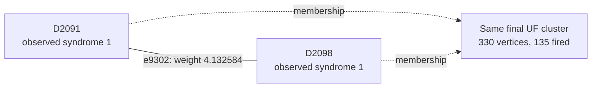

# Shot 61448: A tied cycle edge is discarded while a correct boundary choice remains

A data-Y edge completes in a tied batch but is skipped because earlier unions in that
batch already connect its endpoints. Despite losing that direct edge, the forest still
admits the correct logical answer. The odd Z-yoke tree has two terminals; one root is
correct, and its logical class has a lower minimum weight.

This is row 61448 (zero-based) of the preserved seed-42, 100,000-shot experiment: 1D
YSC, d=7, SI1000 p=0.003, 28 noisy rounds, six physical patches, and two yokes. It
contains 380 sampled physical fault events and 732 fired detectors. The measured yoke
bits are X=0, Z=0.

[Collection, notation, and replay instructions](README.md).

**The full-shot logical outcome.**

| Result | Observable mask | Wrong logical predictions |
|---|---|---|
| Actual sampled outcome | 119 | — |
| Repository UF | 125 | L1, L3 |
| Ordinary joint MWPM | 119 | None |
| Correlated MWPM | 119 | None |

All three graph corrections satisfy every detector, including the yokes. UF's residual
has the logical commutation pattern `X_L,0 X_L,1`, ignoring global phase. The decoder
predicts observable flips; this notation does not describe literal physical correction
gates.

**Reading the logical result by patch.**

| Patch | Actual flips (X, Z) | UF predicts (X, Z) | Wrong observable sector |
|---|---|---|---|
| 0 | (1, 1) | (1, 0) | Z |
| 1 | (1, 0) | (1, 1) | Z |
| 2 | (1, 1) | (1, 1) | None |
| 3 | (1, 0) | (1, 0) | None |
| 4 | (0, 0) | (0, 0) | None |
| 5 | (0, 0) | (0, 0) | None |

These are flip indicators relative to the ideal logical measurements: 1 means a flip and
0 means no flip. They are not the absolute encoded-state bits. Correlated MWPM matches
the actual column on every patch. A correction can satisfy every detector while
predicting the wrong logical flips; that leaves a residual logical error when its
correction or Pauli frame is used.

**Two actual physical events.**

| Event | Circuit location | Noise channel | Sampled error, local coordinates | Detector flips in isolation | Observable flips in isolation |
|---|---|---|---|---|---|
| F99 | patch 1, round 7; tick 70; instruction 2901 | DEPOLARIZE1(0.006) | Y on data q82 at (4, 3) | D2090, D2091, D2098, D2099 | None |
| F77 | patch 1, round 7; tick 61; instruction 2577 | X_ERROR(0.006) | X on ancilla q359 at (1.5, 1.5) | D1787, D2075 | None |

Fault IDs are local to this shot. Qubit, patch, and detector IDs are zero-based; rounds
are numbered 1–28. Instruction indices expand repeat blocks and retain SHIFT_COORDS. An
I label means that target receives no Pauli error. These are recovered simulator draws,
not merely compatible DEM explanations. Individual detector flips can cancel when all
faults are combined.

**A local decoding decision.**

Focus on F99's component e9302, D2091–D2098. Its original weight is 4.132583800266, and
its observable label is None. Correlated MWPM selects this edge; UF does not. The full
detector footprint above also includes another graph component of the same event.

The solid line is the target graph edge, and the dashed arrows describe final UF
membership. This is not the full correction or a diagram of physical gates. Detector
time and circuit round are different from algorithmic growth time.

| Endpoint | Full syndrome bit | Detector coordinates (global x, y, t) | Final cluster |
|---|---|---|---|
| D2091 | 1 | [11.5, 3.5, 7.0] | 330 vertices, 135 fired; boundary terminal |
| D2098 | 1 | [12.5, 2.5, 7.0] | 330 vertices, 135 fired; boundary terminal |

At growth time 2.293432151703, e9302 is among the completed edges, but it does not enter
the forest. Other edges in the tied batch have already joined its endpoints when this
edge is processed, so including it would create a cycle. Its completed growth is
4.132583800266.

| Endpoint | Incident edges selected by UF |
|---|---|
| D2091 | e10747 |
| D2098 | e9300 |

| Decoder | Selects the highlighted target edge? |
|---|---|
| repository_uf | No |
| joint_mwpm_uncorrelated | No |
| joint_mwpm_correlated | Yes |

**Recorded growth transitions for the highlighted edge.**

The initial rate is 2, counting active detector endpoints; a virtual terminal never
initiates growth. The table records changes in this edge's rate or internal status.
Other unions and parity-preserving size changes are omitted. Times are algorithmic
growth coordinates, not circuit rounds or software latency.

| Growth time | Accumulated growth | First endpoint cluster | Second endpoint cluster | Rate after event | Edge event |
|---|---|---|---|---|---|
| 1.839151649 | 3.678303297 | 3 fired, odd; active | 4 fired, even; inactive | 1 | Activity changed |
| 2.293432152 | 4.132583800 | 7 fired, odd; active | 7 fired, odd; active | 0 | Skipped completed cycle |

Required growth is 4.132583800266; final accumulated growth is 4.132583800266. Final
edge status: completed, then skipped in tied batch.

**What correlation changes locally.**

| Quantity | Value |
|---|---|
| Target | e9302: D2091–D2098 |
| First-pass selected source | e10741: D2090–D2099 |
| Original target weight | 4.132583800266 |
| Reweighted target weight | 0.000000000000 |
| Source marginal probability | 0.0103267636825066 |
| Shared DEM mechanism probability | 0.00519032127620351 |
| Clipped implied probability | 0.5 |

The rule uses min(1/2, shared probability / source probability) to obtain the implied
probability, then lowers the target's log-odds weight if appropriate. The same recovered
physical fault supplies both graph components. The source is selected in the first pass;
it is inferred evidence, not knowledge of the physical-fault log.

The zero weight results from clipping the implied probability at 1/2. It does not mean
the error is certain or has probability one.

Reconstructing all second-pass weights in floating point reproduces correlated MWPM's
saved observable mask 119. As a separate intervention, running the repository UF growth
and peeling on those first-pass-adjusted weights returns mask 119 (correct). This
intervention uses an MWPM first pass and is not an independently benchmarked UF decoder.
No single-edge-only weight intervention is claimed.

**The other traced physical connection.**

For F77, the selected diagnostic component is e9182, D1787–D2075. Its observable label
is None, and its weight is 3.678303297125. Its growth outcome is: forest edge; unused by
peeling.

| Decoder | Selects this target edge? |
|---|---|
| repository_uf | No |
| joint_mwpm_uncorrelated | No |
| joint_mwpm_correlated | Yes |

| Endpoint | Observed bit | Final cluster |
|---|---|---|
| D1787 | 1 | 330 vertices, 135 fired; boundary terminal |
| D2075 | 1 | 330 vertices, 135 fired; boundary terminal |

This target receives no correlation discount. Its use by correlated MWPM is part of the
complete matching correction.

**The full growth result and the freedom left to peeling.**

| Yoke | First cluster: vertices / fired / parity | Final cluster: vertices / fired / parity | Final terminals | Final ordinary member-defect counts, patches 0–5 |
|---|---|---|---|---|
| X | 15 / 14 / 0 | 69 / 30 / 0 | None | 5, 7, 11, 1, 2, 4 |
| Z | 15 / 14 / 0 | 330 / 135 / 1 | T8543, T8695 | 29, 43, 13, 22, 12, 16 |

The yoke belongs to one cluster and is counted once. Vertex count includes unfired
vertices and terminals; detector parity counts only fired detectors. A cluster can stop
with even detector parity or by touching an unconstrained terminal. For a yoke cluster
without terminals, its per-patch member-defect parities fix that sector of the UF
prediction.

| Yoke tree | Terminal | Attached detector | Patch | Boundary edge selected by UF? |
|---|---|---|---|---|
| Z | T8543 | D1195 | 0 | Yes |
| Z | T8695 | D2107 | 1 | No |

Several terminals can attach to the same patch. Their count does not determine the
number of independent logical changes; the logical-space calculation below tracks their
observable labels.

| Allowed correction edges | Logical-change rank | Correct logical answer exists? | Restricted MWPM prediction |
|---|---|---|---|
| UF forest | 1 | Yes | 119 |
| All original edges within each final UF cluster | 1 | Yes | 119 |

| Forest logical prediction | Compared with actual outcome | Minimum forest cost at original float weights |
|---|---|---|
| 119 | Correct | 1689.788758225402 |
| 125 | Incorrect | 1691.127371314771 |

The cheapest correct forest class is lighter by 1.338613089369. An independent tree
dynamic program recovers it using the same forest and original float weights. Thus the
current peeling policy misses an available, lower-cost correction with the right logical
answer.

All 2 combinations of terminal roots for the two yoke trees were tested with the
existing peeling function. 1 choice is correct. One successful choice visits T8695
first, and returns mask 119.

| Terminal in a yoke tree | Attached detector | Patch | UF correction | Cheapest correct forest correction |
|---|---|---|---|---|
| T8543 | D1195 | 0 | Selected | Unused |
| T8695 | D2107 | 1 | Unused | Selected |

The cheapest correct forest solution can be reproduced by toggling these 27 edges
relative to the original UF correction: e3528, e4652, e4701, e4762, e4792, e4967, e4970,
e6131, e6146, e6187, e6231, e6232, e6233, e6415, e6420, e6422, e7831, e9271, e9322,
e10747, e10793, e23272, e24048, e24711, e24712, e25488, e25527. All are already in the
UF forest. Their combined detector incidence is zero, and their observable mask is 10,
changing prediction 125 to 119. The full reconstructed correction and its weight were
checked explicitly.

**Physical interventions.**

| Physical error pattern | Actual mask | UF mask | Correlated MWPM mask | UF wrong predictions |
|---|---|---|---|---|
| Original | 119 | 125 | 119 | L1, L3 |
| F99 removed | 119 | 119 | 119 | None |
| F77 removed | 119 | 119 | 119 | None |
| F99 and F77 removed | 119 | 119 | 119 | None |
| F99 alone | 0 | 0 | 0 | None |
| F77 alone | 0 | 0 | 0 | None |
| F99 and F77 alone | 0 | 0 | 0 | None |

Each deletion retains all other sampled events and the original decoder graph. The
syndrome and actual observables are changed by the removed events' independently
verified responses. Every resulting decoder correction still satisfies its input
syndrome. These counterfactuals distinguish a full repair, a partial repair, and a
change to a different wrong answer.

F99 supplies the discarded cycle edge, while F77 is an ancilla X fault with a temporal
component that is retained in the forest. Removing either event fixes UF; both alone are
correctly decoded. Ordinary MWPM succeeds without selecting either highlighted target
edge, so reproducing these individual physical components is not necessary for every
successful correction.

**An explicit logical correction exchange.**

| Wrong observable | Patch observable | Boundary endpoint | Path from its yoke, edge IDs in order |
|---|---|---|---|
| L1 | Z0 | T8543 | e4652, e6131, e4701, e6146, e6187, e6233, e4762 |
| L3 | Z1 | T8742 | e13695, e12211, e10730, e12139, e12102, e10622, e9182, e9219, e9266, e7831, e6422, e7860, e9300, e9302, e10747, e9314, e10722, e10686 |

Every listed edge belongs to the symmetric difference of the complete UF and correlated
MWPM corrections. Toggle the paths in pairs within each sector; doing this for all
listed paths changes mask 125 to 119. Internal detector incidences change by an even
number, the paired paths cancel their yoke incidence, and only the virtual boundary
endpoints are unconstrained. The resulting correction was explicitly checked against
every detector and all 12 observables. A single yoke-to-boundary path is not by itself a
valid syndrome-preserving toggle.

The local edge example illustrates one decision, while these complete paths supply a
valid logical repair. Restoring just the highlighted edge, or deleting one selected
fault, is not asserted to reproduce the entire correlated MWPM correction.

**Replay and scope.**

The original arrays are in `out/union_find_correlated_comparison_d7_p003_100k_seed42`;
select row 61448 consistently across detector, actual-observable, and prediction arrays.
The original 100,000-shot call was regenerated byte for byte using Stim 1.16.0 SSE2. All
380 recovered events reproduce this shot, both in aggregate and by XORing their
individual responses. A forced-fault circuit also reproduces it for eight checks with
the ordinary sampler using seeds 1 and 123456. Graph corrections and prediction masks
reproduce the saved results with PyMatching 2.4.0.

Detailed scripts, fault traces, and numerical records are local temporary data under
`$TMPDIR/uf-case-collection-next-6a0xaw4f/shot_61448`. [The collection guide](README.md)
records common hashes, the method, and the limits of the diagnostic interventions. These
are deliberately selected case studies; they do not estimate mechanism frequencies or
establish a decoder change's accuracy. The repository decoder was not modified.

[All cases](README.md) · [Previous: shot 44875](shot_44875.md) · [Next: shot 68871](shot_68871.md)
