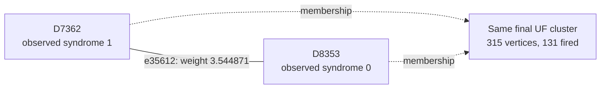

# Shot 6269: A correct forest correction costs more than the wrong one

The original forest admits the correct logical answer, and a different root can produce
it. However, minimizing the original float weights within this forest prefers the wrong
logical class. Adding all graph edges internal to the same UF clusters makes restricted
MWPM return the correct answer.

This is row 6269 (zero-based) of the preserved seed-42, 100,000-shot experiment: 1D YSC,
d=7, SI1000 p=0.003, 28 noisy rounds, six physical patches, and two yokes. It contains
410 sampled physical fault events and 786 fired detectors. The measured yoke bits are
X=0, Z=0.

[Collection, notation, and replay instructions](README.md).

**The full-shot logical outcome.**

| Result | Observable mask | Wrong logical predictions |
|---|---|---|
| Actual sampled outcome | 3808 | — |
| Repository UF | 3648 | L5, L7 |
| Ordinary joint MWPM | 3808 | None |
| Correlated MWPM | 3808 | None |

All three graph corrections satisfy every detector, including the yokes. UF's residual
has the logical commutation pattern `X_L,2 X_L,3`, ignoring global phase. The decoder
predicts observable flips; this notation does not describe literal physical correction
gates.

**Two actual physical events.**

| Event | Circuit location | Noise channel | Sampled error, local coordinates | Detector flips in isolation | Observable flips in isolation |
|---|---|---|---|---|---|
| F370 | patch 3, round 26; tick 251; instruction 8792 | DEPOLARIZE1(0.006) | Y on data q172 at (3, 0) | D7361, D7362, D7368, D8353 | L7 |
| F49 | patch 2, round 5; tick 46; instruction 1942 | DEPOLARIZE2(0.003) | Z on data q127 at (3, 5); Y on ancilla q424 at (3.5, 4.5) | D1270, D1276, D1564, D1572 | None |

Fault IDs are local to this shot. Qubit, patch, and detector IDs are zero-based; rounds
are numbered 1–28. Instruction indices expand repeat blocks and retain SHIFT_COORDS. An
I label means that target receives no Pauli error. These are recovered simulator draws,
not merely compatible DEM explanations. Individual detector flips can cancel when all
faults are combined.

**A local decoding decision.**

Focus on F370's component e35612, D7362–D8353. Its original weight is 3.544870902667,
and its observable label is L7. Correlated MWPM selects this edge; UF does not. The full
detector footprint above also includes another graph component of the same event.

The solid line is the target graph edge, and the dashed arrows describe final UF
membership. This is not the full correction or a diagram of physical gates. Detector
time and circuit round are different from algorithmic growth time.

| Endpoint | Full syndrome bit | Detector coordinates (global x, y, t) | Final cluster |
|---|---|---|---|
| D7362 | 1 | [26.5, 0.5, 25.0] | 315 vertices, 131 fired; boundary terminal |
| D8353 | 0 | [0.0, -2.0, 28.0] | 315 vertices, 131 fired; boundary terminal |

At growth time 3.555384247314, other connections merge the endpoints into one cluster.
The edge has grown only 3.135845508875 of its required 3.544870902667; it freezes
internally and never enters the forest. Immediately before the merge, the endpoint
clusters contain 5 and 7 fired detectors.

| Endpoint | Incident edges selected by UF |
|---|---|
| D7362 | e35611 |
| D8353 | e936, e3171, e5775, e10095, e10851, e12015, e16611, e16851, e17612, e20492, e24332, e24771, e26808, e28335, e29132, e33411, e37848, e40488 |

| Unfired endpoint | Actual fault contributions | Resulting detector bit |
|---|---|---|
| D8353 | F1, F25, F30, F31, F73, F90, F103, F151, F177, F179, F216, F247, F249, F271, F272, F333, F341, F347, F351, F370, F400, F407 | 22 mod 2 = 0 |

Correlated MWPM may pass through an unfired detector using an even number of incident
correction edges. It does not need to interpret that detector as a defect. The absence
of a fired bit is not evidence that the corresponding physical faults were absent.

**What correlation changes locally.**

| Quantity | Value |
|---|---|
| Target | e35612: D7362–D8353 |
| First-pass selected source | e37088: D7361–D7368 |
| Original target weight | 3.544870902667 |
| Reweighted target weight | 0.000000000000 |
| Source marginal probability | 0.0103267636825066 |
| Shared DEM mechanism probability | 0.00519032127620351 |
| Clipped implied probability | 0.5 |

The rule uses min(1/2, shared probability / source probability) to obtain the implied
probability, then lowers the target's log-odds weight if appropriate. The same recovered
physical fault supplies both graph components. The source is selected in the first pass;
it is inferred evidence, not knowledge of the physical-fault log.

The zero weight results from clipping the implied probability at 1/2. It does not mean
the error is certain or has probability one.

Reconstructing all second-pass weights in floating point reproduces correlated MWPM's
saved observable mask 3808. As a separate intervention, running the repository UF growth
and peeling on those first-pass-adjusted weights returns mask 3813 (wrong on L0, L2).
This intervention uses an MWPM first pass and is not an independently benchmarked UF
decoder. No single-edge-only weight intervention is claimed.

**The full growth result and the freedom left to peeling.**

| Yoke | First cluster: vertices / fired / parity | Final cluster: vertices / fired / parity | Final terminals | Final ordinary member-defect counts, patches 0–5 |
|---|---|---|---|---|
| X | 11 / 10 / 0 | 224 / 80 / 0 | None | 28, 18, 14, 1, 18, 1 |
| Z | 8 / 7 / 1 | 315 / 131 / 1 | T8606, T9382 | 34, 20, 19, 28, 27, 3 |

The yoke belongs to one cluster and is counted once. Vertex count includes unfired
vertices and terminals; detector parity counts only fired detectors. A cluster can stop
with even detector parity or by touching an unconstrained terminal. For a yoke cluster
without terminals, its per-patch member-defect parities fix that sector of the UF
prediction.

| Allowed correction edges | Logical-change rank | Correct logical answer exists? | Restricted MWPM prediction |
|---|---|---|---|
| UF forest | 1 | Yes | 3648 |
| All original edges within each final UF cluster | 1 | Yes | 3808 |

| Forest logical prediction | Compared with actual outcome | Minimum forest cost at original float weights |
|---|---|---|
| 3648 | Incorrect | 1892.695301400259 |
| 3808 | Correct | 1894.882107601359 |

The correct logical class is available in the forest but its cheapest realization costs
2.186806201099 more than the cheapest incorrect class. This comparison comes from an
independent tree dynamic program using the original float weights, with free boundary
terminals and explicit logical-mask tracking. A correct answer's existence is therefore
different from its preference under these weights.

All 2 combinations of terminal roots for the two yoke trees were tested with the
existing peeling function. 1 choice is correct. One successful choice visits T9382
first, and returns mask 3808.

| Terminal in a yoke tree | Attached detector | Patch | UF correction | Cheapest correct forest correction |
|---|---|---|---|---|
| T8606 | D1565 | 2 | Selected | Unused |
| T9382 | D6221 | 3 | Unused | Selected |

The cheapest correct forest solution can be reproduced by toggling these 27 edges
relative to the original UF correction: e3692, e3694, e5102, e6542, e6544, e6596, e6606,
e6641, e6674, e7990, e8031, e8448, e8518, e9956, e9966, e11438, e29886, e29954, e31338,
e31346, e31387, e32731, e32771, e34131, e34171, e34174, e35574. All are already in the
UF forest. Their combined detector incidence is zero, and their observable mask is 160,
changing prediction 3648 to 3808. The full reconstructed correction and its weight were
checked explicitly.

Restoring all original graph edges internal to the fixed clusters makes restricted MWPM
return the correct answer. The forest already admitted that answer; the extra edges
change the costs of available realizations. This experiment does not show that the
correct logical class was absent from the forest.

**Physical interventions.**

| Physical error pattern | Actual mask | UF mask | Correlated MWPM mask | UF wrong predictions |
|---|---|---|---|---|
| Original | 3808 | 3648 | 3808 | L5, L7 |
| F370 removed | 3680 | 3816 | 3680 | L3, L7 |
| F49 removed | 3808 | 3688 | 3808 | L3, L7 |
| F370 and F49 removed | 3680 | 3816 | 3680 | L3, L7 |
| F370 alone | 128 | 128 | 128 | None |
| F49 alone | 0 | 0 | 0 | None |
| F370 and F49 alone | 128 | 128 | 128 | None |

Each deletion retains all other sampled events and the original decoder graph. The
syndrome and actual observables are changed by the removed events' independently
verified responses. Every resulting decoder correction still satisfies its input
syndrome. These counterfactuals distinguish a full repair, a partial repair, and a
change to a different wrong answer.

This separates existence from weight preference. The correct answer was not absent from
the forest; its available realization was more expensive there. Reweighting and
rerunning UF using the correlated first pass introduces a different wrong logical pair,
so that intervention is not a fix for this shot.

**An explicit logical correction exchange.**

| Wrong observable | Patch observable | Boundary endpoint | Path from its yoke, edge IDs in order |
|---|---|---|---|
| L5 | Z2 | T8606 | e3692, e3694, e5102, e6542, e6544, e7990, e8031, e6596, e6641, e6674, e6606 |
| L7 | Z3 | T9383 | e35612, e35611, e34171, e32731, e32771, e31338, e31346, e31387, e31433, e29962 |

Every listed edge belongs to the symmetric difference of the complete UF and correlated
MWPM corrections. Toggle the paths in pairs within each sector; doing this for all
listed paths changes mask 3648 to 3808. Internal detector incidences change by an even
number, the paired paths cancel their yoke incidence, and only the virtual boundary
endpoints are unconstrained. The resulting correction was explicitly checked against
every detector and all 12 observables. A single yoke-to-boundary path is not by itself a
valid syndrome-preserving toggle.

The local edge example illustrates one decision, while these complete paths supply a
valid logical repair. Restoring just the highlighted edge, or deleting one selected
fault, is not asserted to reproduce the entire correlated MWPM correction.

**Replay and scope.**

The original arrays are in `out/union_find_correlated_comparison_d7_p003_100k_seed42`;
select row 6269 consistently across detector, actual-observable, and prediction arrays.
The original 100,000-shot call was regenerated byte for byte using Stim 1.16.0 SSE2. All
410 recovered events reproduce this shot, both in aggregate and by XORing their
individual responses. A forced-fault circuit also reproduces it for eight checks with
the ordinary sampler using seeds 1 and 123456. Graph corrections and prediction masks
reproduce the saved results with PyMatching 2.4.0.

Detailed scripts, fault traces, and numerical records are local temporary data under
`$TMPDIR/uf-case-collection-9pbSDiuL/shot_6269`. [The collection guide](README.md)
records common hashes, the method, and the limits of the diagnostic interventions. These
are deliberately selected case studies; they do not estimate mechanism frequencies or
establish a decoder change's accuracy. The repository decoder was not modified.

[All cases](README.md) · [Previous: shot 4365](shot_4365.md) · [Next: shot 12273](shot_12273.md)
