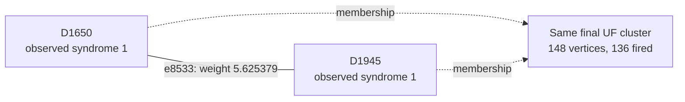

# Shot 68871: An even Z-yoke tree needs two boundary branches

The Z-yoke tree has 136 fired detectors and two terminals. Its parity is even, so the
current single-root peeling rule leaves its boundary edges unused for either root. A
cheaper correct forest correction exists, but neither root choice produces it. A
completed XI-fault edge is also discarded during a tied cycle-closing batch.

This is row 68871 (zero-based) of the preserved seed-42, 100,000-shot experiment: 1D
YSC, d=7, SI1000 p=0.003, 28 noisy rounds, six physical patches, and two yokes. It
contains 421 sampled physical fault events and 827 fired detectors. The measured yoke
bits are X=1, Z=1.

[Collection, notation, and replay instructions](README.md).

**The full-shot logical outcome.**

| Result | Observable mask | Wrong logical predictions |
|---|---|---|
| Actual sampled outcome | 142 | — |
| Repository UF | 646 | L3, L9 |
| Ordinary joint MWPM | 142 | None |
| Correlated MWPM | 142 | None |

All three graph corrections satisfy every detector, including the yokes. UF's residual
has the logical commutation pattern `X_L,1 X_L,4`, ignoring global phase. The decoder
predicts observable flips; this notation does not describe literal physical correction
gates.

**Reading the logical result by patch.**

| Patch | Actual flips (X, Z) | UF predicts (X, Z) | Wrong observable sector |
|---|---|---|---|
| 0 | (0, 1) | (0, 1) | None |
| 1 | (1, 1) | (1, 0) | Z |
| 2 | (0, 0) | (0, 0) | None |
| 3 | (0, 1) | (0, 1) | None |
| 4 | (0, 0) | (0, 1) | Z |
| 5 | (0, 0) | (0, 0) | None |

These are flip indicators relative to the ideal logical measurements: 1 means a flip and
0 means no flip. They are not the absolute encoded-state bits. Correlated MWPM matches
the actual column on every patch. A correction can satisfy every detector while
predicting the wrong logical flips; that leaves a residual logical error when its
correction or Pauli frame is used.

**Two actual physical events.**

| Event | Circuit location | Noise channel | Sampled error, local coordinates | Detector flips in isolation | Observable flips in isolation |
|---|---|---|---|---|---|
| F69 | patch 4, round 6; tick 53; instruction 2258 | DEPOLARIZE2(0.003) | X on data q223 at (3, 1); I on ancilla q517 at (3.5, 1.5) | D1650, D1945 | None |
| F51 | patch 4, round 4; tick 40; instruction 1920 | DEPOLARIZE1(0.006) | Y on data q214 at (1, 6) | D1353, D1359, D1360 | None |

Fault IDs are local to this shot. Qubit, patch, and detector IDs are zero-based; rounds
are numbered 1–28. Instruction indices expand repeat blocks and retain SHIFT_COORDS. An
I label means that target receives no Pauli error. These are recovered simulator draws,
not merely compatible DEM explanations. Individual detector flips can cancel when all
faults are combined.

**A local decoding decision.**

Focus on F69's component e8533, D1650–D1945. Its original weight is 5.625379320882, and
its observable label is None. Correlated MWPM selects this edge; UF does not. This
component accounts for the event's entire detector response.

The solid line is the target graph edge, and the dashed arrows describe final UF
membership. This is not the full correction or a diagram of physical gates. Detector
time and circuit round are different from algorithmic growth time.

| Endpoint | Full syndrome bit | Detector coordinates (global x, y, t) | Final cluster |
|---|---|---|---|
| D1650 | 1 | [34.5, 0.5, 5.0] | 148 vertices, 136 fired; boundary terminal |
| D1945 | 1 | [35.5, 1.5, 6.0] | 148 vertices, 136 fired; boundary terminal |

At growth time 3.534742380093, e8533 is among the completed edges, but it does not enter
the forest. Other edges in the tied batch have already joined its endpoints when this
edge is processed, so including it would create a cycle. Its completed growth is
5.625379320882.

| Endpoint | Incident edges selected by UF |
|---|---|
| D1650 | e7052 |
| D1945 | e8541 |

| Decoder | Selects the highlighted target edge? |
|---|---|
| repository_uf | No |
| joint_mwpm_uncorrelated | Yes |
| joint_mwpm_correlated | Yes |

**Recorded growth transitions for the highlighted edge.**

The initial rate is 2, counting active detector endpoints; a virtual terminal never
initiates growth. The table records changes in this edge's rate or internal status.
Other unions and parity-preserving size changes are omitted. Times are algorithmic
growth coordinates, not circuit rounds or software latency.

| Growth time | Accumulated growth | First endpoint cluster | Second endpoint cluster | Rate after event | Edge event |
|---|---|---|---|---|---|
| 1.772435451 | 3.544870903 | 34 fired, even; inactive (yoke) | 1 fired, odd; active | 1 | Activity changed |
| 1.793462141 | 3.565897592 | 49 fired, odd; active (yoke) | 1 fired, odd; active | 2 | Activity changed |
| 2.066291900 | 4.111557111 | 49 fired, odd; active (yoke) | 2 fired, even; inactive | 1 | Activity changed |
| 2.147445439 | 4.192710650 | 58 fired, even; inactive (yoke) | 2 fired, even; inactive | 0 | Activity changed |
| 2.183245812 | 4.192710650 | 59 fired, odd; active (yoke) | 2 fired, even; inactive | 1 | Activity changed |
| 2.299218128 | 4.308682966 | 70 fired, even; inactive (yoke) | 2 fired, even; inactive | 0 | Activity changed |
| 2.745336857 | 4.308682966 | 75 fired, odd; active (yoke) | 2 fired, even; inactive | 1 | Activity changed |
| 2.950624486 | 4.513970595 | 89 fired, odd; active (yoke) | 5 fired, odd; active | 2 | Activity changed |
| 3.035749025 | 4.684219673 | 90 fired, even; inactive (yoke) | 5 fired, odd; active | 1 | Activity changed |
| 3.092576087 | 4.741046735 | 97 fired, odd; active (yoke) | 5 fired, odd; active | 2 | Activity changed |
| 3.534742380 | 5.625379321 | 124 fired, even; inactive (yoke) | 124 fired, even; inactive (yoke) | 0 | Skipped completed cycle |

Required growth is 5.625379320882; final accumulated growth is 5.625379320882. Final
edge status: completed, then skipped in tied batch.

**What correlation changes locally.**

This edge receives no correlation discount: its weight remains 5.625379320882.
Correlated MWPM still selects it as part of its global solution. Its success cannot be
attributed to lowering this particular edge's cost. Correlation updates elsewhere and
the choice of a complete correction must be considered separately.

Reconstructing all second-pass weights in floating point reproduces correlated MWPM's
saved observable mask 142. As a separate intervention, running the repository UF growth
and peeling on those first-pass-adjusted weights returns mask 399 (wrong on L0, L8).
This intervention uses an MWPM first pass and is not an independently benchmarked UF
decoder. No single-edge-only weight intervention is claimed.

**The other traced physical connection.**

For F51, the selected diagnostic component is e5568, D1359–boundary. Its observable
label is None, and its weight is 3.390989621338. Its growth outcome is: incomplete
between final clusters.

| Decoder | Selects this target edge? |
|---|---|
| repository_uf | No |
| joint_mwpm_uncorrelated | No |
| joint_mwpm_correlated | Yes |

| Endpoint | Observed bit | Final cluster |
|---|---|---|
| D1359 | 1 | 148 vertices, 136 fired; boundary terminal |
| T8573 | Unconstrained | 1 vertex, 0 fired; boundary terminal |

The selected first-pass source is e7048 (D1353–D1360); it lowers the target weight from
3.390989621338 to 0.000000000000. That source is another component of this same
recovered physical event.

**The full growth result and the freedom left to peeling.**

| Yoke | First cluster: vertices / fired / parity | Final cluster: vertices / fired / parity | Final terminals | Final ordinary member-defect counts, patches 0–5 |
|---|---|---|---|---|
| X | 32 / 32 / 0 | 120 / 100 / 0 | None | 22, 17, 18, 10, 16, 16 |
| Z | 34 / 34 / 0 | 148 / 136 / 0 | T8574, T9077 | 15, 26, 10, 19, 45, 20 |

The yoke belongs to one cluster and is counted once. Vertex count includes unfired
vertices and terminals; detector parity counts only fired detectors. A cluster can stop
with even detector parity or by touching an unconstrained terminal. For a yoke cluster
without terminals, its per-patch member-defect parities fix that sector of the UF
prediction.

| Yoke tree | Terminal | Attached detector | Patch | Boundary edge selected by UF? |
|---|---|---|---|---|
| Z | T8574 | D1373 | 4 | No |
| Z | T9077 | D4383 | 1 | No |

Several terminals can attach to the same patch. Their count does not determine the
number of independent logical changes; the logical-space calculation below tracks their
observable labels.

| Allowed correction edges | Logical-change rank | Correct logical answer exists? | Restricted MWPM prediction |
|---|---|---|---|
| UF forest | 1 | Yes | 142 |
| All original edges within each final UF cluster | 1 | Yes | 142 |

| Forest logical prediction | Compared with actual outcome | Minimum forest cost at original float weights |
|---|---|---|
| 142 | Correct | 2001.025729557212 |
| 646 | Incorrect | 2011.371529508967 |

The cheapest correct forest class is lighter by 10.345799951755. An independent tree
dynamic program recovers it using the same forest and original float weights. Thus the
current peeling policy misses an available, lower-cost correction with the right logical
answer.

All 2 combinations of terminal roots for the two yoke trees were tested with the
existing peeling function. 0 choices are correct. All tested roots leave the logical
answer wrong. The relevant even tree needs boundary branches that single-root peeling
leaves unused; changing the root alone does not enable them.

| Terminal in a yoke tree | Attached detector | Patch | UF correction | Cheapest correct forest correction |
|---|---|---|---|---|
| T8574 | D1373 | 4 | Unused | Selected |
| T9077 | D4383 | 1 | Unused | Selected |

The cheapest correct forest solution can be reproduced by toggling these 20 edges
relative to the original UF correction: e4072, e4186, e5511, e5512, e5612, e5614, e5624,
e5633, e5646, e7059, e7118, e16412, e16414, e17861, e17866, e19275, e20688, e20715,
e20717, e22163. All are already in the UF forest. Their combined detector incidence is
zero, and their observable mask is 520, changing prediction 646 to 142. The full
reconstructed correction and its weight were checked explicitly.

**Physical interventions.**

| Physical error pattern | Actual mask | UF mask | Correlated MWPM mask | UF wrong predictions |
|---|---|---|---|---|
| Original | 142 | 646 | 142 | L3, L9 |
| F69 removed | 142 | 646 | 142 | L3, L9 |
| F51 removed | 142 | 142 | 142 | None |
| F69 and F51 removed | 142 | 142 | 142 | None |
| F69 alone | 0 | 0 | 0 | None |
| F51 alone | 0 | 0 | 0 | None |
| F69 and F51 alone | 0 | 0 | 0 | None |

Each deletion retains all other sampled events and the original decoder graph. The
syndrome and actual observables are changed by the removed events' independently
verified responses. Every resulting decoder correction still satisfies its input
syndrome. These counterfactuals distinguish a full repair, a partial repair, and a
change to a different wrong answer.

Removing F69 leaves the original Z-logical pair L3 and L9 wrong. Removing F51 fixes UF,
and the pair removal is also correct. Running UF on all weights inferred from the MWPM
first pass changes the failure to an X-logical pair instead of repairing the shot. That
diagnostic separates the availability of correlation evidence from whether UF's
subsequent growth and peeling use it successfully.

**An explicit logical correction exchange.**

| Wrong observable | Patch observable | Boundary endpoint | Path from its yoke, edge IDs in order |
|---|---|---|---|
| L3 | Z1 | T9077 | e16412, e16414, e17861, e17866, e19275, e20715, e20717, e22163, e20688 |
| L9 | Z4 | T8573 | e7052, e8533, e8541, e9986, e8551, e7142, e7137, e5659, e4221, e4186, e5633, e5638, e5568 |

Every listed edge belongs to the symmetric difference of the complete UF and correlated
MWPM corrections. Toggle the paths in pairs within each sector; doing this for all
listed paths changes mask 646 to 142. Internal detector incidences change by an even
number, the paired paths cancel their yoke incidence, and only the virtual boundary
endpoints are unconstrained. The resulting correction was explicitly checked against
every detector and all 12 observables. A single yoke-to-boundary path is not by itself a
valid syndrome-preserving toggle.

The local edge example illustrates one decision, while these complete paths supply a
valid logical repair. Restoring just the highlighted edge, or deleting one selected
fault, is not asserted to reproduce the entire correlated MWPM correction.

**Replay and scope.**

The original arrays are in `out/union_find_correlated_comparison_d7_p003_100k_seed42`;
select row 68871 consistently across detector, actual-observable, and prediction arrays.
The original 100,000-shot call was regenerated byte for byte using Stim 1.16.0 SSE2. All
421 recovered events reproduce this shot, both in aggregate and by XORing their
individual responses. A forced-fault circuit also reproduces it for eight checks with
the ordinary sampler using seeds 1 and 123456. Graph corrections and prediction masks
reproduce the saved results with PyMatching 2.4.0.

Detailed scripts, fault traces, and numerical records are local temporary data under
`$TMPDIR/uf-case-collection-next-6a0xaw4f/shot_68871`. [The collection guide](README.md)
records common hashes, the method, and the limits of the diagnostic interventions. These
are deliberately selected case studies; they do not estimate mechanism frequencies or
establish a decoder change's accuracy. The repository decoder was not modified.

[All cases](README.md) · [Previous: shot 61448](shot_61448.md) · [Next: shot 71143](shot_71143.md)
