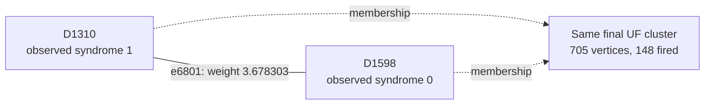

# Shot 71143: A cancelled readout event and a costlier correct forest class

A readout fault F65 and an XX fault F75 both toggle D1598, leaving that detector unfired
in the complete shot. Correlated MWPM traverses it using an even number of incident
edges. UF's even X-yoke tree has 148 fired detectors and two terminals, but neither
single-root choice gives the correct answer.

This is row 71143 (zero-based) of the preserved seed-42, 100,000-shot experiment: 1D
YSC, d=7, SI1000 p=0.003, 28 noisy rounds, six physical patches, and two yokes. It
contains 426 sampled physical fault events and 803 fired detectors. The measured yoke
bits are X=1, Z=0.

[Collection, notation, and replay instructions](README.md).

**The full-shot logical outcome.**

| Result | Observable mask | Wrong logical predictions |
|---|---|---|
| Actual sampled outcome | 3361 | — |
| Repository UF | 2401 | L6, L10 |
| Ordinary joint MWPM | 3361 | None |
| Correlated MWPM | 3361 | None |

All three graph corrections satisfy every detector, including the yokes. UF's residual
has the logical commutation pattern `Z_L,3 Z_L,5`, ignoring global phase. The decoder
predicts observable flips; this notation does not describe literal physical correction
gates.

**Reading the logical result by patch.**

| Patch | Actual flips (X, Z) | UF predicts (X, Z) | Wrong observable sector |
|---|---|---|---|
| 0 | (1, 0) | (1, 0) | None |
| 1 | (0, 0) | (0, 0) | None |
| 2 | (0, 1) | (0, 1) | None |
| 3 | (0, 0) | (1, 0) | X |
| 4 | (1, 0) | (1, 0) | None |
| 5 | (1, 1) | (0, 1) | X |

These are flip indicators relative to the ideal logical measurements: 1 means a flip and
0 means no flip. They are not the absolute encoded-state bits. Correlated MWPM matches
the actual column on every patch. A correction can satisfy every detector while
predicting the wrong logical flips; that leaves a residual logical error when its
correction or Pauli frame is used.

**Two actual physical events.**

| Event | Circuit location | Noise channel | Sampled error, local coordinates | Detector flips in isolation | Observable flips in isolation |
|---|---|---|---|---|---|
| F65 | patch 3, round 5; tick 50; instruction 1955 | M(0.015) | readout on ancilla q458 at (1.5, 4.5) | D1310, D1598 | None |
| F75 | patch 3, round 6; tick 53; instruction 2258 | DEPOLARIZE2(0.003) | X on data q163 at (1, 5); X on ancilla q459 at (1.5, 5.5) | D1592, D1593, D1598, D1887 | None |

Fault IDs are local to this shot. Qubit, patch, and detector IDs are zero-based; rounds
are numbered 1–28. Instruction indices expand repeat blocks and retain SHIFT_COORDS. An
I label means that target receives no Pauli error. These are recovered simulator draws,
not merely compatible DEM explanations. Individual detector flips can cancel when all
faults are combined.

**A local decoding decision.**

Focus on F65's component e6801, D1310–D1598. Its original weight is 3.678303297125, and
its observable label is None. Correlated MWPM selects this edge; UF does not. This
component accounts for the event's entire detector response.

The solid line is the target graph edge, and the dashed arrows describe final UF
membership. This is not the full correction or a diagram of physical gates. Detector
time and circuit round are different from algorithmic growth time.

| Endpoint | Full syndrome bit | Detector coordinates (global x, y, t) | Final cluster |
|---|---|---|---|
| D1310 | 1 | [25.5, 4.5, 4.0] | 705 vertices, 148 fired; boundary terminal |
| D1598 | 0 | [25.5, 4.5, 5.0] | 705 vertices, 148 fired; boundary terminal |

The edge enters the forest at growth time 3.678303297125; peeling subsequently leaves it
unselected. Having the physical event's direct edge available is therefore insufficient
to identify the final correction. The UF edges incident to its endpoints are shown
below.

| Endpoint | Incident edges selected by UF |
|---|---|
| D1310 | e5362 |
| D1598 | None |

| Unfired endpoint | Actual fault contributions | Resulting detector bit |
|---|---|---|
| D1598 | F65, F75 | 2 mod 2 = 0 |

Correlated MWPM may pass through an unfired detector using an even number of incident
correction edges. It does not need to interpret that detector as a defect. The absence
of a fired bit is not evidence that the corresponding physical faults were absent.

| Decoder | Selects the highlighted target edge? |
|---|---|
| repository_uf | No |
| joint_mwpm_uncorrelated | No |
| joint_mwpm_correlated | Yes |

**Recorded growth transitions for the highlighted edge.**

The initial rate is 1, counting active detector endpoints; a virtual terminal never
initiates growth. The table records changes in this edge's rate or internal status.
Other unions and parity-preserving size changes are omitted. Times are algorithmic
growth coordinates, not circuit rounds or software latency.

| Growth time | Accumulated growth | First endpoint cluster | Second endpoint cluster | Rate after event | Edge event |
|---|---|---|---|---|---|
| 3.678303297 | 3.678303297 | 1 fired, odd; active | 1 fired, odd; active | 0 | Entered forest |

Required growth is 3.678303297125; final accumulated growth is 3.678303297125. Final
edge status: forest edge; unused by peeling.

**Why a grown edge can be unused.**

Growing adds an edge to the available forest; peeling chooses a subset of that forest as
the correction. Cutting the highlighted tree edge splits its final tree into these two
components:

| Side containing | Vertices | Fired detectors | Boundary terminals | Yokes |
|---|---|---|---|---|
| D1310 | 704 | 148 | T8521, T8729 | D8352 |
| D1598 | 1 | 0 | None | None |

The D1598 side has 0 fired detectors and no boundary terminal. Its even parity requires
zero selected correction edges across this one-edge cut. Thus peeling cannot simply
select the highlighted edge while leaving this forest and syndrome otherwise unchanged.

**What correlation changes locally.**

This edge receives no correlation discount: its weight remains 3.678303297125.
Correlated MWPM still selects it as part of its global solution. Its success cannot be
attributed to lowering this particular edge's cost. Correlation updates elsewhere and
the choice of a complete correction must be considered separately.

Reconstructing all second-pass weights in floating point reproduces correlated MWPM's
saved observable mask 3361. As a separate intervention, running the repository UF growth
and peeling on those first-pass-adjusted weights returns mask 2401 (wrong on L6, L10).
This intervention uses an MWPM first pass and is not an independently benchmarked UF
decoder. No single-edge-only weight intervention is claimed.

**The other traced physical connection.**

For F75, the selected diagnostic component is e6804, D1593–D1598. Its observable label
is None, and its weight is 4.132583800266. Its growth outcome is: frozen inside cluster
before completion.

| Decoder | Selects this target edge? |
|---|---|
| repository_uf | No |
| joint_mwpm_uncorrelated | No |
| joint_mwpm_correlated | Yes |

| Endpoint | Observed bit | Final cluster |
|---|---|---|
| D1593 | 1 | 705 vertices, 148 fired; boundary terminal |
| D1598 | 0 | 705 vertices, 148 fired; boundary terminal |

At D1598, the recovered contributions are F65, F75; 2 contributions have even parity,
leaving the observed bit zero.

The selected first-pass source is e8245 (D1592–D1887); it lowers the target weight from
4.132583800266 to 1.417837019967. That source is another component of this same
recovered physical event.

**The full growth result and the freedom left to peeling.**

| Yoke | First cluster: vertices / fired / parity | Final cluster: vertices / fired / parity | Final terminals | Final ordinary member-defect counts, patches 0–5 |
|---|---|---|---|---|
| X | 45 / 45 / 1 | 705 / 148 / 0 | T8521, T8729 | 33, 24, 12, 35, 19, 24 |
| Z | 17 / 16 / 0 | 164 / 62 / 0 | None | 6, 2, 21, 10, 10, 13 |

The yoke belongs to one cluster and is counted once. Vertex count includes unfired
vertices and terminals; detector parity counts only fired detectors. A cluster can stop
with even detector parity or by touching an unconstrained terminal. For a yoke cluster
without terminals, its per-patch member-defect parities fix that sector of the UF
prediction.

| Yoke tree | Terminal | Attached detector | Patch | Boundary edge selected by UF? |
|---|---|---|---|---|
| X | T8521 | D1048 | 3 | No |
| X | T8729 | D2296 | 5 | No |

Several terminals can attach to the same patch. Their count does not determine the
number of independent logical changes; the logical-space calculation below tracks their
observable labels.

| Allowed correction edges | Logical-change rank | Correct logical answer exists? | Restricted MWPM prediction |
|---|---|---|---|
| UF forest | 1 | Yes | 2401 |
| All original edges within each final UF cluster | 1 | Yes | 3361 |

| Forest logical prediction | Compared with actual outcome | Minimum forest cost at original float weights |
|---|---|---|
| 2401 | Incorrect | 1963.226815044389 |
| 3361 | Correct | 1964.241109292197 |

The correct logical class is available in the forest but its cheapest realization costs
1.014294247808 more than the cheapest incorrect class. This comparison comes from an
independent tree dynamic program using the original float weights, with free boundary
terminals and explicit logical-mask tracking. A correct answer's existence is therefore
different from its preference under these weights.

All 2 combinations of terminal roots for the two yoke trees were tested with the
existing peeling function. 0 choices are correct. All tested roots leave the logical
answer wrong. The relevant even tree needs boundary branches that single-root peeling
leaves unused; changing the root alone does not enable them.

| Terminal in a yoke tree | Attached detector | Patch | UF correction | Cheapest correct forest correction |
|---|---|---|---|---|
| T8521 | D1048 | 3 | Unused | Selected |
| T8729 | D2296 | 5 | Unused | Selected |

The cheapest correct forest solution can be reproduced by toggling these 18 edges
relative to the original UF correction: e2392, e3831, e3832, e3987, e4060, e5362, e5424,
e5466, e6763, e6764, e6901, e10100, e10133, e10178, e10249, e10297, e10300, e11613. All
are already in the UF forest. Their combined detector incidence is zero, and their
observable mask is 1088, changing prediction 2401 to 3361. The full reconstructed
correction and its weight were checked explicitly.

Restoring all original graph edges internal to the fixed clusters makes restricted MWPM
return the correct answer. The forest already admitted that answer; the extra edges
change the costs of available realizations. This experiment does not show that the
correct logical class was absent from the forest.

**Physical interventions.**

| Physical error pattern | Actual mask | UF mask | Correlated MWPM mask | UF wrong predictions |
|---|---|---|---|---|
| Original | 3361 | 2401 | 3361 | L6, L10 |
| F65 removed | 3361 | 3361 | 3361 | None |
| F75 removed | 3361 | 3361 | 3361 | None |
| F65 and F75 removed | 3361 | 3361 | 3361 | None |
| F65 alone | 0 | 0 | 0 | None |
| F75 alone | 0 | 0 | 0 | None |
| F65 and F75 alone | 0 | 0 | 0 | None |

Each deletion retains all other sampled events and the original decoder graph. The
syndrome and actual observables are changed by the removed events' independently
verified responses. Every resulting decoder correction still satisfies its input
syndrome. These counterfactuals distinguish a full repair, a partial repair, and a
change to a different wrong answer.

The correct forest class exists but costs more than the cheapest wrong class. Allowing
all original edges internal to the same clusters makes restricted MWPM correct;
reweighting and rerunning UF still leaves the original L6 and L10 mistake. Removing
either highlighted fault fixes the full shot, as does removing both, whereas both faults
together in isolation are decoded correctly.

**An explicit logical correction exchange.**

| Wrong observable | Patch observable | Boundary endpoint | Path from its yoke, edge IDs in order |
|---|---|---|---|
| L6 | X3 | T8521 | e6764, e6804, e6801, e5362, e3987, e5424, e6901, e5466, e4060 |
| L10 | X5 | T9545 | e33164, e33162, e31764, e33237, e31839, e33316, e34758, e36239, e37643, e37640, e37636, e36154, e36152, e34748, e34782, e34780 |

Every listed edge belongs to the symmetric difference of the complete UF and correlated
MWPM corrections. Toggle the paths in pairs within each sector; doing this for all
listed paths changes mask 2401 to 3361. Internal detector incidences change by an even
number, the paired paths cancel their yoke incidence, and only the virtual boundary
endpoints are unconstrained. The resulting correction was explicitly checked against
every detector and all 12 observables. A single yoke-to-boundary path is not by itself a
valid syndrome-preserving toggle.

The local edge example illustrates one decision, while these complete paths supply a
valid logical repair. Restoring just the highlighted edge, or deleting one selected
fault, is not asserted to reproduce the entire correlated MWPM correction.

**Replay and scope.**

The original arrays are in `out/union_find_correlated_comparison_d7_p003_100k_seed42`;
select row 71143 consistently across detector, actual-observable, and prediction arrays.
The original 100,000-shot call was regenerated byte for byte using Stim 1.16.0 SSE2. All
426 recovered events reproduce this shot, both in aggregate and by XORing their
individual responses. A forced-fault circuit also reproduces it for eight checks with
the ordinary sampler using seeds 1 and 123456. Graph corrections and prediction masks
reproduce the saved results with PyMatching 2.4.0.

Detailed scripts, fault traces, and numerical records are local temporary data under
`$TMPDIR/uf-case-collection-next-6a0xaw4f/shot_71143`. [The collection guide](README.md)
records common hashes, the method, and the limits of the diagnostic interventions. These
are deliberately selected case studies; they do not estimate mechanism frequencies or
establish a decoder change's accuracy. The repository decoder was not modified.

[All cases](README.md) · [Previous: shot 68871](shot_68871.md) · [Next: shot 80183](shot_80183.md)
