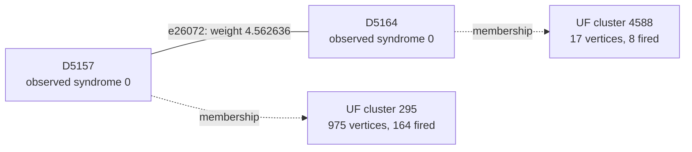

# Shot 73966: A 65-vertex first yoke star does not resolve the error

The first X-yoke cluster contains 65 vertices, the largest first-yoke cluster size among
the preserved UF-fails/correlated MWPM-passes shots. A round-17 data-Y connection
remains outside the final cluster connectivity needed for a correct answer.

This is row 73966 (zero-based) of the preserved seed-42, 100,000-shot experiment: 1D
YSC, d=7, SI1000 p=0.003, 28 noisy rounds, six physical patches, and two yokes. It
contains 425 sampled physical fault events and 813 fired detectors. The measured yoke
bits are X=1, Z=0.

[Collection, notation, and replay instructions](README.md).

**The full-shot logical outcome.**

| Result | Observable mask | Wrong logical predictions |
|---|---|---|
| Actual sampled outcome | 1934 | — |
| Repository UF | 911 | L0, L10 |
| Ordinary joint MWPM | 654 | L8, L10 |
| Correlated MWPM | 1934 | None |

All three graph corrections satisfy every detector, including the yokes. UF's residual
has the logical commutation pattern `Z_L,0 Z_L,5`, ignoring global phase. The decoder
predicts observable flips; this notation does not describe literal physical correction
gates.

**Two actual physical events.**

| Event | Circuit location | Noise channel | Sampled error, local coordinates | Detector flips in isolation | Observable flips in isolation |
|---|---|---|---|---|---|
| F244 | patch 5, round 17; tick 170; instruction 6171 | DEPOLARIZE1(0.006) | Y on data q276 at (3, 4) | D5157, D5158, D5163, D5164 | None |
| F155 | patch 0, round 11; tick 108; instruction 3911 | DEPOLARIZE2(0.003) | Z on data q13 at (1, 5); Y on ancilla q308 at (0.5, 4.5) | D2888, D3176, D3177, D3182 | None |

Fault IDs are local to this shot. Qubit, patch, and detector IDs are zero-based; rounds
are numbered 1–28. Instruction indices expand repeat blocks and retain SHIFT_COORDS. An
I label means that target receives no Pauli error. These are recovered simulator draws,
not merely compatible DEM explanations. Individual detector flips can cancel when all
faults are combined.

**A local decoding decision.**

Focus on F244's component e26072, D5157–D5164. Its original weight is 4.562635883352,
and its observable label is None. Correlated MWPM selects this edge; UF does not. The
full detector footprint above also includes another graph component of the same event.

The solid line is the target graph edge, and the dashed arrows describe final UF
membership. This is not the full correction or a diagram of physical gates. Detector
time and circuit round are different from algorithmic growth time.

| Endpoint | Full syndrome bit | Detector coordinates (global x, y, t) | Final cluster |
|---|---|---|---|
| D5157 | 0 | [42.5, 3.5, 17.0] | 975 vertices, 164 fired; boundary terminal |
| D5164 | 0 | [43.5, 4.5, 17.0] | 17 vertices, 8 fired; boundary terminal |

The endpoints finish in different inactive clusters. The connection has grown
1.820761497850 of its required 4.562635883352 and never enters the forest. One side
stops because of a boundary terminal; the other stops because of a boundary terminal.

| Endpoint | Incident edges selected by UF |
|---|---|
| D5157 | None |
| D5164 | None |

| Unfired endpoint | Actual fault contributions | Resulting detector bit |
|---|---|---|
| D5157 | F243, F244 | 2 mod 2 = 0 |
| D5164 | F239, F244 | 2 mod 2 = 0 |

Correlated MWPM may pass through an unfired detector using an even number of incident
correction edges. It does not need to interpret that detector as a defect. The absence
of a fired bit is not evidence that the corresponding physical faults were absent.

**What correlation changes locally.**

| Quantity | Value |
|---|---|
| Target | e26072: D5157–D5164 |
| First-pass selected source | e24633: D5158–D5163 |
| Original target weight | 4.562635883352 |
| Reweighted target weight | 0.713850186433 |
| Source marginal probability | 0.0157881144111313 |
| Shared DEM mechanism probability | 0.00519032127620351 |
| Clipped implied probability | 0.328748648574785 |

The rule uses min(1/2, shared probability / source probability) to obtain the implied
probability, then lowers the target's log-odds weight if appropriate. The same recovered
physical fault supplies both graph components. The source is selected in the first pass;
it is inferred evidence, not knowledge of the physical-fault log.

Reconstructing all second-pass weights in floating point reproduces correlated MWPM's
saved observable mask 1934. As a separate intervention, running the repository UF growth
and peeling on those first-pass-adjusted weights returns mask 1934 (correct). This
intervention uses an MWPM first pass and is not an independently benchmarked UF decoder.
No single-edge-only weight intervention is claimed.

**The full growth result and the freedom left to peeling.**

| Yoke | First cluster: vertices / fired / parity | Final cluster: vertices / fired / parity | Final terminals | Final ordinary member-defect counts, patches 0–5 |
|---|---|---|---|---|
| X | 65 / 65 / 1 | 975 / 164 / 0 | T8979 | 31, 21, 30, 24, 31, 26 |
| Z | 11 / 10 / 0 | 261 / 120 / 0 | None | 29, 17, 30, 11, 21, 12 |

The yoke belongs to one cluster and is counted once. Vertex count includes unfired
vertices and terminals; detector parity counts only fired detectors. A cluster can stop
with even detector parity or by touching an unconstrained terminal. For a yoke cluster
without terminals, its per-patch member-defect parities fix that sector of the UF
prediction.

| Allowed correction edges | Logical-change rank | Correct logical answer exists? | Restricted MWPM prediction |
|---|---|---|---|
| UF forest | 0 | No | 911 |
| All original edges within each final UF cluster | 0 | No | 911 |

An exhaustive GF(2) cycle-space certificate shows that the required logical change, mask
1025, is unavailable even if every original edge internal to the final clusters is
restored. The same syndrome and partition therefore cannot be repaired by a different
peeling choice. A correct answer requires connections beyond that partition. This is
stronger than merely observing that restricted MWPM returns the wrong answer.

**Physical interventions.**

| Physical error pattern | Actual mask | UF mask | Correlated MWPM mask | UF wrong predictions |
|---|---|---|---|---|
| Original | 1934 | 911 | 1934 | L0, L10 |
| F244 removed | 1934 | 1934 | 1934 | None |
| F155 removed | 1934 | 974 | 1934 | L6, L10 |
| F244 and F155 removed | 1934 | 1934 | 1934 | None |
| F244 alone | 0 | 0 | 0 | None |
| F155 alone | 0 | 0 | 0 | None |
| F244 and F155 alone | 0 | 0 | 0 | None |

Each deletion retains all other sampled events and the original decoder graph. The
syndrome and actual observables are changed by the removed events' independently
verified responses. Every resulting decoder correction still satisfies its input
syndrome. These counterfactuals distinguish a full repair, a partial repair, and a
change to a different wrong answer.

Removing F244 fixes UF. Removing the second highlighted fault changes which logical pair
is wrong but does not make UF correct. This case records the actual large tied event
together with a physical intervention, rather than treating cluster size alone as proof
of the cause.

**An explicit logical correction exchange.**

| Wrong observable | Patch observable | Boundary endpoint | Path from its yoke, edge IDs in order |
|---|---|---|---|
| L0 | X0 | T8979 | e14684, e14724, e16197, e14799, e16276, e17760, e17771 |
| L10 | X5 | T9114 | e24513, e24551, e26025, e26072, e24636, e24673, e23274, e23271, e21832 |

Every listed edge belongs to the symmetric difference of the complete UF and correlated
MWPM corrections. Toggle the paths in pairs within each sector; doing this for all
listed paths changes mask 911 to 1934. Internal detector incidences change by an even
number, the paired paths cancel their yoke incidence, and only the virtual boundary
endpoints are unconstrained. The resulting correction was explicitly checked against
every detector and all 12 observables. A single yoke-to-boundary path is not by itself a
valid syndrome-preserving toggle.

The local edge example illustrates one decision, while these complete paths supply a
valid logical repair. Restoring just the highlighted edge, or deleting one selected
fault, is not asserted to reproduce the entire correlated MWPM correction.

**Replay and scope.**

The original arrays are in `out/union_find_correlated_comparison_d7_p003_100k_seed42`;
select row 73966 consistently across detector, actual-observable, and prediction arrays.
The original 100,000-shot call was regenerated byte for byte using Stim 1.16.0 SSE2. All
425 recovered events reproduce this shot, both in aggregate and by XORing their
individual responses. A forced-fault circuit also reproduces it for eight checks with
the ordinary sampler using seeds 1 and 123456. Graph corrections and prediction masks
reproduce the saved results with PyMatching 2.4.0.

Detailed scripts, fault traces, and numerical records are local temporary data under
`$TMPDIR/uf-case-collection-9pbSDiuL/shot_73966`. [The collection guide](README.md)
records common hashes, the method, and the limits of the diagnostic interventions. These
are deliberately selected case studies; they do not estimate mechanism frequencies or
establish a decoder change's accuracy. The repository decoder was not modified.

[All cases](README.md) · [Previous: shot 72480](shot_72480.md) · [Next: shot 76890](shot_76890.md)
