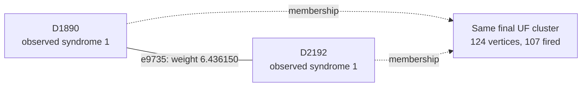

# Shot 76890: An ancilla Y fault is trapped by the first yoke star

An IY fault places the nontrivial Pauli on the check ancilla. Its two-detector
connection is frozen inside the very first fired Z-yoke star. The forest still admits
both the correct and incorrect logical classes at equal minimum weight.

This is row 76890 (zero-based) of the preserved seed-42, 100,000-shot experiment: 1D
YSC, d=7, SI1000 p=0.003, 28 noisy rounds, six physical patches, and two yokes. It
contains 401 sampled physical fault events and 754 fired detectors. The measured yoke
bits are X=0, Z=1.

[Collection, notation, and replay instructions](README.md).

**The full-shot logical outcome.**

| Result | Observable mask | Wrong logical predictions |
|---|---|---|
| Actual sampled outcome | 3236 | — |
| Repository UF | 3116 | L3, L7 |
| Ordinary joint MWPM | 3110 | L1, L7 |
| Correlated MWPM | 3236 | None |

All three graph corrections satisfy every detector, including the yokes. UF's residual
has the logical commutation pattern `X_L,1 X_L,3`, ignoring global phase. The decoder
predicts observable flips; this notation does not describe literal physical correction
gates.

**Two actual physical events.**

| Event | Circuit location | Noise channel | Sampled error, local coordinates | Detector flips in isolation | Observable flips in isolation |
|---|---|---|---|---|---|
| F90 | patch 3, round 7; tick 65; instruction 2592 | DEPOLARIZE2(0.003) | I on data q179 at (4, 0); Y on ancilla q468 at (3.5, 0.5) | D1890, D1896, D2184, D2192 | None |
| F354 | patch 1, round 25; tick 246; instruction 8483 | DEPOLARIZE1(0.0003) | Y on data q95 at (6, 2) | D6999, D7288, D7294 | None |

Fault IDs are local to this shot. Qubit, patch, and detector IDs are zero-based; rounds
are numbered 1–28. Instruction indices expand repeat blocks and retain SHIFT_COORDS. An
I label means that target receives no Pauli error. These are recovered simulator draws,
not merely compatible DEM explanations. Individual detector flips can cancel when all
faults are combined.

**A local decoding decision.**

Focus on F90's component e9735, D1890–D2192. Its original weight is 6.436150368370, and
its observable label is None. Correlated MWPM selects this edge; UF does not. The full
detector footprint above also includes another graph component of the same event.

The solid line is the target graph edge, and the dashed arrows describe final UF
membership. This is not the full correction or a diagram of physical gates. Detector
time and circuit round are different from algorithmic growth time.

| Endpoint | Full syndrome bit | Detector coordinates (global x, y, t) | Final cluster |
|---|---|---|---|
| D1890 | 1 | [26.5, 0.5, 6.0] | 124 vertices, 107 fired; boundary terminal |
| D2192 | 1 | [28.5, 0.5, 7.0] | 124 vertices, 107 fired; boundary terminal |

At growth time 1.772435451334, other connections merge the endpoints into one cluster.
The edge has grown only 3.544870902667 of its required 6.436150368370; it freezes
internally and never enters the forest. Immediately before the merge, the endpoint
clusters contain 1 and 1 fired detectors.

| Endpoint | Incident edges selected by UF |
|---|---|
| D1890 | e9731 |
| D2192 | e9768 |

**What correlation changes locally.**

| Quantity | Value |
|---|---|
| Target | e9735: D1890–D2192 |
| First-pass selected source | e9734: D1896–D2184 |
| Original target weight | 6.436150368370 |
| Reweighted target weight | 4.103204601482 |
| Source marginal probability | 0.0246431772929301 |
| Shared DEM mechanism probability | 0.000400480897975892 |
| Clipped implied probability | 0.0162511876295589 |

The rule uses min(1/2, shared probability / source probability) to obtain the implied
probability, then lowers the target's log-odds weight if appropriate. The same recovered
physical fault supplies both graph components. The source is selected in the first pass;
it is inferred evidence, not knowledge of the physical-fault log.

Reconstructing all second-pass weights in floating point reproduces correlated MWPM's
saved observable mask 3236. As a separate intervention, running the repository UF growth
and peeling on those first-pass-adjusted weights returns mask 3116 (wrong on L3, L7).
This intervention uses an MWPM first pass and is not an independently benchmarked UF
decoder. No single-edge-only weight intervention is claimed.

**The full growth result and the freedom left to peeling.**

| Yoke | First cluster: vertices / fired / parity | Final cluster: vertices / fired / parity | Final terminals | Final ordinary member-defect counts, patches 0–5 |
|---|---|---|---|---|
| X | 14 / 13 / 1 | 292 / 117 / 1 | T8795, T8843, T8891 | 10, 40, 26, 22, 12, 7 |
| Z | 37 / 37 / 1 | 124 / 107 / 1 | T9462, T9526 | 8, 22, 25, 20, 16, 15 |

The yoke belongs to one cluster and is counted once. Vertex count includes unfired
vertices and terminals; detector parity counts only fired detectors. A cluster can stop
with even detector parity or by touching an unconstrained terminal. For a yoke cluster
without terminals, its per-patch member-defect parities fix that sector of the UF
prediction.

| Allowed correction edges | Logical-change rank | Correct logical answer exists? | Restricted MWPM prediction |
|---|---|---|---|
| UF forest | 1 | Yes | 3116 |
| All original edges within each final UF cluster | 1 | Yes | 3116 |

| Forest logical prediction | Compared with actual outcome | Minimum forest cost at original float weights |
|---|---|---|
| 3116 | Incorrect | 1771.685034939206 |
| 3236 | Correct | 1771.685034939206 |

An independent tree dynamic program, allowing every terminal to absorb parity, finds
correct and incorrect forest logical classes tied within 1e-9. Each recovered optimum
was checked against every detector and its logical mask. A fixed-weight optimum does not
select a unique logical answer in this forest.

All 6 combinations of terminal roots for the two yoke trees were tested with the
existing peeling function. 3 choices are correct. One successful choice visits T8795,
T9526 first, and returns mask 3236.

| Terminal in a yoke tree | Attached detector | Patch | UF correction | Cheapest correct forest correction |
|---|---|---|---|---|
| T8795 | D2684 | 1 | Selected | Selected |
| T8843 | D2972 | 1 | Unused | Unused |
| T8891 | D3260 | 1 | Unused | Unused |
| T9462 | D6701 | 1 | Selected | Unused |
| T9526 | D7085 | 3 | Unused | Selected |

The cheapest correct forest solution can be reproduced by toggling these 20 edges
relative to the original UF correction: e818, e2391, e2392, e15562, e17002, e17037,
e32252, e32286, e32354, e32388, e33731, e33775, e33821, e34172, e34186, e34206, e34221,
e35631, e35651, e35678. All are already in the UF forest. Their combined detector
incidence is zero, and their observable mask is 136, changing prediction 3116 to 3236.
The full reconstructed correction and its weight were checked explicitly.

**Physical interventions.**

| Physical error pattern | Actual mask | UF mask | Correlated MWPM mask | UF wrong predictions |
|---|---|---|---|---|
| Original | 3236 | 3116 | 3236 | L3, L7 |
| F90 removed | 3236 | 3236 | 3236 | None |
| F354 removed | 3236 | 3236 | 3236 | None |
| F90 and F354 removed | 3236 | 3236 | 3236 | None |
| F90 alone | 0 | 0 | 0 | None |
| F354 alone | 0 | 0 | 0 | None |
| F90 and F354 alone | 0 | 0 | 0 | None |

Each deletion retains all other sampled events and the original decoder graph. The
syndrome and actual observables are changed by the removed events' independently
verified responses. Every resulting decoder correction still satisfies its input
syndrome. These counterfactuals distinguish a full repair, a partial repair, and a
change to a different wrong answer.

Correlated MWPM succeeds, but rerunning UF with the same correlated first-pass weights
leaves UF's original wrong prediction. This case shows a concrete limit of transferring
correlation-adjusted weights into the existing growth rule. Removing either highlighted
physical event fixes UF.

**An explicit logical correction exchange.**

| Wrong observable | Patch observable | Boundary endpoint | Path from its yoke, edge IDs in order |
|---|---|---|---|
| L3 | Z1 | T9462 | e32252, e33731, e33775, e33780, e33816, e35284, e35296, e33847, e32388, e32354, e32286 |
| L7 | Z3 | T8710 | e9768, e9735, e9731, e8299, e6861, e6826, e8273, e9716, e11156, e12638, e11202, e9726 |

Every listed edge belongs to the symmetric difference of the complete UF and correlated
MWPM corrections. Toggle the paths in pairs within each sector; doing this for all
listed paths changes mask 3116 to 3236. Internal detector incidences change by an even
number, the paired paths cancel their yoke incidence, and only the virtual boundary
endpoints are unconstrained. The resulting correction was explicitly checked against
every detector and all 12 observables. A single yoke-to-boundary path is not by itself a
valid syndrome-preserving toggle.

The local edge example illustrates one decision, while these complete paths supply a
valid logical repair. Restoring just the highlighted edge, or deleting one selected
fault, is not asserted to reproduce the entire correlated MWPM correction.

**Replay and scope.**

The original arrays are in `out/union_find_correlated_comparison_d7_p003_100k_seed42`;
select row 76890 consistently across detector, actual-observable, and prediction arrays.
The original 100,000-shot call was regenerated byte for byte using Stim 1.16.0 SSE2. All
401 recovered events reproduce this shot, both in aggregate and by XORing their
individual responses. A forced-fault circuit also reproduces it for eight checks with
the ordinary sampler using seeds 1 and 123456. Graph corrections and prediction masks
reproduce the saved results with PyMatching 2.4.0.

Detailed scripts, fault traces, and numerical records are local temporary data under
`$TMPDIR/uf-case-collection-9pbSDiuL/shot_76890`. [The collection guide](README.md)
records common hashes, the method, and the limits of the diagnostic interventions. These
are deliberately selected case studies; they do not estimate mechanism frequencies or
establish a decoder change's accuracy. The repository decoder was not modified.

[All cases](README.md) · [Previous: shot 73966](shot_73966.md) · [Next: shot 93574](shot_93574.md)
