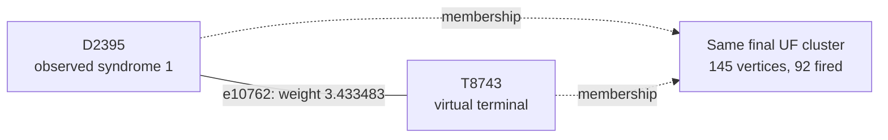

# Shot 78: An available boundary edge is unused by an even yoke tree

A data-Y fault supplies a boundary edge that enters the forest and is selected by both
matching decoders. UF leaves it unused because its Z-yoke tree has even detector parity.
That tree has only one terminal, and the complete fixed partition excludes the correct
L3 and L5 answer.

This is row 78 (zero-based) of the preserved seed-42, 100,000-shot experiment: 1D YSC,
d=7, SI1000 p=0.003, 28 noisy rounds, six physical patches, and two yokes. It contains
433 sampled physical fault events and 806 fired detectors. The measured yoke bits are
X=0, Z=1.

[Collection, notation, and replay instructions](README.md).

**The full-shot logical outcome.**

| Result | Observable mask | Wrong logical predictions |
|---|---|---|
| Actual sampled outcome | 42 | — |
| Repository UF | 2 | L3, L5 |
| Ordinary joint MWPM | 42 | None |
| Correlated MWPM | 42 | None |

All three graph corrections satisfy every detector, including the yokes. UF's residual
has the logical commutation pattern `X_L,1 X_L,2`, ignoring global phase. The decoder
predicts observable flips; this notation does not describe literal physical correction
gates.

**Reading the logical result by patch.**

| Patch | Actual flips (X, Z) | UF predicts (X, Z) | Wrong observable sector |
|---|---|---|---|
| 0 | (0, 1) | (0, 1) | None |
| 1 | (0, 1) | (0, 0) | Z |
| 2 | (0, 1) | (0, 0) | Z |
| 3 | (0, 0) | (0, 0) | None |
| 4 | (0, 0) | (0, 0) | None |
| 5 | (0, 0) | (0, 0) | None |

These are flip indicators relative to the ideal logical measurements: 1 means a flip and
0 means no flip. They are not the absolute encoded-state bits. Correlated MWPM matches
the actual column on every patch. A correction can satisfy every detector while
predicting the wrong logical flips; that leaves a residual logical error when its
correction or Pauli frame is used.

**Two actual physical events.**

| Event | Circuit location | Noise channel | Sampled error, local coordinates | Detector flips in isolation | Observable flips in isolation |
|---|---|---|---|---|---|
| F116 | patch 1, round 9; tick 81; instruction 3233 | DEPOLARIZE1(0.006) | Y on data q99 at (6, 6) | D2395, D2396 | None |
| F202 | patch 2, round 15; tick 148; instruction 5219 | DEPOLARIZE2(0.003) | Y on data q134 at (4, 5); I on ancilla q424 at (3.5, 4.5) | D4444, D4445, D4452, D4453 | None |

Fault IDs are local to this shot. Qubit, patch, and detector IDs are zero-based; rounds
are numbered 1–28. Instruction indices expand repeat blocks and retain SHIFT_COORDS. An
I label means that target receives no Pauli error. These are recovered simulator draws,
not merely compatible DEM explanations. Individual detector flips can cancel when all
faults are combined.

**A local decoding decision.**

Focus on F116's component e10762, D2395–boundary. Its original weight is 3.433482966390,
and its observable label is None. Correlated MWPM selects this edge; UF does not. The
full detector footprint above also includes another graph component of the same event.

The solid line is the target graph edge, and the dashed arrows describe final UF
membership. This is not the full correction or a diagram of physical gates. Detector
time and circuit round are different from algorithmic growth time.

| Endpoint | Full syndrome bit | Detector coordinates (global x, y, t) | Final cluster |
|---|---|---|---|
| D2395 | 1 | [13.5, 5.5, 8.0] | 145 vertices, 92 fired; boundary terminal |
| T8743 | Unconstrained | Virtual boundary | 145 vertices, 92 fired; boundary terminal |

The edge enters the forest at growth time 4.589005895031; peeling subsequently leaves it
unselected. Having the physical event's direct edge available is therefore insufficient
to identify the final correction. The UF edges incident to its endpoints are shown
below.

| Endpoint | Incident edges selected by UF |
|---|---|
| D2395 | e12233 |
| T8743 | None |

| Decoder | Selects the highlighted target edge? |
|---|---|
| repository_uf | No |
| joint_mwpm_uncorrelated | Yes |
| joint_mwpm_correlated | Yes |

**Recorded growth transitions for the highlighted edge.**

The initial rate is 1, counting active detector endpoints; a virtual terminal never
initiates growth. The table records changes in this edge's rate or internal status.
Other unions and parity-preserving size changes are omitted. Times are algorithmic
growth coordinates, not circuit rounds or software latency.

| Growth time | Accumulated growth | First endpoint cluster | Second endpoint cluster | Rate after event | Edge event |
|---|---|---|---|---|---|
| 2.698100168 | 2.698100168 | 58 fired, even; inactive (yoke) | 0 fired, boundary; inactive | 0 | Activity changed |
| 2.860407246 | 2.698100168 | 63 fired, odd; active (yoke) | 0 fired, boundary; inactive | 1 | Activity changed |
| 2.893843199 | 2.731536122 | 66 fired, even; inactive (yoke) | 0 fired, boundary; inactive | 0 | Activity changed |
| 3.076288003 | 2.731536122 | 67 fired, odd; active (yoke) | 0 fired, boundary; inactive | 1 | Activity changed |
| 3.401847827 | 3.057095946 | 68 fired, even; inactive (yoke) | 0 fired, boundary; inactive | 0 | Activity changed |
| 4.212618875 | 3.057095946 | 69 fired, odd; active (yoke) | 0 fired, boundary; inactive | 1 | Activity changed |
| 4.589005895 | 3.433482966 | 77 fired, boundary; inactive (yoke) | 77 fired, boundary; inactive (yoke) | 0 | Entered forest |

Required growth is 3.433482966390; final accumulated growth is 3.433482966390. Final
edge status: forest edge; unused by peeling.

**Why a grown edge can be unused.**

Growing adds an edge to the available forest; peeling chooses a subset of that forest as
the correction. Cutting the highlighted tree edge splits its final tree into these two
components:

| Side containing | Vertices | Fired detectors | Boundary terminals | Yokes |
|---|---|---|---|---|
| D2395 | 144 | 92 | None | D8353 |
| T8743 | 1 | 0 | T8743 | None |

The D2395 side has 92 fired detectors and no boundary terminal. Its even parity requires
zero selected correction edges across this one-edge cut. Thus peeling cannot simply
select the highlighted edge while leaving this forest and syndrome otherwise unchanged.

**What correlation changes locally.**

| Quantity | Value |
|---|---|
| Target | e10762: D2395–boundary |
| First-pass selected source | e10811: D2396–boundary |
| Original target weight | 3.433482966390 |
| Reweighted target weight | 0.461179597522 |
| Source marginal probability | 0.0159817991653669 |
| Shared DEM mechanism probability | 0.00618025807349817 |
| Clipped implied probability | 0.386706027872695 |

The rule uses min(1/2, shared probability / source probability) to obtain the implied
probability, then lowers the target's log-odds weight if appropriate. The same recovered
physical fault supplies both graph components. The source is selected in the first pass;
it is inferred evidence, not knowledge of the physical-fault log.

Reconstructing all second-pass weights in floating point reproduces correlated MWPM's
saved observable mask 42. As a separate intervention, running the repository UF growth
and peeling on those first-pass-adjusted weights returns mask 42 (correct). This
intervention uses an MWPM first pass and is not an independently benchmarked UF decoder.
No single-edge-only weight intervention is claimed.

**The other traced physical connection.**

For F202, the selected diagnostic component is e21074, D4445–D4452. Its observable label
is None, and its weight is 4.132583800266. Its growth outcome is: forest edge; unused by
peeling.

| Decoder | Selects this target edge? |
|---|---|
| repository_uf | No |
| joint_mwpm_uncorrelated | No |
| joint_mwpm_correlated | Yes |

| Endpoint | Observed bit | Final cluster |
|---|---|---|
| D4445 | 1 | 11 vertices, 3 fired; boundary terminal |
| D4452 | 1 | 11 vertices, 3 fired; boundary terminal |

The selected first-pass source is e22513 (D4444–D4453); it lowers the target weight from
4.132583800266 to 0.000000000000. That source is another component of this same
recovered physical event.

**The full growth result and the freedom left to peeling.**

| Yoke | First cluster: vertices / fired / parity | Final cluster: vertices / fired / parity | Final terminals | Final ordinary member-defect counts, patches 0–5 |
|---|---|---|---|---|
| X | 21 / 20 / 0 | 101 / 55 / 1 | T8794 | 6, 21, 0, 4, 12, 12 |
| Z | 25 / 25 / 1 | 145 / 92 / 0 | T8743 | 5, 26, 16, 10, 10, 24 |

The yoke belongs to one cluster and is counted once. Vertex count includes unfired
vertices and terminals; detector parity counts only fired detectors. A cluster can stop
with even detector parity or by touching an unconstrained terminal. For a yoke cluster
without terminals, its per-patch member-defect parities fix that sector of the UF
prediction.

| Yoke tree | Terminal | Attached detector | Patch | Boundary edge selected by UF? |
|---|---|---|---|---|
| X | T8794 | D2682 | 1 | Yes |
| Z | T8743 | D2395 | 1 | No |

Several terminals can attach to the same patch. Their count does not determine the
number of independent logical changes; the logical-space calculation below tracks their
observable labels.

| Allowed correction edges | Logical-change rank | Correct logical answer exists? | Restricted MWPM prediction |
|---|---|---|---|
| UF forest | 0 | No | 2 |
| All original edges within each final UF cluster | 0 | No | 2 |

An exhaustive GF(2) cycle-space certificate shows that the required logical change, mask
40, is unavailable even if every original edge internal to the final clusters is
restored. The same syndrome and partition therefore cannot be repaired by a different
peeling choice. A correct answer requires connections beyond that partition. This is
stronger than merely observing that restricted MWPM returns the wrong answer.

**Physical interventions.**

| Physical error pattern | Actual mask | UF mask | Correlated MWPM mask | UF wrong predictions |
|---|---|---|---|---|
| Original | 42 | 2 | 42 | L3, L5 |
| F116 removed | 42 | 42 | 42 | None |
| F202 removed | 42 | 2 | 42 | L3, L5 |
| F116 and F202 removed | 42 | 42 | 42 | None |
| F116 alone | 0 | 0 | 0 | None |
| F202 alone | 0 | 0 | 0 | None |
| F116 and F202 alone | 0 | 0 | 0 | None |

Each deletion retains all other sampled events and the original decoder graph. The
syndrome and actual observables are changed by the removed events' independently
verified responses. Every resulting decoder correction still satisfies its input
syndrome. These counterfactuals distinguish a full repair, a partial repair, and a
change to a different wrong answer.

Removing F116 fixes UF; removing the other data-Y event F202 leaves the original
mistake. F202's target edge is also retained but unused, in a different
boundary-containing cluster. Removing both is correct. Having a physical boundary edge
available does not guarantee that a correction confined to the final UF clusters can use
it with the required logical parity.

**An explicit logical correction exchange.**

| Wrong observable | Patch observable | Boundary endpoint | Path from its yoke, edge IDs in order |
|---|---|---|---|
| L3 | Z1 | T8743 | e10728, e10730, e12175, e12221, e10788, e12233, e10762 |
| L5 | Z2 | T9086 | e23928, e23930, e25375, e23940, e23981, e22545, e21074, e21006 |

Every listed edge belongs to the symmetric difference of the complete UF and correlated
MWPM corrections. Toggle the paths in pairs within each sector; doing this for all
listed paths changes mask 2 to 42. Internal detector incidences change by an even
number, the paired paths cancel their yoke incidence, and only the virtual boundary
endpoints are unconstrained. The resulting correction was explicitly checked against
every detector and all 12 observables. A single yoke-to-boundary path is not by itself a
valid syndrome-preserving toggle.

The local edge example illustrates one decision, while these complete paths supply a
valid logical repair. Restoring just the highlighted edge, or deleting one selected
fault, is not asserted to reproduce the entire correlated MWPM correction.

**Replay and scope.**

The original arrays are in `out/union_find_correlated_comparison_d7_p003_100k_seed42`;
select row 78 consistently across detector, actual-observable, and prediction arrays.
The original 100,000-shot call was regenerated byte for byte using Stim 1.16.0 SSE2. All
433 recovered events reproduce this shot, both in aggregate and by XORing their
individual responses. A forced-fault circuit also reproduces it for eight checks with
the ordinary sampler using seeds 1 and 123456. Graph corrections and prediction masks
reproduce the saved results with PyMatching 2.4.0.

Detailed scripts, fault traces, and numerical records are local temporary data under
`$TMPDIR/uf-case-collection-next-6a0xaw4f/shot_78`. [The collection guide](README.md)
records common hashes, the method, and the limits of the diagnostic interventions. These
are deliberately selected case studies; they do not estimate mechanism frequencies or
establish a decoder change's accuracy. The repository decoder was not modified.

[All cases](README.md) · [Previous: shot 64](shot_64.md) · [Next: shot 97](shot_97.md)
