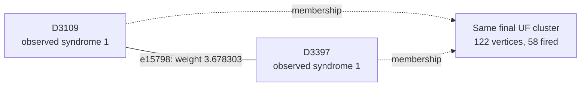

# Shot 86347: Two retained physical connections accompany an even-tree peeling restriction

Both highlighted target edges enter the forest: a data-Y connection and a temporal
readout connection. UF selects neither, while both matching decoders select them. The
even X-yoke tree touches two terminals. A cheaper correct forest correction exists, but
changing the single peeling root cannot produce it.

This is row 86347 (zero-based) of the preserved seed-42, 100,000-shot experiment: 1D
YSC, d=7, SI1000 p=0.003, 28 noisy rounds, six physical patches, and two yokes. It
contains 412 sampled physical fault events and 812 fired detectors. The measured yoke
bits are X=0, Z=0.

[Collection, notation, and replay instructions](README.md).

**The full-shot logical outcome.**

| Result | Observable mask | Wrong logical predictions |
|---|---|---|
| Actual sampled outcome | 1310 | — |
| Repository UF | 1118 | L6, L8 |
| Ordinary joint MWPM | 1310 | None |
| Correlated MWPM | 1310 | None |

All three graph corrections satisfy every detector, including the yokes. UF's residual
has the logical commutation pattern `Z_L,3 Z_L,4`, ignoring global phase. The decoder
predicts observable flips; this notation does not describe literal physical correction
gates.

**Reading the logical result by patch.**

| Patch | Actual flips (X, Z) | UF predicts (X, Z) | Wrong observable sector |
|---|---|---|---|
| 0 | (0, 1) | (0, 1) | None |
| 1 | (1, 1) | (1, 1) | None |
| 2 | (1, 0) | (1, 0) | None |
| 3 | (0, 0) | (1, 0) | X |
| 4 | (1, 0) | (0, 0) | X |
| 5 | (1, 0) | (1, 0) | None |

These are flip indicators relative to the ideal logical measurements: 1 means a flip and
0 means no flip. They are not the absolute encoded-state bits. Correlated MWPM matches
the actual column on every patch. A correction can satisfy every detector while
predicting the wrong logical flips; that leaves a residual logical error when its
correction or Pauli frame is used.

**Two actual physical events.**

| Event | Circuit location | Noise channel | Sampled error, local coordinates | Detector flips in isolation | Observable flips in isolation |
|---|---|---|---|---|---|
| F147 | patch 4, round 11; tick 110; instruction 3917 | M(0.015) | readout on ancilla q529 at (4.5, 5.5) | D3109, D3397 | None |
| F303 | patch 3, round 21; tick 201; instruction 7157 | DEPOLARIZE1(0.006) | Y on data q174 at (3, 2) | D5923, D5924, D5929, D5930 | None |

Fault IDs are local to this shot. Qubit, patch, and detector IDs are zero-based; rounds
are numbered 1–28. Instruction indices expand repeat blocks and retain SHIFT_COORDS. An
I label means that target receives no Pauli error. These are recovered simulator draws,
not merely compatible DEM explanations. Individual detector flips can cancel when all
faults are combined.

**A local decoding decision.**

Focus on F147's component e15798, D3109–D3397. Its original weight is 3.678303297125,
and its observable label is None. Correlated MWPM selects this edge; UF does not. This
component accounts for the event's entire detector response.

The solid line is the target graph edge, and the dashed arrows describe final UF
membership. This is not the full correction or a diagram of physical gates. Detector
time and circuit round are different from algorithmic growth time.

| Endpoint | Full syndrome bit | Detector coordinates (global x, y, t) | Final cluster |
|---|---|---|---|
| D3109 | 1 | [36.5, 5.5, 10.0] | 122 vertices, 58 fired; boundary terminal |
| D3397 | 1 | [36.5, 5.5, 11.0] | 122 vertices, 58 fired; boundary terminal |

The edge enters the forest at growth time 1.839151648562; peeling subsequently leaves it
unselected. Having the physical event's direct edge available is therefore insufficient
to identify the final correction. The UF edges incident to its endpoints are shown
below.

| Endpoint | Incident edges selected by UF |
|---|---|
| D3109 | e14358 |
| D3397 | e15834 |

| Decoder | Selects the highlighted target edge? |
|---|---|
| repository_uf | No |
| joint_mwpm_uncorrelated | Yes |
| joint_mwpm_correlated | Yes |

**Recorded growth transitions for the highlighted edge.**

The initial rate is 2, counting active detector endpoints; a virtual terminal never
initiates growth. The table records changes in this edge's rate or internal status.
Other unions and parity-preserving size changes are omitted. Times are algorithmic
growth coordinates, not circuit rounds or software latency.

| Growth time | Accumulated growth | First endpoint cluster | Second endpoint cluster | Rate after event | Edge event |
|---|---|---|---|---|---|
| 1.839151649 | 3.678303297 | 3 fired, odd; active | 3 fired, odd; active | 0 | Entered forest |

Required growth is 3.678303297125; final accumulated growth is 3.678303297125. Final
edge status: forest edge; unused by peeling.

**Why a grown edge can be unused.**

Growing adds an edge to the available forest; peeling chooses a subset of that forest as
the correction. Cutting the highlighted tree edge splits its final tree into these two
components:

| Side containing | Vertices | Fired detectors | Boundary terminals | Yokes |
|---|---|---|---|---|
| D3109 | 119 | 56 | T9337 | D8352 |
| D3397 | 3 | 2 | T8914 | None |

Both sides contain boundary terminals. Their detector parities can be satisfied through
those terminals. Which boundary routes single-root peeling uses depends on the chosen
root; edge availability alone does not decide the logical answer.

**What correlation changes locally.**

This edge receives no correlation discount: its weight remains 3.678303297125.
Correlated MWPM still selects it as part of its global solution. Its success cannot be
attributed to lowering this particular edge's cost. Correlation updates elsewhere and
the choice of a complete correction must be considered separately.

Reconstructing all second-pass weights in floating point reproduces correlated MWPM's
saved observable mask 1310. As a separate intervention, running the repository UF growth
and peeling on those first-pass-adjusted weights returns mask 1310 (correct). This
intervention uses an MWPM first pass and is not an independently benchmarked UF decoder.
No single-edge-only weight intervention is claimed.

**The other traced physical connection.**

For F303, the selected diagnostic component is e29900, D5923–D5930. Its observable label
is None, and its weight is 4.562635883352. Its growth outcome is: forest edge; unused by
peeling.

| Decoder | Selects this target edge? |
|---|---|
| repository_uf | No |
| joint_mwpm_uncorrelated | Yes |
| joint_mwpm_correlated | Yes |

| Endpoint | Observed bit | Final cluster |
|---|---|---|
| D5923 | 1 | 122 vertices, 58 fired; boundary terminal |
| D5930 | 1 | 122 vertices, 58 fired; boundary terminal |

The selected first-pass source is e28461 (D5924–D5929); it lowers the target weight from
4.562635883352 to 0.713850186433. That source is another component of this same
recovered physical event.

**The full growth result and the freedom left to peeling.**

| Yoke | First cluster: vertices / fired / parity | Final cluster: vertices / fired / parity | Final terminals | Final ordinary member-defect counts, patches 0–5 |
|---|---|---|---|---|
| X | 8 / 7 / 1 | 122 / 58 / 0 | T8914, T9337 | 6, 7, 11, 23, 10, 1 |
| Z | 12 / 11 / 1 | 31 / 18 / 0 | None | 5, 1, 6, 4, 0, 2 |

The yoke belongs to one cluster and is counted once. Vertex count includes unfired
vertices and terminals; detector parity counts only fired detectors. A cluster can stop
with even detector parity or by touching an unconstrained terminal. For a yoke cluster
without terminals, its per-patch member-defect parities fix that sector of the UF
prediction.

| Yoke tree | Terminal | Attached detector | Patch | Boundary edge selected by UF? |
|---|---|---|---|---|
| X | T8914 | D3402 | 4 | No |
| X | T9337 | D5944 | 3 | No |

Several terminals can attach to the same patch. Their count does not determine the
number of independent logical changes; the logical-space calculation below tracks their
observable labels.

| Allowed correction edges | Logical-change rank | Correct logical answer exists? | Restricted MWPM prediction |
|---|---|---|---|
| UF forest | 1 | Yes | 1310 |
| All original edges within each final UF cluster | 1 | Yes | 1310 |

| Forest logical prediction | Compared with actual outcome | Minimum forest cost at original float weights |
|---|---|---|
| 1118 | Incorrect | 1899.006733001921 |
| 1310 | Correct | 1893.682054052769 |

The cheapest correct forest class is lighter by 5.324678949153. An independent tree
dynamic program recovers it using the same forest and original float weights. Thus the
current peeling policy misses an available, lower-cost correction with the right logical
answer.

All 2 combinations of terminal roots for the two yoke trees were tested with the
existing peeling function. 0 choices are correct. All tested roots leave the logical
answer wrong. The relevant even tree needs boundary branches that single-root peeling
leaves unused; changing the root alone does not enable them.

| Terminal in a yoke tree | Attached detector | Patch | UF correction | Cheapest correct forest correction |
|---|---|---|---|---|
| T8914 | D3402 | 4 | Unused | Selected |
| T9337 | D5944 | 3 | Unused | Selected |

The cheapest correct forest solution can be reproduced by toggling these 29 edges
relative to the original UF correction: e1719, e1725, e3159, e5252, e6690, e6692,
e11303, e12783, e12825, e12829, e14312, e14353, e14358, e15798, e15832, e15834, e22540,
e23979, e23980, e24846, e26286, e26322, e28343, e28375, e28496, e28540, e29853, e29900,
e29975. All are already in the UF forest. Their combined detector incidence is zero, and
their observable mask is 320, changing prediction 1118 to 1310. The full reconstructed
correction and its weight were checked explicitly.

**Physical interventions.**

| Physical error pattern | Actual mask | UF mask | Correlated MWPM mask | UF wrong predictions |
|---|---|---|---|---|
| Original | 1310 | 1118 | 1310 | L6, L8 |
| F147 removed | 1310 | 1310 | 1310 | None |
| F303 removed | 1310 | 1310 | 1310 | None |
| F147 and F303 removed | 1310 | 1310 | 1310 | None |
| F147 alone | 0 | 0 | 0 | None |
| F303 alone | 0 | 0 | 0 | None |
| F147 and F303 alone | 0 | 0 | 0 | None |

Each deletion retains all other sampled events and the original decoder graph. The
syndrome and actual observables are changed by the removed events' independently
verified responses. Every resulting decoder correction still satisfies its input
syndrome. These counterfactuals distinguish a full repair, a partial repair, and a
change to a different wrong answer.

Removing F147, removing F303, or removing both makes UF correct. The readout edge itself
receives no correlation discount. These interventions complement the fixed-forest
calculation: the existing peeling policy misses a valid, lower-cost correction despite
the availability of multiple physical components and both necessary boundary
alternatives.

**An explicit logical correction exchange.**

| Wrong observable | Patch observable | Boundary endpoint | Path from its yoke, edge IDs in order |
|---|---|---|---|
| L6 | X3 | T9336 | e28343, e28375, e29853, e29900, e28496, e28528, e28532 |
| L8 | X4 | T8914 | e11303, e12783, e12825, e12829, e14312, e14353, e14358, e15798, e15834, e15832 |

Every listed edge belongs to the symmetric difference of the complete UF and correlated
MWPM corrections. Toggle the paths in pairs within each sector; doing this for all
listed paths changes mask 1118 to 1310. Internal detector incidences change by an even
number, the paired paths cancel their yoke incidence, and only the virtual boundary
endpoints are unconstrained. The resulting correction was explicitly checked against
every detector and all 12 observables. A single yoke-to-boundary path is not by itself a
valid syndrome-preserving toggle.

The local edge example illustrates one decision, while these complete paths supply a
valid logical repair. Restoring just the highlighted edge, or deleting one selected
fault, is not asserted to reproduce the entire correlated MWPM correction.

**Replay and scope.**

The original arrays are in `out/union_find_correlated_comparison_d7_p003_100k_seed42`;
select row 86347 consistently across detector, actual-observable, and prediction arrays.
The original 100,000-shot call was regenerated byte for byte using Stim 1.16.0 SSE2. All
412 recovered events reproduce this shot, both in aggregate and by XORing their
individual responses. A forced-fault circuit also reproduces it for eight checks with
the ordinary sampler using seeds 1 and 123456. Graph corrections and prediction masks
reproduce the saved results with PyMatching 2.4.0.

Detailed scripts, fault traces, and numerical records are local temporary data under
`$TMPDIR/uf-case-collection-next-6a0xaw4f/shot_86347`. [The collection guide](README.md)
records common hashes, the method, and the limits of the diagnostic interventions. These
are deliberately selected case studies; they do not estimate mechanism frequencies or
establish a decoder change's accuracy. The repository decoder was not modified.

[All cases](README.md) · [Previous: shot 80183](shot_80183.md) · [Next: shot 88907](shot_88907.md)
