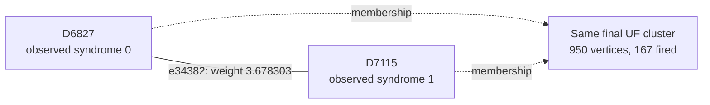

# Shot 90957: An unfired readout endpoint inside a 950-vertex Z-yoke tree

The final Z-yoke tree has 950 vertices, 167 fired detectors, and two terminals. A
readout component with one unfired endpoint is present in the forest but unused by UF.
Changing the root to the other terminal fixes L9 and L11, and the correct forest class
is cheaper under the original weights.

This is row 90957 (zero-based) of the preserved seed-42, 100,000-shot experiment: 1D
YSC, d=7, SI1000 p=0.003, 28 noisy rounds, six physical patches, and two yokes. It
contains 428 sampled physical fault events and 765 fired detectors. The measured yoke
bits are X=0, Z=1.

[Collection, notation, and replay instructions](README.md).

**The full-shot logical outcome.**

| Result | Observable mask | Wrong logical predictions |
|---|---|---|
| Actual sampled outcome | 248 | — |
| Repository UF | 2808 | L9, L11 |
| Ordinary joint MWPM | 248 | None |
| Correlated MWPM | 248 | None |

All three graph corrections satisfy every detector, including the yokes. UF's residual
has the logical commutation pattern `X_L,4 X_L,5`, ignoring global phase. The decoder
predicts observable flips; this notation does not describe literal physical correction
gates.

**Reading the logical result by patch.**

| Patch | Actual flips (X, Z) | UF predicts (X, Z) | Wrong observable sector |
|---|---|---|---|
| 0 | (0, 0) | (0, 0) | None |
| 1 | (0, 1) | (0, 1) | None |
| 2 | (1, 1) | (1, 1) | None |
| 3 | (1, 1) | (1, 1) | None |
| 4 | (0, 0) | (0, 1) | Z |
| 5 | (0, 0) | (0, 1) | Z |

These are flip indicators relative to the ideal logical measurements: 1 means a flip and
0 means no flip. They are not the absolute encoded-state bits. Correlated MWPM matches
the actual column on every patch. A correction can satisfy every detector while
predicting the wrong logical flips; that leaves a residual logical error when its
correction or Pauli frame is used.

**Two actual physical events.**

| Event | Circuit location | Noise channel | Sampled error, local coordinates | Detector flips in isolation | Observable flips in isolation |
|---|---|---|---|---|---|
| F368 | patch 4, round 24; tick 240; instruction 8168 | M(0.015) | readout on ancilla q503 at (1.5, 1.5) | D6827, D7115 | None |
| F357 | patch 5, round 23; tick 230; instruction 8133 | DEPOLARIZE1(0.006) | Y on data q278 at (3, 6) | D6887, D6893, D6894 | None |

Fault IDs are local to this shot. Qubit, patch, and detector IDs are zero-based; rounds
are numbered 1–28. Instruction indices expand repeat blocks and retain SHIFT_COORDS. An
I label means that target receives no Pauli error. These are recovered simulator draws,
not merely compatible DEM explanations. Individual detector flips can cancel when all
faults are combined.

**A local decoding decision.**

Focus on F368's component e34382, D6827–D7115. Its original weight is 3.678303297125,
and its observable label is None. Correlated MWPM selects this edge; UF does not. This
component accounts for the event's entire detector response.

The solid line is the target graph edge, and the dashed arrows describe final UF
membership. This is not the full correction or a diagram of physical gates. Detector
time and circuit round are different from algorithmic growth time.

| Endpoint | Full syndrome bit | Detector coordinates (global x, y, t) | Final cluster |
|---|---|---|---|
| D6827 | 0 | [33.5, 1.5, 23.0] | 950 vertices, 167 fired; boundary terminal |
| D7115 | 1 | [33.5, 1.5, 24.0] | 950 vertices, 167 fired; boundary terminal |

The edge enters the forest at growth time 3.678303297125; peeling subsequently leaves it
unselected. Having the physical event's direct edge available is therefore insufficient
to identify the final correction. The UF edges incident to its endpoints are shown
below.

| Endpoint | Incident edges selected by UF |
|---|---|
| D6827 | None |
| D7115 | e35822 |

| Unfired endpoint | Actual fault contributions | Resulting detector bit |
|---|---|---|
| D6827 | F346, F368 | 2 mod 2 = 0 |

Correlated MWPM may pass through an unfired detector using an even number of incident
correction edges. It does not need to interpret that detector as a defect. The absence
of a fired bit is not evidence that the corresponding physical faults were absent.

| Decoder | Selects the highlighted target edge? |
|---|---|
| repository_uf | No |
| joint_mwpm_uncorrelated | Yes |
| joint_mwpm_correlated | Yes |

**Recorded growth transitions for the highlighted edge.**

The initial rate is 1, counting active detector endpoints; a virtual terminal never
initiates growth. The table records changes in this edge's rate or internal status.
Other unions and parity-preserving size changes are omitted. Times are algorithmic
growth coordinates, not circuit rounds or software latency.

| Growth time | Accumulated growth | First endpoint cluster | Second endpoint cluster | Rate after event | Edge event |
|---|---|---|---|---|---|
| 3.678303297 | 3.678303297 | 2 fired, even; inactive | 2 fired, even; inactive | 0 | Entered forest |

Required growth is 3.678303297125; final accumulated growth is 3.678303297125. Final
edge status: forest edge; unused by peeling.

**Why a grown edge can be unused.**

Growing adds an edge to the available forest; peeling chooses a subset of that forest as
the correction. Cutting the highlighted tree edge splits its final tree into these two
components:

| Side containing | Vertices | Fired detectors | Boundary terminals | Yokes |
|---|---|---|---|---|
| D6827 | 1 | 0 | None | None |
| D7115 | 949 | 167 | T9445, T9581 | D8353 |

The D6827 side has 0 fired detectors and no boundary terminal. Its even parity requires
zero selected correction edges across this one-edge cut. Thus peeling cannot simply
select the highlighted edge while leaving this forest and syndrome otherwise unchanged.

**What correlation changes locally.**

This edge receives no correlation discount: its weight remains 3.678303297125.
Correlated MWPM still selects it as part of its global solution. Its success cannot be
attributed to lowering this particular edge's cost. Correlation updates elsewhere and
the choice of a complete correction must be considered separately.

Reconstructing all second-pass weights in floating point reproduces correlated MWPM's
saved observable mask 248. As a separate intervention, running the repository UF growth
and peeling on those first-pass-adjusted weights returns mask 248 (correct). This
intervention uses an MWPM first pass and is not an independently benchmarked UF decoder.
No single-edge-only weight intervention is claimed.

**The other traced physical connection.**

For F357, the selected diagnostic component is e33246, D6893–boundary. Its observable
label is None, and its weight is 3.390989621338. Its growth outcome is: incomplete
between final clusters.

| Decoder | Selects this target edge? |
|---|---|
| repository_uf | No |
| joint_mwpm_uncorrelated | No |
| joint_mwpm_correlated | Yes |

| Endpoint | Observed bit | Final cluster |
|---|---|---|
| D6893 | 0 | 950 vertices, 167 fired; boundary terminal |
| T9494 | Unconstrained | 1 vertex, 0 fired; boundary terminal |

At D6893, the recovered contributions are F357, F358; 2 contributions have even parity,
leaving the observed bit zero.

The selected first-pass source is e34723 (D6887–D6894); it lowers the target weight from
3.390989621338 to 0.000000000000. That source is another component of this same
recovered physical event.

**The full growth result and the freedom left to peeling.**

| Yoke | First cluster: vertices / fired / parity | Final cluster: vertices / fired / parity | Final terminals | Final ordinary member-defect counts, patches 0–5 |
|---|---|---|---|---|
| X | 7 / 6 / 0 | 46 / 20 / 0 | None | 6, 4, 1, 5, 0, 4 |
| Z | 27 / 27 / 1 | 950 / 167 / 1 | T9445, T9581 | 40, 13, 21, 25, 37, 30 |

The yoke belongs to one cluster and is counted once. Vertex count includes unfired
vertices and terminals; detector parity counts only fired detectors. A cluster can stop
with even detector parity or by touching an unconstrained terminal. For a yoke cluster
without terminals, its per-patch member-defect parities fix that sector of the UF
prediction.

| Yoke tree | Terminal | Attached detector | Patch | Boundary edge selected by UF? |
|---|---|---|---|---|
| Z | T9445 | D6591 | 5 | Yes |
| Z | T9581 | D7407 | 4 | No |

Several terminals can attach to the same patch. Their count does not determine the
number of independent logical changes; the logical-space calculation below tracks their
observable labels.

| Allowed correction edges | Logical-change rank | Correct logical answer exists? | Restricted MWPM prediction |
|---|---|---|---|
| UF forest | 1 | Yes | 248 |
| All original edges within each final UF cluster | 1 | Yes | 248 |

| Forest logical prediction | Compared with actual outcome | Minimum forest cost at original float weights |
|---|---|---|
| 248 | Correct | 1839.068480712094 |
| 2808 | Incorrect | 1847.203505287391 |

The cheapest correct forest class is lighter by 8.135024575297. An independent tree
dynamic program recovers it using the same forest and original float weights. Thus the
current peeling policy misses an available, lower-cost correction with the right logical
answer.

All 2 combinations of terminal roots for the two yoke trees were tested with the
existing peeling function. 1 choice is correct. One successful choice visits T9581
first, and returns mask 248.

| Terminal in a yoke tree | Attached detector | Patch | UF correction | Cheapest correct forest correction |
|---|---|---|---|---|
| T9445 | D6591 | 5 | Selected | Unused |
| T9581 | D7407 | 4 | Unused | Selected |

The cheapest correct forest solution can be reproduced by toggling these 33 edges
relative to the original UF correction: e804, e1882, e2379, e3322, e3357, e3819, e5259,
e5260, e8362, e9802, e9837, e31728, e31798, e33281, e34412, e34414, e34711, e34747,
e35808, e35822, e36168, e36179, e37262, e37264, e37277, e37315, e37620, e37647, e37654,
e37656, e38669, e38674, e38751. All are already in the UF forest. Their combined
detector incidence is zero, and their observable mask is 2560, changing prediction 2808
to 248. The full reconstructed correction and its weight were checked explicitly.

**Physical interventions.**

| Physical error pattern | Actual mask | UF mask | Correlated MWPM mask | UF wrong predictions |
|---|---|---|---|---|
| Original | 248 | 2808 | 248 | L9, L11 |
| F368 removed | 248 | 248 | 248 | None |
| F357 removed | 248 | 248 | 248 | None |
| F368 and F357 removed | 248 | 248 | 248 | None |
| F368 alone | 0 | 0 | 0 | None |
| F357 alone | 0 | 0 | 0 | None |
| F368 and F357 alone | 0 | 0 | 0 | None |

Each deletion retains all other sampled events and the original decoder graph. The
syndrome and actual observables are changed by the removed events' independently
verified responses. Every resulting decoder correction still satisfies its input
syndrome. These counterfactuals distinguish a full repair, a partial repair, and a
change to a different wrong answer.

Removing either F368 or F357 fixes UF. The latter event has an unfired detector on a
boundary connection that never completes; individual physical responses must therefore
be distinguished from the full syndrome. The successful root intervention retains the
original syndrome and forest and does not need to restore that incomplete boundary edge.

**An explicit logical correction exchange.**

| Wrong observable | Patch observable | Boundary endpoint | Path from its yoke, edge IDs in order |
|---|---|---|---|
| L9 | Z4 | T9581 | e31491, e32898, e32908, e34382, e35822, e37262, e37264, e38669, e38674, e37277, e38751, e37315, e35808 |
| L11 | Z5 | T9494 | e36168, e37647, e37654, e37656, e37620, e36179, e34711, e34747, e33314, e33246 |

Every listed edge belongs to the symmetric difference of the complete UF and correlated
MWPM corrections. Toggle the paths in pairs within each sector; doing this for all
listed paths changes mask 2808 to 248. Internal detector incidences change by an even
number, the paired paths cancel their yoke incidence, and only the virtual boundary
endpoints are unconstrained. The resulting correction was explicitly checked against
every detector and all 12 observables. A single yoke-to-boundary path is not by itself a
valid syndrome-preserving toggle.

The local edge example illustrates one decision, while these complete paths supply a
valid logical repair. Restoring just the highlighted edge, or deleting one selected
fault, is not asserted to reproduce the entire correlated MWPM correction.

**Replay and scope.**

The original arrays are in `out/union_find_correlated_comparison_d7_p003_100k_seed42`;
select row 90957 consistently across detector, actual-observable, and prediction arrays.
The original 100,000-shot call was regenerated byte for byte using Stim 1.16.0 SSE2. All
428 recovered events reproduce this shot, both in aggregate and by XORing their
individual responses. A forced-fault circuit also reproduces it for eight checks with
the ordinary sampler using seeds 1 and 123456. Graph corrections and prediction masks
reproduce the saved results with PyMatching 2.4.0.

Detailed scripts, fault traces, and numerical records are local temporary data under
`$TMPDIR/uf-case-collection-next-6a0xaw4f/shot_90957`. [The collection guide](README.md)
records common hashes, the method, and the limits of the diagnostic interventions. These
are deliberately selected case studies; they do not estimate mechanism frequencies or
establish a decoder change's accuracy. The repository decoder was not modified.

[All cases](README.md) · [Previous: shot 88907](shot_88907.md) · [Next: shot 93829](shot_93829.md)
