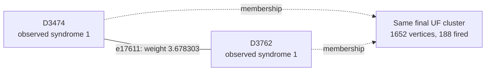

# Shot 93574: An ancilla fault is frozen inside a 1652-vertex yoke cluster

The final Z-yoke cluster reaches 1652 vertices, the largest final yoke cluster among the
preserved UF-fails/correlated MWPM-passes shots. An ancilla X fault's temporal edge is
frozen during the first fired-yoke batch, before its weight is fully grown.

This is row 93574 (zero-based) of the preserved seed-42, 100,000-shot experiment: 1D
YSC, d=7, SI1000 p=0.003, 28 noisy rounds, six physical patches, and two yokes. It
contains 372 sampled physical fault events and 715 fired detectors. The measured yoke
bits are X=1, Z=1.

[Collection, notation, and replay instructions](README.md).

**The full-shot logical outcome.**

| Result | Observable mask | Wrong logical predictions |
|---|---|---|
| Actual sampled outcome | 2382 | — |
| Repository UF | 332 | L1, L11 |
| Ordinary joint MWPM | 2382 | None |
| Correlated MWPM | 2382 | None |

All three graph corrections satisfy every detector, including the yokes. UF's residual
has the logical commutation pattern `X_L,0 X_L,5`, ignoring global phase. The decoder
predicts observable flips; this notation does not describe literal physical correction
gates.

**Two actual physical events.**

| Event | Circuit location | Noise channel | Sampled error, local coordinates | Detector flips in isolation | Observable flips in isolation |
|---|---|---|---|---|---|
| F163 | patch 0, round 13; tick 121; instruction 4539 | X_ERROR(0.006) | X on ancilla q318 at (2.5, 0.5) | D3474, D3762 | None |
| F213 | patch 5, round 17; tick 169; instruction 5877 | DEPOLARIZE1(0.0003) | Y on data q262 at (1, 4) | D5143, D5144, D5149, D5150 | None |

Fault IDs are local to this shot. Qubit, patch, and detector IDs are zero-based; rounds
are numbered 1–28. Instruction indices expand repeat blocks and retain SHIFT_COORDS. An
I label means that target receives no Pauli error. These are recovered simulator draws,
not merely compatible DEM explanations. Individual detector flips can cancel when all
faults are combined.

**A local decoding decision.**

Focus on F163's component e17611, D3474–D3762. Its original weight is 3.678303297125,
and its observable label is None. Correlated MWPM selects this edge; UF does not. This
component accounts for the event's entire detector response.

The solid line is the target graph edge, and the dashed arrows describe final UF
membership. This is not the full correction or a diagram of physical gates. Detector
time and circuit round are different from algorithmic growth time.

| Endpoint | Full syndrome bit | Detector coordinates (global x, y, t) | Final cluster |
|---|---|---|---|
| D3474 | 1 | [2.5, 0.5, 12.0] | 1652 vertices, 188 fired; boundary terminal |
| D3762 | 1 | [2.5, 0.5, 13.0] | 1652 vertices, 188 fired; boundary terminal |

At growth time 1.772435451334, other connections merge the endpoints into one cluster.
The edge has grown only 3.544870902667 of its required 3.678303297125; it freezes
internally and never enters the forest. Immediately before the merge, the endpoint
clusters contain 1 and 1 fired detectors.

| Endpoint | Incident edges selected by UF |
|---|---|
| D3474 | e17651 |
| D3762 | e17612 |

**What correlation changes locally.**

This edge receives no correlation discount: its weight remains 3.678303297125.
Correlated MWPM still selects it as part of its global solution. Its success cannot be
attributed to lowering this particular edge's cost. Correlation updates elsewhere and
the choice of a complete correction must be considered separately.

Reconstructing all second-pass weights in floating point reproduces correlated MWPM's
saved observable mask 2382. As a separate intervention, running the repository UF growth
and peeling on those first-pass-adjusted weights returns mask 2382 (correct). This
intervention uses an MWPM first pass and is not an independently benchmarked UF decoder.
No single-edge-only weight intervention is claimed.

**The full growth result and the freedom left to peeling.**

| Yoke | First cluster: vertices / fired / parity | Final cluster: vertices / fired / parity | Final terminals | Final ordinary member-defect counts, patches 0–5 |
|---|---|---|---|---|
| X | 33 / 33 / 1 | 172 / 119 / 1 | T8561 | 20, 21, 21, 15, 11, 30 |
| Z | 24 / 24 / 0 | 1652 / 188 / 0 | T8974 | 34, 27, 20, 42, 26, 38 |

The yoke belongs to one cluster and is counted once. Vertex count includes unfired
vertices and terminals; detector parity counts only fired detectors. A cluster can stop
with even detector parity or by touching an unconstrained terminal. For a yoke cluster
without terminals, its per-patch member-defect parities fix that sector of the UF
prediction.

| Allowed correction edges | Logical-change rank | Correct logical answer exists? | Restricted MWPM prediction |
|---|---|---|---|
| UF forest | 0 | No | 332 |
| All original edges within each final UF cluster | 0 | No | 332 |

An exhaustive GF(2) cycle-space certificate shows that the required logical change, mask
2050, is unavailable even if every original edge internal to the final clusters is
restored. The same syndrome and partition therefore cannot be repaired by a different
peeling choice. A correct answer requires connections beyond that partition. This is
stronger than merely observing that restricted MWPM returns the wrong answer.

**Physical interventions.**

| Physical error pattern | Actual mask | UF mask | Correlated MWPM mask | UF wrong predictions |
|---|---|---|---|---|
| Original | 2382 | 332 | 2382 | L1, L11 |
| F163 removed | 2382 | 326 | 2382 | L3, L11 |
| F213 removed | 2382 | 2382 | 2382 | None |
| F163 and F213 removed | 2382 | 2382 | 2382 | None |
| F163 alone | 0 | 0 | 0 | None |
| F213 alone | 0 | 0 | 0 | None |
| F163 and F213 alone | 0 | 0 | 0 | None |

Each deletion retains all other sampled events and the original decoder graph. The
syndrome and actual observables are changed by the removed events' independently
verified responses. Every resulting decoder correction still satisfies its input
syndrome. These counterfactuals distinguish a full repair, a partial repair, and a
change to a different wrong answer.

The large cluster contains many unfired vertices; its size is not its defect parity.
Removing the ancilla event changes the remaining wrong logical pair but does not fix the
shot. Removing the selected data-Y event does fix UF. These observations distinguish the
conspicuous early merge from a complete causal account.

**An explicit logical correction exchange.**

| Wrong observable | Patch observable | Boundary endpoint | Path from its yoke, edge IDs in order |
|---|---|---|---|
| L1 | Z0 | T8974 | e17612, e17611, e17651, e17695, e16259, e16226, e16184, e17668, e19147, e17714, e17646 |
| L11 | Z5 | T9205 | e24572, e24574, e26019, e24586, e24557, e26003, e24528 |

Every listed edge belongs to the symmetric difference of the complete UF and correlated
MWPM corrections. Toggle the paths in pairs within each sector; doing this for all
listed paths changes mask 332 to 2382. Internal detector incidences change by an even
number, the paired paths cancel their yoke incidence, and only the virtual boundary
endpoints are unconstrained. The resulting correction was explicitly checked against
every detector and all 12 observables. A single yoke-to-boundary path is not by itself a
valid syndrome-preserving toggle.

The local edge example illustrates one decision, while these complete paths supply a
valid logical repair. Restoring just the highlighted edge, or deleting one selected
fault, is not asserted to reproduce the entire correlated MWPM correction.

**Replay and scope.**

The original arrays are in `out/union_find_correlated_comparison_d7_p003_100k_seed42`;
select row 93574 consistently across detector, actual-observable, and prediction arrays.
The original 100,000-shot call was regenerated byte for byte using Stim 1.16.0 SSE2. All
372 recovered events reproduce this shot, both in aggregate and by XORing their
individual responses. A forced-fault circuit also reproduces it for eight checks with
the ordinary sampler using seeds 1 and 123456. Graph corrections and prediction masks
reproduce the saved results with PyMatching 2.4.0.

Detailed scripts, fault traces, and numerical records are local temporary data under
`$TMPDIR/uf-case-collection-9pbSDiuL/shot_93574`. [The collection guide](README.md)
records common hashes, the method, and the limits of the diagnostic interventions. These
are deliberately selected case studies; they do not estimate mechanism frequencies or
establish a decoder change's accuracy. The repository decoder was not modified.

[All cases](README.md) · [Previous: shot 76890](shot_76890.md)
